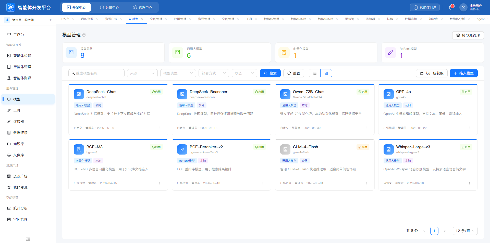
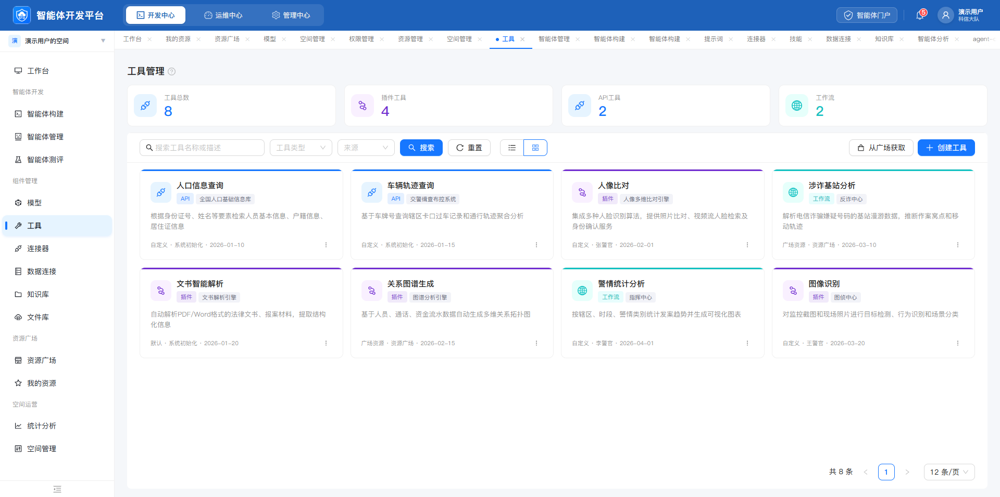
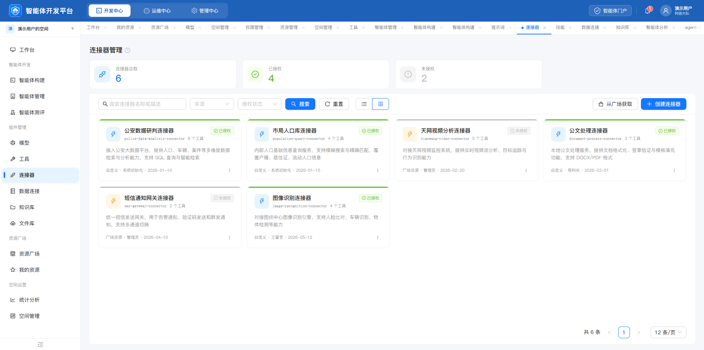
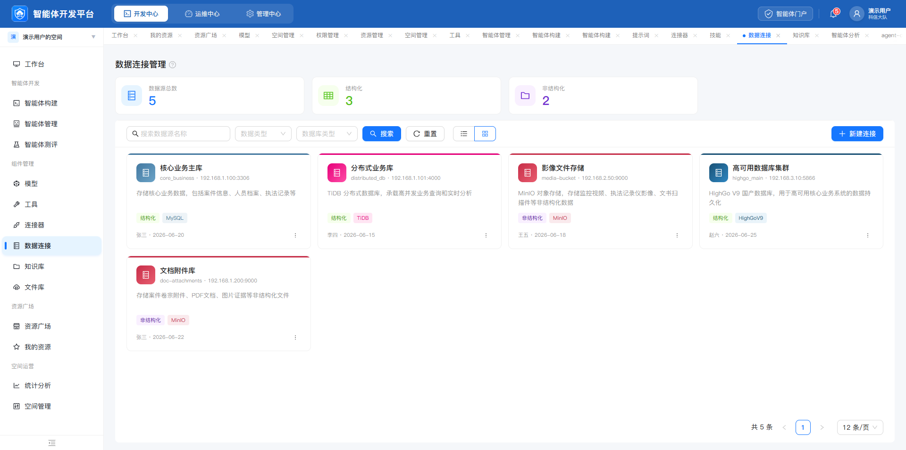
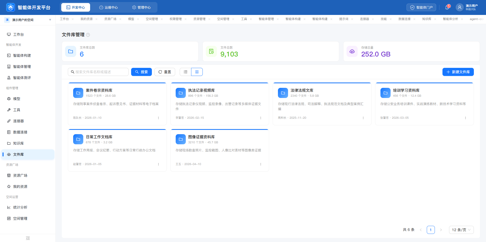
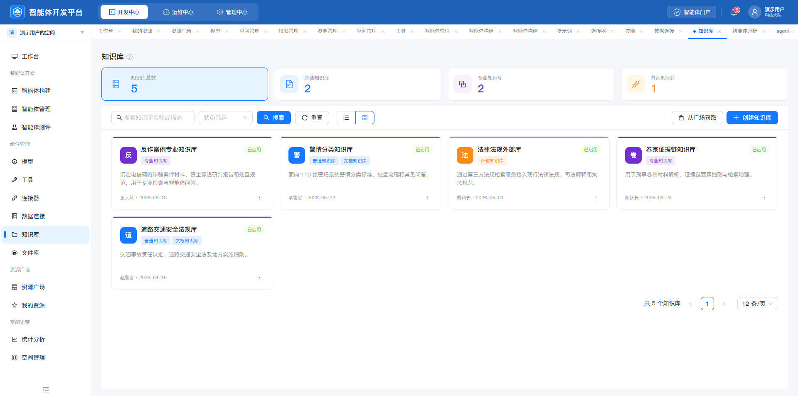

# 资源管理页面视觉一致性审查

日期：2026-07-24  
范围：模型、工具、连接器、数据连接、文件库、知识库 6 个开发中心页面  
目标：判断同类资源管理页是否采用统一设计规范，并识别视觉与可用性优化机会。

## 总体结论

六个页面已经形成稳定的共享骨架，视觉统一度约为 80%：

- 全局顶栏、工作空间入口、侧栏、页签栏、内容画布一致。
- 页面均遵循“标题 → 统计摘要 → 筛选工具栏 → 四列卡片网格 → 分页”的结构。
- 主按钮、输入控件、卡片圆角、图标容器和基础间距基本一致。
- 主要偏差集中在统计卡布局、统计卡选中态、资源卡色条语义和分页定位。

## 页面步骤与健康度

| 步骤 | 页面 | 健康度 | 主要结论 |
|---|---|---|---|
| 1 | 模型管理 | 良好 | 结构完整，但筛选栏偏拥挤，“模型源管理”与主要任务区脱节。 |
| 2 | 工具管理 | 良好 | 与模型页最接近，是当前较好的基准页。 |
| 3 | 连接器管理 | 需优化 | 三项统计只占 75% 宽度；顶部色条同时承担授权状态，语义不稳定。 |
| 4 | 数据连接管理 | 需优化 | 三项统计留下大块空白；卡片颜色过多且缺少统一含义。 |
| 5 | 文件库管理 | 良好 | 三项统计正确铺满整行，可作为三指标布局基准。 |
| 6 | 知识库 | 需优化 | 只有该页默认高亮“总数”统计卡；分页没有固定在内容区底部。 |

## 审查证据

### 1. 模型管理

- 优点：四项统计、筛选器、双入口操作和卡片结构完整。
- 风险：五个筛选项加视图切换使工具栏拥挤；“模型源管理”单独漂浮在标题区右侧。
- 建议：将“模型源管理”并入工具栏右侧，作为“从广场获取”之前的次级操作或更多菜单项。

### 2. 工具管理

- 优点：统计、筛选、卡片和分页关系清楚，左右操作层级合理。
- 风险：不同工具类型通过顶部色条、图标底色和标签重复表达，视觉信号略多。
- 建议：保留图标底色和类型标签，顶部色条统一为中性或主色。

### 3. 连接器管理

- 优点：授权状态清楚，未授权资源有明显弱化。
- 风险：三项统计卡只占页面四分之三；顶部色条在这里代表授权状态，但在其他页面代表资源类型。
- 建议：三项统计等分整行；授权状态只使用状态 Tag 和卡片弱化，不再占用顶部色条。

### 4. 数据连接管理

- 优点：结构化、非结构化分类明确，卡片信息完整。
- 风险：统计区右侧空白；蓝、粉、红、深蓝色条缺少跨页面一致语义。
- 建议：三项统计等分整行；数据库类型使用标签和图标区分，卡片顶边统一。

### 5. 文件库管理

- 优点：三项统计正确铺满整行；卡片色彩克制，信息扫描效率高。
- 风险：文件库卡片缺少状态或最近更新时间之外的管理线索，但不是纯视觉问题。
- 建议：将该页的三指标布局、单一主色卡片作为其他资源页的统一参考。

### 6. 知识库

- 优点：知识库类型标签和状态标签易于识别。
- 风险：只有“知识库总数”统计卡默认呈选中态，其他页面没有对应规则；分页停留在卡片下方而不是内容区底部。
- 建议：若统计卡可筛选，所有页面默认高亮“总数”；若不可筛选，则全部取消高亮。分页统一固定在白色内容面板右下角。

## 高优先级问题

### 1. 统计卡布局没有按数量自适应

连接器和数据连接页面的三项统计沿用四列网格，只占 75% 宽度；文件库页面却采用三等分铺满。相同数量出现两种布局，是最明显的一致性问题。

统一规则：

- 4 项：四等分。
- 3 项：三等分铺满。
- 2 项：优先二等分；若指标内容短，可限制单卡最大宽度但整组左对齐。
- 不为了填满四列虚构无价值指标。

### 2. 统计卡选中态不一致

知识库页默认高亮“总数”，其余页面没有默认高亮。需要确定统计卡是否承担筛选功能。

统一规则：

- 可点击筛选：所有页面默认选中“总数”，选中态采用主色边框与浅蓝背景。
- 仅展示数据：所有页面均取消选中态和指针手势。

### 3. 分页位置不一致

模型、工具、连接器、数据连接和文件库的分页位于内容面板底部；知识库分页紧随卡片列表，导致页面视觉重心上浮。

统一规则：主内容面板使用纵向 Flex，卡片区 `flex: 1`，分页固定在面板右下角。

## 中优先级问题

### 4. 卡片顶部色条承担了不同含义

- 工具、数据连接、知识库：大多表示资源类型。
- 连接器：表示授权状态。
- 模型：主要表示启用状态或统一品牌色。
- 文件库：统一品牌色。

建议只保留一种含义。更稳妥的方案是：

- 卡片顶边统一为主色或中性边框。
- 资源类型通过图标底色和类型 Tag 表达。
- 启用、停用、授权等状态只通过状态 Tag、文本和整体弱化表达。

### 5. 资源卡片骨架应进一步固定

建议六类资源统一使用：

1. 40px 身份图标。
2. 单行名称。
3. 单行技术标识或数量摘要。
4. 一行标签区，预留 22px 高度。
5. 最多两行描述。
6. 底部所有者、日期与更多菜单，固定贴底。

这样可以减少模型卡偏高、工具卡偏矮以及同一行内容上下跳动。

### 6. 工具栏操作层级可以更稳定

统一为：

- 左侧：搜索 → 分类筛选 → 状态筛选 → 搜索 → 重置 → 视图切换。
- 右侧：外部获取/同步等次操作 → 创建/接入主操作。
- 页面级设置不要漂浮在标题区；放入工具栏右侧或明确的更多菜单。

## 可访问性风险

从截图可以确认的风险：

- 卡片描述、技术标识、日期和顶部页签使用了较浅灰色，小字号下可能低于 WCAG 4.5:1 对比度。
- 绿色状态文字、紫色类型文字位于浅色底上，字号约 11-12px，需要实际测量对比度。
- 卡片右下角省略号、分页箭头和标题帮助图标的可点击区域看起来偏小，建议至少提供 32×32px 热区。
- 顶部打开的页签数量很多，弱色关闭图标和相近标签会增加键盘及低视力用户的定位成本。

截图无法确认：

- 键盘焦点样式和 Tab 顺序。
- 卡片、统计卡是否具备正确语义和键盘操作。
- 屏幕阅读器名称、状态变化播报和缩放重排。

## 建议的统一规范补充

1. 统计卡列数根据实际数量自动铺满。
2. 统计卡选中态必须由“是否可筛选”决定。
3. 卡片顶部色条不再表达状态。
4. 资源卡片使用统一内容骨架和最小高度。
5. 工具栏遵循固定左右分区与控件顺序。
6. 分页固定在主内容面板右下角。
7. 辅助文字不低于 12px，并提升到可通过对比度检查的灰阶。

## 证据限制

本审查基于用户在当前会话提供的 6 张 1920×956 静态截图。可以判断布局、层级、颜色、密度和明显的可访问性风险，但不能据此确认交互行为、响应式表现或完整 WCAG 合规性。
