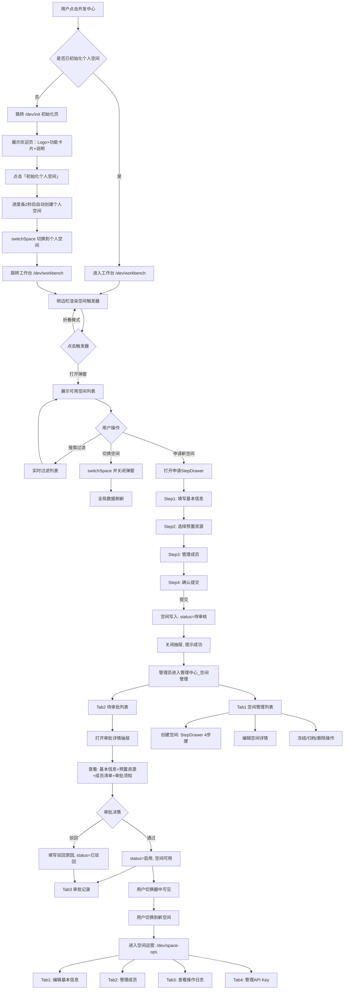
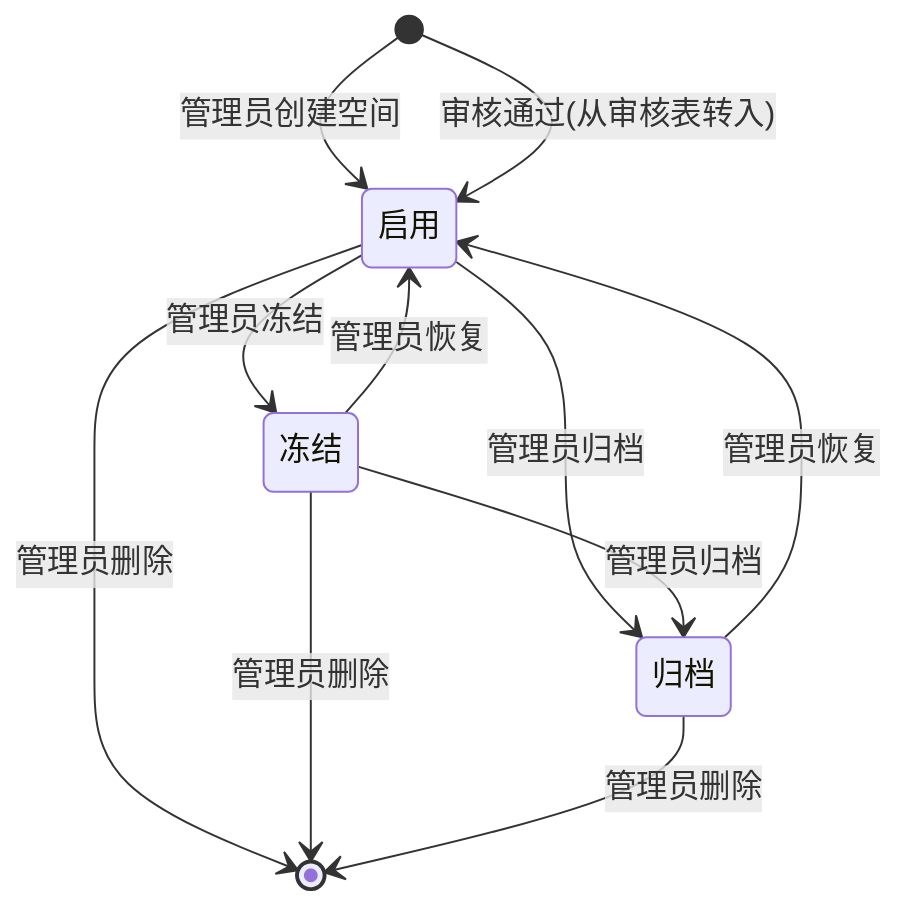
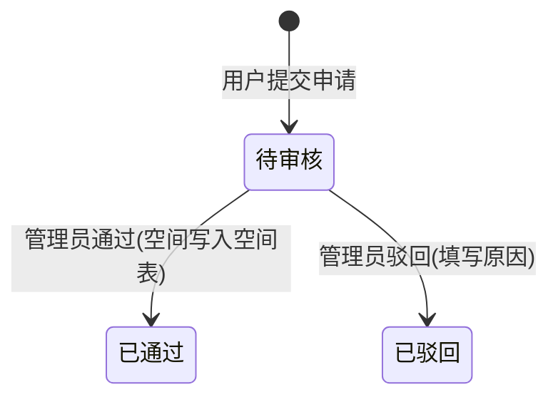

# 空间管理闭环体系 · 产品需求文档

## 版本变更记录

| 版本号  | 修订日期       | 修订人 | 变更类型 | 变更描述                                    | 影响面                           |
| :--- | :--------- | :-- | :--- | :-------------------------------------- | :---------------------------- |
| v1.0 | 2026-07-17 | AI  | 新建   | 整合三大模块（空间切换与申请、空间运营、空间管理）为一个闭环体系的PRD    | 全篇                            |
| v1.1 | 2026-07-17 | AI  | 新增   | 新增 D00 个人空间初始化页：首次进入开发中心时展示欢迎页，一键创建个人空间 | 4.1 / 4.3 / 5.0 / 5.1 / 5.2.0 |

***

## 1. 需求背景

### 1.1 问题描述

平台面向多警种、多部门协作场景，用户在日常工作中面临以下痛点：

**空间发现与切换（模块A）**：用户可能同时归属于多个工作空间（个人空间、工作空间、专案空间），需要在不同空间之间快速切换。当前切换入口不够直观，且用户需要加入新空间时缺乏线上自主申请通道，只能依赖线下沟通由管理员创建。

**空间日常运营（模块B）**：空间所有者需要对当前工作空间的基本信息、成员协作、操作审计和API集成进行日常管理。缺乏集中的"一站式"管理视图。

**平台级空间管控（模块C）**：超级管理员需要全局管理所有空间的生命周期（启用/冻结/归档/删除），并处理用户的建空间审批请求，确保空间创建的合规性和资源预置的合理性。

三个模块共同构成\*\*"申请 → 审批 → 可用 → 运营 → 管控"\*\*的空间全生命周期闭环。

### 1.2 目标用户

| 角色    | 核心场景                                           |
| ----- | ---------------------------------------------- |
| 普通开发者 | 切换空间（已加入的）、申请新空间。开发中心主导航（除空间运营以外的模块）           |
| 空间所有者 | 切换空间（已加入的）、管理空间信息/成员/API Key、申请新空间。开发中心主导航全部功能 |
| 平台管理员 | 全局空间列表、创建空间、审批申请、状态管控                          |

### 1.3 业务目标

1. **无缝切换**：侧边栏常驻入口，一键打开空间列表，支持搜索和即时切换
2. **自主申请**：用户可在切换弹窗中发起空间申请，4步骤表单提交后进入审批
3. **高效审批**：管理员在同一页面完成审批（通过/驳回），支持查看申请详情和填写驳回原因
4. **空间运营**：空间内基本信息、成员管理、操作日志、API Key集中管理
5. **闭环管控**：「待审核→通过→启用→出现在已加入成员的切换器」全链路可追踪

***

## 2. 产品定位

### 2.1 产品定义

本PRD覆盖平台中与"空间"相关的全部用户界面和交互逻辑，按功能域分为三个模块：

| 模块         | 入口                     | 核心组件                | 数据依赖                            |
| ---------- | ---------------------- | ------------------- | ------------------------------- |
| A. 空间切换与申请 | 开发中心侧边栏顶部              | `WorkspaceSwitcher` | `WorkspaceContext`              |
| B. 空间运营    | `/dev/space-ops`       | `SpaceManagePage`   | `WorkspaceContext.currentSpace` |
| C. 空间管理    | `/manage/space-manage` | `OpsSpacesPage`     | 全部空间数据                          |

### 2.2 核心价值

1. **快速切换**：侧边栏顶部常驻入口，一键打开弹窗，搜索+切换全在 Modal 内完成
2. **全局联动**：切换后通过 WorkspaceContext 驱动所有页面数据刷新
3. **自主申请**：用户无需离开开发中心即可发起空间申请，降低协作门槛
4. **审批闭环**：申请 → 管理员审批 → 空间启用 → 出现在已加入成员的切换器，全流程可追踪
5. **生命周期管控**：冻结/归档/删除三级差异化管理，ConfirmActionModal 分级确认

***

## 4. 用户旅程

### 4.1 端到端主流程图



**逐段解释：**

1. **个人空间初始化**：用户首次点击开发中心时，若尚未初始化个人空间，跳转 `/dev/init` 欢迎页（保留顶栏导航，隐藏侧边栏和页签栏）。页面展示 Logo、功能卡片、说明文字和「初始化个人空间」按钮。点击后按钮替换为进度条，约 2 秒后自动创建个人空间（命名规则：`{用户名}的个人空间`，type=个人空间），switchSpace 切换到该空间后跳转工作台。
2. **入口**：WorkspaceSwitcher在开发中心侧边栏顶部常驻渲染，展开/折叠模式自适应
3. **切换弹窗**：Modal 680px宽，展示启用空间列表（个人空间排最前），支持实时搜索过滤
4. **申请新空间**：弹窗底部"申请新的空间"链接→关闭Modal→打开4步骤StepDrawer
5. **申请提交**：构造审核记录（status='待审核'）→写入审核表→关闭抽屉→提示成功
6. **管理员审批**：进入管理中心空间管理Tab2→打开审批详情抽屉（含基本信息/预置资源清单/成员清单/审批须知）→通过/驳回
7. **审批通过**：写入空间表（status='启用'）→审核记录状态变为"已通过"→空间在已加入成员的切换器中可见
8. **审批驳回**：填写驳回原因→审核记录状态变为"已驳回"→进入Tab3审批记录
9. **空间运营**：用户切换进入空间后，可在/dev/space-ops管理基本信息/成员/日志/API Key
10. **空间管控**：管理员在Tab1执行创建空间（4步向导）、编辑详情、冻结/归档/删除等操作
11. **异常分支**：切换器不展示归档/冻结（灰色不可选）空间；待审核和已驳回不在空间表中

### 4.2 空间状态流转图

**空间表状态（SpaceItem.status）：**



**审核表状态（SpaceApproval.status）：**



**逐段解释：**

1. 空间表只有三种状态：启用/冻结/归档。空间可通过管理员创建或审核通过后写入
2. 审核表独立于空间表，有三种状态：待审核/已通过/已驳回
3. 待审核→已通过时，同步在空间表中创建一条启用状态的空间记录
4. 待审核→已驳回时，仅更新审核记录，不产生空间数据
5. 审核表只增不减不删，作为审批审计日志留存
6. 空间表启用/冻结/归档三种状态下均允许删除（danger级别确认+输入名称），删除后不可恢复

### 4.3 主流程覆盖模块对齐表

| Coverage Index ID | 页面/模块       | PRD章节定位 | 流程图节点名         | 是否覆盖 |
| ----------------- | ----------- | ------- | -------------- | ---- |
| D00               | 个人空间初始化页    | 5.2.0   | 展示欢迎页 → 初始化    | ✅    |
| P01               | 空间切换触发器     | 5.2.1   | 侧边栏渲染空间触发器     | ✅    |
| D01               | 空间切换弹窗      | 5.2.2   | 展示可用空间列表       | ✅    |
| D02               | 申请新空间向导     | 5.2.3   | 打开申请StepDrawer | ✅    |
| P02               | 空间运营页（开发中心） | 5.3.2   | 进入空间运营         | ✅    |
| D03               | 基本信息编辑模块    | 5.3.3   | Tab1编辑基本信息     | ✅    |
| D04               | 成员管理模块      | 5.3.4   | Tab2管理成员       | ✅    |
| D05               | 操作日志模块      | 5.3.5   | Tab3查看操作日志     | ✅    |
| P03               | 空间管理页（管理中心） | 5.4.1   | 进入管理中心\_空间管理   | ✅    |
| D06               | 创建空间向导      | 5.4.4   | 创建空间StepDrawer | ✅    |
| D07               | 空间详情抽屉      | 5.4.5   | 编辑空间详情         | ✅    |
| D08               | 审批详情抽屉      | 5.4.6   | 打开审批详情抽屉       | ✅    |
| D09               | 驳回原因弹窗      | 5.4.6   | 填写驳回原因         | ✅    |
| D10               | 操作确认弹窗      | 5.4.7   | 冻结/归档/删除确认     | ✅    |

***

## 5. 功能清单与详细说明

### 5.0 功能覆盖索引

| ID  | 页面/模块   | 类型          | 入口/路由                | 关键功能                        | PRD章节 | 覆盖状态 |
| --- | ------- | ----------- | -------------------- | --------------------------- | ----- | ---- |
| D00 | 个人空间初始化 | Page        | /dev/init            | 首次进入开发中心的初始化欢迎页，创建个人空间      | 5.2.0 | ✅    |
| P01 | 空间切换触发器 | Trigger     | 开发中心侧边栏              | 展示当前空间头像+名称，点击打开弹窗          | 5.2.1 | ✅    |
| D01 | 空间切换弹窗  | Modal       | P01点击                | 空间列表+搜索+切换+申请入口             | 5.2.2 | ✅    |
| D02 | 申请新空间向导 | StepDrawer  | D01底部链接              | 4步骤：基本信息→预置资源→成员管理→确认提交     | 5.2.3 | ✅    |
| D11 | 我的申请面板  | Modal       | D01底部链接              | 查看当前用户发起的全部申请及其审批状态         | 5.2.4 | ✅    |
| P02 | 空间运营页   | List/Tabs   | /dev/space-ops       | 4Tab：基本信息+成员管理+操作日志+API Key | 5.3.2 | ✅    |
| D03 | 基本信息编辑  | Inline Form | P02 Tab1             | 只读/编辑切换，编辑空间名称/描述/图标/部门     | 5.3.3 | ✅    |
| D04 | 成员管理    | Panel       | P02 Tab2             | 成员筛选+添加+移除，个人空间只读           | 5.3.4 | ✅    |
| D05 | 操作日志    | Panel       | P02 Tab3             | 日志筛选+详情+导出，日志详情弹窗           | 5.3.5 | ✅    |
| P03 | 空间管理页   | List/Tabs   | /manage/space-manage | 3Tab：空间管理+待审批+审批记录          | 5.4.1 | ✅    |
| D06 | 创建空间向导  | StepDrawer  | P03 Tab1创建按钮         | 4步骤向导（同D02，提交后直接启用）         | 5.4.4 | ✅    |
| D07 | 空间详情抽屉  | Drawer      | P03 Tab1行操作          | 3Tab：基本信息编辑+成员管理+操作日志       | 5.4.5 | ✅    |
| D08 | 审批详情抽屉  | Drawer      | P03 Tab2审批按钮         | 查看申请详情+通过/驳回操作              | 5.4.6 | ✅    |
| D09 | 驳回原因弹窗  | Modal       | D08驳回按钮              | 必填TextArea驳回原因              | 5.4.6 | ✅    |
| D10 | 操作确认弹窗  | Modal       | P03 Tab1 ...菜单       | 冻结/归档/删除差异化确认               | 5.4.7 | ✅    |

### 5.1 核心功能清单

| 模块    | 功能点       | 优先级 | 功能描述                        |
| ----- | --------- | --- | --------------------------- |
| A-初始化 | 个人空间初始化   | P0  | 首次进入开发中心时展示欢迎页，一键创建个人空间     |
| A-切换  | 侧边栏触发器    | P0  | 展示当前空间头像+名称，折叠模式仅头像         |
| A-切换  | 空间切换弹窗    | P0  | Modal 680px，空间列表+搜索+状态区分    |
| A-切换  | 空间搜索过滤    | P0  | 按空间名称实时模糊搜索                 |
| A-切换  | 空间即时切换    | P0  | 点击后switchSpace，全局联动刷新       |
| A-申请  | 申请入口      | P0  | 弹窗左下角"⊕ 申请新的空间"链接+提示文字      |
| A-申请  | 空间申请表单    | P0  | 4步骤StepDrawer，提交后status=待审核 |
| B-运营  | 基本信息管理    | P0  | 只读/编辑切换，Form表单              |
| B-运营  | 成员管理      | P0  | 增删查，角色只读Tag，个人空间隔离          |
| B-运营  | 操作日志      | P0  | 搜索+时间筛选+详情+导出+分页            |
| B-运营  | 空间API Key | P0  | 安全提示+掩码展示+复制+cURL示例         |
| C-管理  | 三Tab架构    | P0  | 空间管理/待审批(红点)/审批记录           |
| C-管理  | 统计卡片      | P0  | 动态指标，点击联动筛选                 |
| C-管理  | 空间CRUD    | P0  | 创建/编辑/冻结/归档/删除              |
| C-管理  | 审批流程      | P0  | 审批详情抽屉+通过/驳回+驳回原因           |
| C-管理  | 操作确认      | P0  | ConfirmActionModal分级确认      |

***

### 5.2 模块A：开发中心·空间切换与申请

#### \[D00] 个人空间初始化页

##### 业务意图

用户首次进入开发中心时，系统检测尚未创建个人空间，展示初始化欢迎页。用户在页面内一键完成个人空间的创建，随后进入工作台开始使用。

##### 触发时机

- 新用户（未创建个人空间）点击顶栏「开发中心」导航标签时

##### 页面布局

- **顶栏**：保留平台主导航（开发中心/运维中心/管理中心标签），不显示左侧导航菜单和页签栏
- **内容区**：全宽居中，从上到下依次为：
  1. 渐变色火箭图标（80x80px，蓝紫渐变圆角矩形）
  2. 标题「欢迎来到 GA 智能警务平台」
  3. 副标题「AI 驱动的新一代警务智能协作平台」
  4. 三张功能卡片（独立工作区/灵活协作/数据隔离），水平等宽排列
  5. 说明卡片：简述个人空间定位和协作引导
  6. 「初始化个人空间」主按钮（蓝紫渐变，52px高，圆角12px）

##### 交互行为

| 操作           | 行为                                                                                                   |
| ------------ | ---------------------------------------------------------------------------------------------------- |
| 页面加载         | 全宽居中渲染，顶栏可见，侧边栏/页签栏隐藏                                                                                |
| 点击「初始化个人空间」  | 按钮替换为蓝紫渐变 Progress 进度条（约 2s → 100%），下方显示「正在初始化个人空间...」                                               |
| 初始化完成        | `switchSpace('0')` 切换到个人空间 → `localStorage` 写入已初始化标记 → 跳转 `/dev/workbench` → Toast 提示「个人空间已就绪，欢迎使用！」 |
| 已初始化后再次访问此页面 | 仍展示欢迎页，按钮功能同上（重新初始化流程，不会重复创建）                                                                        |

##### 技术要点

- `DevGuard` 组件包裹所有 `/dev/*` 路由（除 `/dev/init` 本身），未初始化时重定向至 `/dev/init`
- `MasterLayout` 中通过 `location.pathname === '/dev/init'` 判断，隐藏侧边栏和页签栏
- 个人空间 mock 数据已预置（id='0'，type=个人空间，命名规则：`{用户名}的个人空间`）\
  \[待确认: 后端需确保首次登录时自动创建个人空间记录并在用户表关联 | P1 | 后端接口负责人]

##### 字段约束

| 约束项       | 值               |
| --------- | --------------- |
| 初始化判定     | localStorage 标记 |
| 进度条时长     | \~2 秒           |
| 个人空间命名规则  | `{用户名}的个人空间`    |
| 个人空间 type | `'个人空间'`        |

***

#### \[P01] 空间切换触发器

##### 业务意图

在侧边栏顶部常驻渲染当前空间信息，让用户随时感知当前工作上下文，并提供一键切换入口。

##### 组件信息

共享组件 `WorkspaceSwitcher`，接收 `collapsed` 和 `inline` 两个Props。

##### Props

| 属性        | 类型      | 默认值   | 说明                     |
| --------- | ------- | ----- | ---------------------- |
| collapsed | boolean | false | 侧边栏折叠状态，折叠时仅展示26px首字头像 |
| inline    | boolean | false | 内联模式（头部嵌入），无边框无背景      |

##### 展开模式交互元素

| 元素     | 类型 | 说明                                                                  |
| ------ | -- | ------------------------------------------------------------------- |
| 空间首字头像 | 展示 | 24x24px，圆角5px，渐变蓝底（#e6f4ff）蓝字（#1677ff），fontSize 11px fontWeight 700 |
| 空间名称   | 文本 | fontSize 12px，fontWeight 600，颜色 #1D2129，textOverflow ellipsis       |
| 下拉箭头   | 图标 | ▼ Unicode字符，fontSize 10px，颜色 #B0B8C8                                |

##### 折叠模式交互元素

| 元素     | 类型 | 说明                    |
| ------ | -- | --------------------- |
| 空间首字头像 | 展示 | 26x26px，圆角7px，样式同上，居中 |

##### 交互行为

- hover时背景变为#fafafa（inline模式下不变）
- 点击触发`setModalOpen(true)`打开切换弹窗
- 仅在开发中心（`activeModule === 'dev'`）渲染

***

#### \[D01] 空间切换弹窗

##### 业务意图

提供集中式的空间选择视图，支持搜索过滤、状态区分和申请入口，降低用户在多空间之间的切换成本。

##### 弹窗容器

| 属性  | 值               | 说明           |
| --- | --------------- | ------------ |
| 宽度  | 680px           | 固定宽度         |
| 标题  | 无（title=null）   | 自绘标题行        |
| 底部  | 无（footer=null）  | 底部操作区自绘      |
| 销毁  | destroyOnHidden | 关闭时销毁DOM     |
| 内边距 | 24px 28px 28px  | body padding |

##### 弹窗内容区域

| 区域    | 元素                          | 说明                                          |
| ----- | --------------------------- | ------------------------------------------- |
| 标题行   | "切换工作空间"                    | fontSize 18px，fontWeight 700                |
| 副标题   | "选择您要进入的工作空间，当前共有N个可用空间"    | fontSize 13px，颜色#7A8599                     |
| 搜索框   | Input prefix SearchOutlined | placeholder="搜索空间名称"，allowClear，圆角6px，≤100字 |
| 空间列表  | 滚动容器                        | flex column，gap 8px，可滚动                     |
| 底部操作区 | "⊕ 申请新的空间" + "我的申请" 入口      | 见5.2.3节和5.2.4节                              |

##### 空间卡片状态样式

| 状态   | 背景      | 边框                  | 鼠标                      | opacity |
| ---- | ------- | ------------------- | ----------------------- | ------- |
| 当前空间 | #F7F9FC | 1px solid #1677ff30 | default                 | 1       |
| 可用空间 | #fff    | 1px solid #E5EAF3   | pointer（hover: #FAFBFC） | 1       |
| 冻结空间 | #fafafa | 1px solid #e8e8e8   | not-allowed             | 0.6     |

##### 搜索过滤行为

- 过滤源：`spaces`（来自WorkspaceContext，仅`status === '启用'`，个人空间排最前）
- 匹配字段：name（大小写不敏感）
- 空搜索词显示全部
- 无匹配结果显示"未找到匹配的空间"

##### 切换行为

- 点击非当前非冻结卡片的任意区域→`switchSpace(space.id)`→关闭弹窗→清空搜索
- 点击"进入"按钮→同上（`e.stopPropagation`防重复）
- 点击当前空间卡片→无操作
- 点击冻结空间卡片→无响应
- 关闭弹窗（onCancel/点击遮罩）→关闭弹窗→清空搜索

***

#### \[D02] 申请新空间向导

##### 业务意图

用户无需离开开发中心即可自主发起空间创建申请，通过4步骤标准化向导确保申请信息的完整性和规范性。提交后进入管理员审批流程。

##### 与创建空间的差异

| 对比项    | 创建空间（管理员/D06）               | 申请新空间（普通用户/D02）      |
| ------ | --------------------------- | -------------------- |
| 触发入口   | P03 Tab1 FilterBar "创建空间"按钮 | D01 弹窗底部"申请新的空间"     |
| 抽屉标题   | "创建空间"                      | "申请新的空间"             |
| 负责人字段  | Select可自由选择                 | Input disabled锁定当前用户 |
| 最后一步按钮 | "确认创建"                      | "提交申请"               |
| 提交后状态  | 直接"启用"                      | "待审核"                |
| 提交后提示  | "空间创建成功"                    | "空间申请已提交，请等待管理员审核"   |

##### 步骤定义

| 步骤     | 标题   | 内容                                                                 |
| ------ | ---- | ------------------------------------------------------------------ |
| Step 0 | 基本信息 | 空间名称（必填）、空间描述、空间图标、所属警种/部门（选填）、负责人（锁定当前用户，不可更改）、空间类型（必填，工作空间/专案空间） |
| Step 1 | 预置资源 | 从平台预置资源中选择模型、提示词、工具、连接器、知识库（多选，可选）                                 |
| Step 2 | 成员管理 | 添加初始成员并设置角色（可选，负责人自动成为"所有者"）                                       |
| Step 3 | 确认提交 | 展示前三个步骤的汇总信息，点击"提交申请"                                              |

##### 表单字段定义（Step 0）

| 字段      | 类型              | 必填 | 默认值          | 字数限制 | 说明                                         |
| ------- | --------------- | -- | ------------ | ---- | ------------------------------------------ |
| 空间名称    | Input           | 是  | -            | ≤50  | 校验全局唯一性                                    |
| 空间描述    | TextArea(3行)    | 否  | -            | ≤500 | 描述用途和适用范围                                  |
| 空间图标    | IconPicker      | 否  | IconPicker组件 | -    | 64x64预览 + 三模式（文字/上传/Icon）                  |
| 所属警种/部门 | Select          | 否  | -            | -    | 10个部门选项                                    |
| 负责人     | Input(disabled) | 是  | 当前用户         | -    | 锁定为当前登录用户，不可更改；下方提示"负责人默认为当前登录用户，不可更改。"    |
| 空间类型    | Select          | 是  | 工作空间         | -    | 工作空间/专案空间；下方提示"个人空间为首次进入开发中心时自动创建，无需手动申请。" |

##### 提交后数据流

```
用户点击"提交申请"
  → 构造新的 SpaceItem 对象（id自增，status='待审核'）
  → 写入空间数据
  → message.success('空间申请已提交，请等待管理员审核')
  → 关闭 StepDrawer，重置表单状态
  → 管理中心空间列表自动包含该待审核记录
```

***

#### \[D11] 我的申请面板

##### 业务意图

申请者在提交空间申请后，需要能够追踪审批进度和查看审批结果，形成用户侧的审批闭环，避免提交后只能被动等待无反馈信息的尴尬。

##### 入口

D01 弹窗底部，"申请新的空间"链接右侧，显示「我的申请」链接。

##### 面板容器

| 属性 | 值              |
| -- | -------------- |
| 类型 | Modal          |
| 宽度 | 560px          |
| 标题 | "我的申请"         |
| 底部 | 无（footer=null） |

##### 列表内容

展示当前登录用户（通过 `creator` 字段匹配）发起的全部空间申请，按 `创建时间` 倒序排列。

##### 列表列定义

| 列名   | 字段              | 说明                                  |
| ---- | --------------- | ----------------------------------- |
| 空间名称 | name            | 申请的拟建空间名称                           |
| 申请时间 | createTime      | 提交申请的时间                             |
| 当前状态 | status          | 待审核（橙色Tag）、已通过/启用（绿色Tag）、已驳回（红色Tag） |
| 驳回原因 | rejectionReason | 仅在已驳回状态下显示，展示管理员填写的驳回理由             |
| 操作   | -               | 已通过状态显示"进入"按钮，其他状态无操作               |

##### 行内操作

| 操作 | 条件              | 行为                        |
| -- | --------------- | ------------------------- |
| 进入 | status === '启用' | 关闭面板和弹窗，switchSpace，进入该空间 |

##### 数据来源

筛选空间数据中 `creator === 当前登录用户名` 且 `type !== '个人空间'`（排除默认个人空间）的记录。

##### 交互行为

- 点击"我的申请"→关闭D01弹窗→打开我的申请Modal
- 关闭Modal→可重新打开D01弹窗
- 无记录时显示"暂无申请记录"空状态

***

### 5.3 模块B：开发中心·空间运营

#### \[P02] 空间运营页

##### 业务意图

为当前空间的成员提供集中式的空间管理视图，集成基本信息编辑、成员协作管理、操作审计和API集成凭证四大能力。

##### 页面结构

```
┌──────────────────────────────────────────────┐
│  空间管理                   [提示文字]         │ ← PageHeader
├──────────────────────────────────────────────┤
│  [空间头像] [空间名称] [类型Tag] [所有者Tag]    │ ← 空间信息横条
│  创建时间：xxx       所有者：xxx              │
├──────────────────────────────────────────────┤
│  [基本信息] [成员管理] [操作日志] [空间API Key] │ ← antd Tabs
├──────────────────────────────────────────────┤
│  Tab 内容区域                                │
└──────────────────────────────────────────────┘
```

##### Tab定义

| Tab  | 图标                 | 标签        | 关键功能              |
| ---- | ------------------ | --------- | ----------------- |
| Tab1 | InfoCircleOutlined | 基本信息      | 空间概览卡片+只读/编辑表单    |
| Tab2 | TeamOutlined       | 成员管理      | 筛选+添加+移除，个人空间只读   |
| Tab3 | HistoryOutlined    | 操作日志      | 筛选+详情+导出          |
| Tab4 | KeyOutlined        | 空间API Key | 安全提示+掩码展示+复制+cURL |

***

#### \[D03] 基本信息编辑

##### 交互元素

| 字段      | 类型              | 只读模式   | 编辑模式   | 字数限制 | 说明        |
| ------- | --------------- | ------ | ------ | ---- | --------- |
| 空间名称    | Input           | 文本     | 可编辑，必填 | ≤50  | 支持修改      |
| 空间描述    | TextArea(3行)    | 文本     | 可编辑    | ≤500 | 选填        |
| 空间图标    | IconPicker      | 渐变蓝首字母 | 可点击更换  | -    | 64x64px预览 |
| 所属警种/部门 | Select          | 文本     | 可编辑    | -    | 9个部门选项    |
| 空间类型    | Input(disabled) | 文本     | 始终只读   | -    | 创建时确定不可改  |
| 所有者     | Input(disabled) | 文本     | 始终只读   | -    | 不可编辑      |
| 创建时间    | Input(disabled) | 文本     | 始终只读   | -    | 不可编辑      |

##### 编辑按钮交互

- 编辑按钮位于`<Form>`组件外部，不受Form.disabled继承影响
- 点击编辑→Form.disabled=false→底部显示保存/取消按钮
- 保存→600ms loading→提示"空间信息已更新"→退出编辑态
- 取消→form.resetFields()恢复初始值→退出编辑态

***

#### \[D04] 成员管理

##### 个人空间分支

- 顶部大卡片：头像(56px)+空间名称+提示文字"个人空间仅创建人可访问，不支持添加其他成员"
- 无搜索栏、添加按钮和行内操作

##### 工作/专案空间分支

**搜索筛选区：**

| 筛选项     | 类型           | 默认值  | 字数限制 | 说明          |
| ------- | ------------ | ---- | ---- | ----------- |
| 搜索姓名或部门 | Input search | 空    | ≤100 | 匹配name和dept |
| 角色筛选    | Select       | 全部角色 | -    | 全部/所有者/普通用户 |

**全局操作按钮：**

| 按钮   | 类型  | 点击行为        |
| ---- | --- | ----------- |
| 添加成员 | 主按钮 | 打开添加成员Modal |

**成员表格列定义：**

| 列名   | 字段         | 宽度  | 说明                                             |
| ---- | ---------- | --- | ---------------------------------------------- |
| 成员   | name       | 200 | 32px圆形头像+姓名+部门                                 |
| 角色   | role       | 100 | Tag: 金色所有者(CrownOutlined)/蓝色普通用户(UserOutlined) |
| 加入时间 | joinTime   | 120 | 灰色文本                                           |
| 最近活跃 | lastActive | 150 | 灰色文本                                           |
| 操作   | -          | 80  | 移除按钮(Popconfirm)                               |

**行内操作：**

| 操作 | 所有者                   | 普通用户                             |
| -- | --------------------- | -------------------------------- |
| 移除 | Button disabled（不可点击） | Popconfirm"确定移除xx？"→确认→提示"已移除xx" |

**添加成员弹窗：**

| 元素    | 类型                  | 说明                        |
| ----- | ------------------- | ------------------------- |
| 成员选择器 | MemberSelect(multi) | 下拉选项头像+姓名+部门，支持搜索         |
| 初始角色  | Input(disabled)     | 固定"普通用户"，提示"新增成员默认为普通用户。" |

***

#### \[D05] 操作日志

##### 搜索筛选区

| 筛选项        | 类型           | 默认值 | 字数限制 | 说明                |
| ---------- | ------------ | --- | ---- | ----------------- |
| 搜索操作人或操作对象 | Input search | 空   | ≤100 | 匹配operator和target |
| 时间范围       | RangePicker  | 空   | -    | 起始\~结束日期          |

**全局操作：** 导出Button（点击下载CSV文件）

##### 日志表格列定义

| 列名   | 字段       | 宽度  | 说明                             |
| ---- | -------- | --- | ------------------------------ |
| 时间   | time     | 170 | 13px灰色文本 "YYYY-MM-DD HH:mm:ss" |
| 操作人  | operator | 100 | 姓名                             |
| 操作类型 | type     | 100 | 彩色Tag，见6.4节操作类型枚举表             |
| 操作对象 | target   | 160 | 加粗资源名称                         |
| 操作   | -        | 80  | 「详情」链接按钮                       |

**日志详情弹窗：** Modal展示当前日志条目的完整JSON数据（等宽字体，#fafafa背景）

***

### 5.4 模块C：管理中心·空间管理

#### \[P03] 空间管理页（管理中心）

##### 业务意图

平台超级管理员统一管理所有空间的全生命周期，处理用户的建空间审批请求，确保空间创建的合规性和资源预置的合理性。

##### 页面结构

```
┌──────────────────────────────────────────────────────┐
│  空间管理                        [提示文字]           │ ← PageHeader
├──────────────────────────────────────────────────────┤
│  [空间管理]  [待审批 (N)]  [审批记录]                 │ ← PageTabs（页面级导航，置于顶部）
├──────────────────────────────────────────────────────┤
│  各Tab独立内容区域（StatCards + FilterBar + Table）     │
└──────────────────────────────────────────────────────┘
```

##### Tab定义

| Tab  | 标签名  | 数据范围      | 核心操作             | 统计卡片         |
| ---- | ---- | --------- | ---------------- | ------------ |
| Tab1 | 空间管理 | 启用/冻结/归档  | 创建空间、编辑、冻结/归档/删除 | 总空间/个人/工作/专案 |
| Tab2 | 待审批  | 待审核       | 审批（通过/驳回）        | 无（需审批事项较少）   |
| Tab3 | 审批记录 | 已驳回(+已通过) | 查看记录             | 已驳回/已通过/驳回率  |

##### Tab切换行为

- 默认激活Tab1（空间管理）
- 切换Tab时保留各自独立的搜索和筛选状态
- Tab2标签显示红色角标数字（当待审核数>0时）

***

#### Tab1：空间管理

##### 统计卡片

| 卡片   | 数值         | 颜色      | 点击行为      |
| ---- | ---------- | ------- | --------- |
| 总空间数 | 启用+冻结+归档总数 | #1677ff | 清除空间类型筛选  |
| 个人空间 | 个人空间数量     | #52c41a | 筛选类型=个人空间 |
| 工作空间 | 工作空间数量     | #722ed1 | 筛选类型=工作空间 |
| 专案空间 | 专案空间数量     | #fa8c16 | 筛选类型=专案空间 |

##### 搜索筛选区

| 筛选项    | 类型           | 默认值 | 字数限制 | 选项             |
| ------ | ------------ | --- | ---- | -------------- |
| 搜索空间名称 | Input search | 空   | ≤100 | -              |
| 状态     | Select       | 全部  | -    | 启用/冻结/归档       |
| 空间类型   | Select       | 全部  | -    | 个人空间/工作空间/专案空间 |

> 状态筛选不包含"待审核"和"已驳回"选项。

##### 全局操作按钮

| 按钮   | 类型  | 展示条件 | 点击行为                   |
| ---- | --- | ---- | ---------------------- |
| 创建空间 | 主按钮 | 始终显示 | 打开\[D06]创建空间StepDrawer |

##### 表格列定义

| 列名      | 字段          | 宽度  | 排序 | 说明                        |
| ------- | ----------- | --- | -- | ------------------------- |
| 空间名称    | name        | 200 | -  | 32px首字头像+可点击名称+部门         |
| 所属警种/部门 | dept        | 110 | -  | 灰色辅助文本                    |
| 空间类型    | type        | 100 | -  | Tag: 蓝色个人空间/绿色工作空间/橙色专案空间 |
| 成员数     | memberCount | 80  | ✅  | 数字                        |
| 智能体数    | agentCount  | 90  | ✅  | 数字                        |
| 状态      | status      | 80  | -  | Tag: 绿色启用/蓝色冻结/灰色归档       |
| 创建时间    | createTime  | 110 | ✅  | YYYY-MM-DD                |
| 操作      | -           | 220 | -  | 编辑+成员+...下拉菜单             |

##### 行内操作按钮

| 按钮    | 展示条件      | 点击行为                                     | 二次确认     | 成功后行为     |
| ----- | --------- | ---------------------------------------- | -------- | --------- |
| 编辑    | 始终显示      | 打开\[D07]详情抽屉Tab1编辑模式                     | 否        | 编辑保存后关闭   |
| 成员    | 始终显示      | 打开\[D07]详情抽屉Tab2成员管理                     | 否        | -         |
| ...冻结 | status=启用 | 弹出\[D10] ConfirmActionModal(warning)     | 需确认      | status→冻结 |
| ...启用 | status=冻结 | 即时操作                                     | 否        | status→启用 |
| ...恢复 | status=归档 | 即时操作                                     | 否        | status→启用 |
| ...归档 | status≠归档 | 弹出\[D10] ConfirmActionModal(info)        | 需确认      | status→归档 |
| ...删除 | 始终显示      | 弹出\[D10] ConfirmActionModal(danger)+名称输入 | 需确认+输入名称 | 删除空间      |

##### 其他交互

- 点击表格行选中空间并高亮（`#f0f5ff`背景）
- 分页：默认每页20条，支持切换条数，显示总数
- 排序：成员数、智能体数、创建时间列支持点击表头排序

***

#### Tab2：待审批

##### 标签

待审批Tab标签显示红色角标数字：`待审批 (N)`，N为待审核空间数量。

##### 搜索筛选区

| 筛选项    | 类型           | 默认值 | 字数限制 | 选项        |
| ------ | ------------ | --- | ---- | --------- |
| 搜索空间名称 | Input search | 空   | ≤100 | -         |
| 空间类型   | Select       | 全部  | -    | 工作空间/专案空间 |

##### 表格列定义

| 列名   | 宽度  | 说明                              |
| ---- | --- | ------------------------------- |
| 空间名称 | 200 | 首字头像+名称（点击查看审批详情）+部门            |
| 空间类型 | 100 | Tag：工作空间/专案空间                   |
| 申请人  | 90  | creator                         |
| 所属部门 | 110 | dept                            |
| 成员数  | 70  | memberCount                     |
| 预置资源 | 220 | 图标+数字：模型/提示词/工具/连接器/知识库         |
| 申请时间 | 170 | createTime（YYYY-MM-DD HH:mm:ss） |
| 操作   | 100 | 「审批」链接按钮                        |

##### 审批操作

点击行或「审批」按钮→打开\[D08]审批详情抽屉。

***

#### Tab3：审批记录

##### 统计卡片

| 卡片  | 说明               |
| --- | ---------------- |
| 已通过 | 已通过审核的空间总数       |
| 已驳回 | 已驳回空间总数          |
| 驳回率 | 已驳回/(已驳回+已通过)百分比 |

##### 数据来源

审批记录展示审核表中所有已完结的记录（已通过+已驳回），只增不减不删，作为审批审计日志留存。

##### 搜索筛选区（同Tab2）

##### 表格列定义

| 列名   | 宽度  | 说明                                |
| ---- | --- | --------------------------------- |
| 空间名称 | 200 | 首字头像+名称+部门                        |
| 空间类型 | 100 | Tag                               |
| 申请人  | 90  | applicant                         |
| 所属部门 | 110 | dept                              |
| 预置资源 | 220 | 图标+数字                             |
| 审批人  | 90  | approver（无则显示"-"）                 |
| 审批时间 | 170 | approvalTime                      |
| 审批结果 | 90  | Tag: 已通过(绿)/已驳回(红)                |
| 驳回原因 | 180 | rejectionReason（ellipsis，仅已驳回时有值） |

##### 行内操作

审批记录作为审计日志留存，不提供行内操作（不可编辑或删除）。

***

#### \[D06] 创建空间向导

##### 业务意图

管理员通过标准化的4步骤向导创建新空间，确保空间创建时负责人明确、资源预置到位。与\[D02]申请新空间向导共享相同的UI结构。

##### 步骤定义

| 步骤     | 标题   | 内容                                                       |
| ------ | ---- | -------------------------------------------------------- |
| Step 0 | 基本信息 | 空间名称（必填）、空间描述、空间图标、所属部门（选填）、负责人（必填，Select可自由选择）、空间类型（必填） |
| Step 1 | 预置资源 | 从平台预置资源中选择模型/提示词/工具/连接器/知识库（多选，可选）                       |
| Step 2 | 成员管理 | 添加初始成员并设置角色（可选，负责人自动成为"所有者"）                             |
| Step 3 | 确认创建 | 汇总展示前三个步骤信息，点击"确认创建"                                     |

##### 与\[D02]的差异

| 对比项   | D02 申请新空间          | D06 创建空间   |
| ----- | ------------------ | ---------- |
| 标题    | "申请新的空间"           | "创建空间"     |
| 负责人   | 锁定当前用户             | Select自由选择 |
| 最后按钮  | "提交申请"             | "确认创建"     |
| 提交后状态 | "待审核"              | "启用"       |
| 提交后提示 | "空间申请已提交，请等待管理员审核" | "空间创建成功"   |
| 提交后行为 | 关闭抽屉               | 关闭抽屉，刷新列表  |
| 字段约束  | 同 \[D02]           | 同 \[D02]   |

***

#### \[D07] 空间详情抽屉

##### 业务意图

在Drawer中聚合展示空间的基本信息编辑、成员管理和操作日志审查，避免页面跳转。

##### 容器

Drawer（宽900px），从右侧滑出。顶部展示空间头像+名称+类型标签+部门+状态标签，下方以Tabs切换三个Tab。

##### Tab1\~Tab3：复用 \[P02] 空间运营页

Tab内容由 `useSpaceDetailTabs` 共享组件提供，与 \[P02] 空间运营页的 Tab1\~Tab3 完全一致。

详见 \[D03] 基本信息编辑 / \[D04] 成员管理 / 操作日志（P02 Tab3）。

***

#### \[D08] 审批详情抽屉

##### 业务意图

管理员审批空间申请时，需在一个视图中查看申请的全部信息（基本信息、预置资源、成员组成），并在确认无误后做出审批决策。

##### 容器

Drawer（宽640px），底部固定操作栏包含"驳回（填写原因）"和"确认通过"按钮。

##### 内容区域

**头部：** 空间头像(48px)+名称+类型Tag+部门+待审核Tag

**基本信息卡片（蓝底）：** 空间名称、空间类型、所属部门、负责人

**预置资源清单卡片（灰底）：** 模型/提示词/工具/连接器/知识库，已选以Tag展示，未选择显示"未选择"

**成员清单卡片（灰底）：** 头像+姓名+部门+角色Tag

**审批须知（黄底）：**

- 通过后，该空间将立即启用，空间创建者将自动成为空间所有者
- 驳回需填写驳回原因，驳回后该空间不会出现在用户切换列表中
- 请确认空间基本信息、资源、成员无误后再操作

##### 审批行为

**通过：** `space.status = '启用'`→`message.success`→关闭抽屉→刷新列表→空间出现在已加入成员的切换器中

**驳回：** 打开\[D09]驳回原因弹窗→填写原因→审核记录`status = '已驳回'`→`message.success`→关闭抽屉→审核记录进入Tab3审批记录

***

#### \[D09] 驳回原因弹窗

##### 交互元素

| 元素   | 类型             | 字数限制 | 说明                                   |
| ---- | -------------- | ---- | ------------------------------------ |
| 驳回原因 | TextArea(4行)   | ≤500 | 必填，placeholder="请填写驳回原因，以便申请人了解审批结果" |
| 确认驳回 | Button(danger) | -    | 点击后执行驳回逻辑                            |
| 取消   | Button         | -    | 关闭弹窗                                 |

##### 业务规则

- 驳回原因为必填，未填写时点击确认驳回提示"请填写驳回原因"
- 驳回完成后`rejectionReason`写入space对象

***

#### \[D10] 操作确认弹窗

##### 业务意图

对危险操作（冻结/归档/删除）提供差异化的二次确认，防止误操作造成数据损失。

##### 各操作类型确认规则

| 操作 | severity | 描述文案                                                                                   | 需输入名称 | 按钮文案 |
| -- | -------- | -------------------------------------------------------------------------------------- | ----- | ---- |
| 冻结 | warning  | 空间不可进入、不可编辑；已发布的智能体对外服务**继续运行**；可随时恢复启用，数据不受影响                                         | 否     | 确认冻结 |
| 归档 | info     | 空间不可进入、不可操作；已发布的智能体对外服务**停止**；归档前请确认空间内无已发布的智能体和已上线资源广场的资源；可恢复，但不轻易操作；适用于长期不活跃或使命完成的空间 | 否     | 确认归档 |
| 删除 | danger   | 空间及所有数据将**永久移除**，不可恢复；仅适用于从未启用、误创建或完全无效的空间；删除前请确认空间内无已发布的智能体和已上线资源广场的资源                | **是** | 确认删除 |

##### 业务规则

- 删除操作`requireNameInput=true`，用户需输入与空间名称一致的文本方能确认
- 取消操作时状态不变

***

## 6. 数据模型

### 6.1 SpaceItem（空间）

| 字段含义 | 业务字段名          | 类型     | 必填 | 说明                               |
| ---- | -------------- | ------ | -- | -------------------------------- |
| 空间ID | id             | String | 是  | 全局唯一标识                           |
| 空间名称 | name           | String | 是  | 列表搜索匹配字段                         |
| 空间图标 | icon           | String | 否  | 图标标识                             |
| 描述   | description    | String | 否  | 空间用途说明                           |
| 所属部门 | dept           | String | 是  | 业务部门                             |
| 空间类型 | type           | enum   | 是  | 个人空间/工作空间/专案空间                   |
| 状态   | status         | enum   | 是  | 启用/冻结/归档                         |
| 成员数  | memberCount    | Number | 是  | 当前成员总数                           |
| 智能体数 | agentCount     | Number | 是  | 智能体总数                            |
| 知识库数 | knowledgeCount | Number | 是  | 知识库总数                            |
| 提示词数 | promptCount    | Number | 是  | 提示词总数                            |
| 工具数  | toolCount      | Number | 是  | 工具总数                             |
| 模型数  | modelCount     | Number | 是  | 模型总数                             |
| 连接器数 | connectorCount | Number | 是  | 连接器总数                            |
| 创建人  | creator        | String | 是  | 创建者/所有者姓名                        |
| 创建时间 | createTime     | String | 是  | YYYY-MM-DD 或 YYYY-MM-DD HH:mm:ss |
| 更新时间 | updateTime     | String | 是  | YYYY-MM-DD 或 YYYY-MM-DD HH:mm:ss |

### 6.2 SpaceApproval（空间审核记录）

> 审核表是独立于空间表的审批流水记录，只增不减不删，作为审批操作的审计日志留存。待审核和已驳回不是空间本身的状态，而是审核记录的状态。

| 字段含义 | 业务字段名           | 类型         | 必填 | 说明                        |
| ---- | --------------- | ---------- | -- | ------------------------- |
| 审核ID | id              | String     | 是  | 全局唯一标识                    |
| 空间名称 | spaceName       | String     | 是  | 申请的空间名称                   |
| 空间类型 | spaceType       | enum       | 是  | 工作空间/专案空间                 |
| 所属部门 | dept            | String     | 是  | 业务部门                      |
| 申请人  | applicant       | String     | 是  | 申请人姓名                     |
| 申请时间 | applyTime       | String     | 是  | YYYY-MM-DD HH:mm:ss       |
| 审批状态 | status          | enum       | 是  | 待审核/已通过/已驳回               |
| 审批人  | approver        | String     | 否  | 审批人姓名（通过或驳回后填入）           |
| 审批时间 | approvalTime    | String     | 否  | YYYY-MM-DD HH:mm:ss       |
| 驳回原因 | rejectionReason | String     | 否  | 驳回原因文本（仅在已驳回状态下有值）        |
| 预置资源 | presetResources | JSON       | 否  | 申请时勾选的模型/提示词/工具/连接器/知识库清单 |
| 成员清单 | members         | JSON Array | 否  | 申请时填写的初始成员列表（含角色）         |

### 6.3 SpaceMember（空间成员）

| 字段含义 | 业务字段名      | 类型     | 必填 | 说明               |
| ---- | ---------- | ------ | -- | ---------------- |
| 成员ID | id         | String | 是  | 全局唯一             |
| 姓名   | name       | String | 是  | 成员姓名             |
| 部门   | dept       | String | 是  | 所属部门             |
| 角色   | role       | enum   | 是  | 所有者/普通用户         |
| 加入时间 | joinTime   | String | 是  | YYYY-MM-DD       |
| 最后活跃 | lastActive | String | 是  | YYYY-MM-DD HH:mm |

### 6.4 OperationLog（操作日志）

> 操作日志聚焦于空间管理相关事件，覆盖空间完整生命周期。开发中心和管理中心的操作日志共用同一数据源。

| 字段含义 | 业务字段名     | 类型     | 必填 | 说明                  |
| ---- | --------- | ------ | -- | ------------------- |
| 日志ID | id        | String | 是  | 全局唯一                |
| 操作时间 | time      | String | 是  | YYYY-MM-DD HH:mm:ss |
| 操作人  | operator  | String | 是  | 操作人姓名               |
| 操作类型 | type      | enum   | 是  | 见下方类型枚举表            |
| 操作对象 | target    | String | 是  | 操作目标名称（空间名/成员名等）    |
| 操作详情 | detail    | String | 是  | 操作描述文本              |
| 所属空间 | spaceName | String | 否  | 操作发生的空间名称           |

**操作类型枚举：**

| 类型     | 说明              | 场景         |
| ------ | --------------- | ---------- |
| 创建空间   | 管理员直接创建空间       | 管理中心 Tab1  |
| 申请空间   | 用户提交空间申请        | 开发中心空间切换弹窗 |
| 审批通过   | 管理员审批通过空间申请     | 管理中心 Tab2  |
| 审批驳回   | 管理员驳回空间申请       | 管理中心 Tab2  |
| 修改空间信息 | 编辑空间名称/描述/图标/部门 | 开发中心/管理中心  |
| 添加成员   | 向空间添加新成员        | 开发中心/管理中心  |
| 移除成员   | 从空间移除成员         | 开发中心/管理中心  |
| 冻结空间   | 管理员冻结空间         | 管理中心 Tab1  |
| 恢复空间   | 管理员解冻空间         | 管理中心 Tab1  |
| 归档空间   | 管理员归档空间         | 管理中心 Tab1  |
| 删除空间   | 管理员删除空间         | 管理中心 Tab1  |

### 6.5 各表数据在界面中的分布

| 数据来源     | P01/D01 切换器 | P03 Tab1 空间管理 | P03 Tab2 待审批 | P03 Tab3 审批记录 | D11 我的申请 |
| -------- | ----------- | ------------- | ------------ | ------------- | -------- |
| 空间表（启用）  | ✅ 展示（可切换）   | ✅ 展示          | ❌            | ❌             | ✅（已通过）   |
| 空间表（冻结）  | ✅ 展示（灰色不可选） | ✅ 展示          | ❌            | ❌             | ❌        |
| 空间表（归档）  | ❌ 过滤        | ✅ 展示          | ❌            | ❌             | ❌        |
| 审核表（待审核） | ❌           | ❌             | ✅ 展示         | ❌             | ✅        |
| 审核表（已通过） | ❌           | ❌             | ❌            | ✅ 展示          | ✅        |
| 审核表（已驳回） | ❌           | ❌             | ❌            | ✅ 展示          | ✅        |

> 说明：D11「我的申请」通过关联空间表（已通过在切换器中可进入）和审核表（待审核/已驳回）来展示用户发起的全部申请记录。审批记录（Tab3）展示审核表中所有已完结的记录（已通过+已驳回），只增不减不删，作为审计日志留存。

***

## 7. 测试标准

### 7.1 模块A测试用例

| 用例ID   | 测试场景       | 前置条件    | 操作步骤          | 预期结果                    |
| ------ | ---------- | ------- | ------------- | ----------------------- |
| TC-A01 | 触发器展示      | 登录开发平台  | 查看侧边栏顶部       | 展示当前空间头像和名称             |
| TC-A02 | 打开切换弹窗     | 登录开发平台  | 点击侧边栏触发器      | 弹出680px Modal           |
| TC-A03 | 空间列表展示     | 打开弹窗    | 查看空间列表        | 所有启用空间展示，当前空间绿色高亮       |
| TC-A04 | 切换空间       | 选中非当前空间 | 点击卡片或"进入"按钮   | 弹窗关闭，页面数据更新             |
| TC-A05 | 搜索过滤       | 打开弹窗    | 输入"指挥"        | 仅展示名称含"指挥"的空间           |
| TC-A06 | 申请入口展示     | 打开弹窗    | 滚动到底部         | 显示"⊕ 申请新的空间"和提示文字       |
| TC-A07 | 点击申请入口     | 弹窗已打开   | 点击"申请新的空间"    | 弹窗关闭，申请StepDrawer打开     |
| TC-A08 | 申请表单提交     | 申请抽屉已打开 | 填写必填字段→步骤4→提交 | 提示"空间申请已提交…"，空间以"待审核"写入 |
| TC-A09 | 提交后不出现在切换器 | 已完成申请   | 重新打开切换弹窗      | 刚申请的空间不在列表中             |

### 7.2 模块B测试用例

| 用例ID   | 测试场景      | 前置条件    | 操作步骤          | 预期结果          |
| ------ | --------- | ------- | ------------- | ------------- |
| TC-B01 | 进入空间运营    | 管理员登录   | 点击"空间运营-空间管理" | 展示空间头+4个Tab   |
| TC-B02 | 基本信息只读    | 进入Tab1  | 查看字段          | 所有字段不可编辑      |
| TC-B03 | 基本信息编辑    | 进入Tab1  | 点击编辑→修改→保存    | 提示"空间信息已更新"   |
| TC-B04 | 个人空间成员只读  | 切换到个人空间 | 点击Tab2        | 仅展示所有者+提示文字   |
| TC-B05 | 工作空间添加成员  | 切换到工作空间 | Tab2→添加成员→确认  | 成员列表新增        |
| TC-B06 | 移除成员      | 工作空间    | 普通用户→移除→确认    | 成员从列表消失       |
| TC-B07 | 日志搜索      | 进入Tab3  | 输入搜索条件        | 列表按条件过滤       |
| TC-B08 | API Key复制 | 进入Tab4  | 点击复制按钮        | API Key复制到剪贴板 |

### 7.3 模块C测试用例

| 用例ID   | 测试场景       | 前置条件       | 操作步骤           | 预期结果             |
| ------ | ---------- | ---------- | -------------- | ---------------- |
| TC-C01 | 三Tab展示     | 进入管理中心空间管理 | 查看页面顶部         | 显示3个Tab          |
| TC-C02 | Tab1统计卡片   | 列表有多个空间    | 查看统计卡片         | 4张卡片展示正确数值       |
| TC-C03 | 统计卡片点击筛选   | 列表有多个空间    | 点击"工作空间"卡片     | 列表仅展示工作空间        |
| TC-C04 | 创建空间       | 管理员进入空间管理  | 创建→完成四步→确认     | 创建成功，抽屉关闭        |
| TC-C05 | 冻结空间       | 空间状态=启用    | ...→冻结→确认      | 状态变为冻结           |
| TC-C06 | 归档空间       | 空间状态≠归档    | ...→归档→确认      | 状态变为归档           |
| TC-C07 | 删除空间       | 选中某空间      | ...→删除→输入名称确认  | 空间从列表消失          |
| TC-C08 | Tab2待审批列表  | 有1条待审核     | 点击待审批Tab       | 列表展示待审核空间        |
| TC-C09 | Tab2待审批角标  | 有N条待审核     | 查看Tab标签        | 显示红色角标"N"        |
| TC-C10 | 审批通过       | 在Tab2中     | 点击审批→查看详情→确认通过 | 空间状态→启用，出现在Tab1  |
| TC-C11 | 审批驳回       | 在Tab2中     | 点击驳回→填写原因→确认   | 空间状态→已驳回，出现在Tab3 |
| TC-C12 | Tab3审批记录列表 | 有审核记录      | 点击审批记录Tab      | 列表展示已通过+已驳回的审核记录 |
| TC-C13 | 审核后切换器可见   | 通过审核       | 用户打开切换弹窗       | 新空间在列表中可切换       |

***

## 8. 非功能性需求

### 8.1 性能要求

- 弹窗打开 < 200ms（useMemo即时过滤）
- 搜索过滤响应 < 100ms（前端内存过滤）
- Tab切换瞬时（各Tab内容为条件渲染）
- 列表首屏加载 ≤ 1.5s

### 8.2 可用性

- 折叠模式适配：侧边栏收起时触发器缩为头像，不挤压布局
- 模块限定：WorkspaceSwitcher仅在`activeModule === 'dev'`时展示
- inline模式预留：支持在页面头部以内联方式嵌入
- 申请入口自然融入：底部操作区与弹窗整体风格一致
- Tab切换保留独立筛选状态

### 8.3 安全与合规

- 冻结空间不可点击切换，opacity降低+cursor not-allowed双重保障
- 归档/待审核/已驳回空间在切换器中过滤排除
- 删除操作需输入空间名称二次确认
- 所有生命周期操作均有说明文案
- 管理端审批需在抽屉中查看完整信息后方可操作

***

## 9. 附录

### 9.1 术语表

| 术语                 | 说明                                                               |
| ------------------ | ---------------------------------------------------------------- |
| 空间                 | 平台中独立的工作隔离单元，承载智能体、知识库、提示词等资源                                    |
| 个人空间               | 每个用户自动拥有的私有空间，成员仅所有者                                             |
| 工作空间/专案空间          | 部门或团队的协作空间，支持多成员。工作空间/专案空间来自于数据字典维护，支持增加新的类型。工作空间/专案空间也业务上没有本质区别 |
| 冻结                 | 暂时关闭空间入口，数据保留，已发布智能体仍运行                                          |
| 归档                 | 长期封存空间，已发布智能体停止，可恢复                                              |
| 待审核                | 用户提交空间申请后的状态，等待管理员审批                                             |
| 已驳回                | 管理员驳回空间申请后的终态                                                    |
| StepDrawer         | 多步向导抽屉，支持步骤前进/后退/取消/完成                                           |
| ConfirmActionModal | 危险操作确认弹窗，支持分级提示+名称输入                                             |
| PageTabs           | 页面级Tab导航组件，置于页面顶部                                                |
| MemberSelect       | 人员多选组件，支持搜索和头像展示                                                 |
| FilterBar          | 共用筛选栏组件，支持搜索框/Select/日期范围/按钮                                     |
| WorkspaceContext   | 全局空间状态管理，提供currentSpace/spaces/switchSpace                       |

### 9.2 空间内角色权限矩阵

| 菜单    | 所有者 | 普通用户 |
| :---- | :-- | :--- |
| 空间切换  | ✅   | ✅    |
| 工作台   | ✅   | ✅    |
| 智能体构建 | ✅   | ✅    |
| 智能体管理 | ✅   | ✅    |
| 智能体测评 | ✅   | ✅    |
| 模型    | ✅   | ✅    |
| 提示词   | ✅   | ✅    |
| 工具    | ✅   | ✅    |
| 连接器   | ✅   | ✅    |
| 技能    | ✅   | ✅    |
| 数据连接  | ✅   | ✅    |
| 知识库   | ✅   | ✅    |
| 资源广场  | ✅   | ✅    |
| 我的资源  | ✅   | ✅    |
| 统计分析  | ✅   | —    |
| 空间管理  | ✅   | —    |

### 9.3 涉及文件清单

| 文件                                      | 所属模块  | 说明                                        |
| --------------------------------------- | ----- | ----------------------------------------- |
| `src/components/WorkspaceSwitcher.tsx`  | A     | 空间切换触发器+弹窗+申请入口                           |
| `src/pages/space-ops/index.tsx`         | B     | 开发中心空间运营页                                 |
| `src/pages/ops-spaces/index.tsx`        | C     | 管理中心空间管理页                                 |
| `src/contexts/WorkspaceContext.tsx`     | A     | 全局空间状态管理                                  |
| `src/mock/data.ts`                      | 全部    | SpaceItem/SpaceMember/OperationLog定义和示例数据 |
| `src/components/StepDrawer.tsx`         | A+C   | 多步向导抽屉组件                                  |
| `src/components/PageTabs.tsx`           | C     | 页面级Tab组件                                  |
| `src/components/StatCards.tsx`          | C     | 统计卡片组件                                    |
| `src/components/FilterBar.tsx`          | B+C   | 筛选栏组件                                     |
| `src/components/ConfirmActionModal.tsx` | C     | 操作确认弹窗                                    |
| `src/components/MemberSelect.tsx`       | A+B+C | 成员多选组件                                    |
| `src/components/PageHeader.tsx`         | B+C   | 页面顶部标题组件                                  |
| `src/components/IconPicker.tsx`         | A+B+C | 空间图标选择组件                                  |

