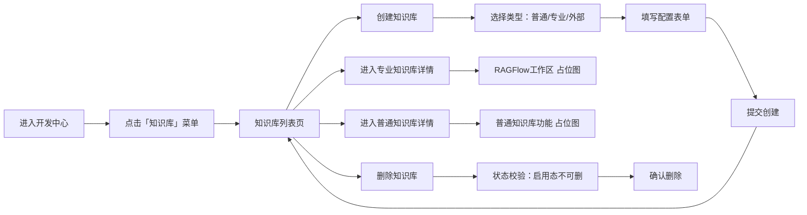

# 知识库模块 — 产品需求规格文档（PRD Draft）

---

## 0. 文档信息

| 字段 | 值 |
|------|-----|
| **文档版本** | v0.2 |
| **对应产品版本** | GA 智能警务平台 V3 |
| **模块** | 知识库 |
| **作者** | - |
| **创建日期** | 2026-07-17 |
| **状态** | Draft（初稿） |

### 版本变更记录

| 版本 | 日期 | 变更人 | 变更内容 |
|------|------|--------|----------|
| v0.2 | 2026-07-17 | - | 补充背景：三种接入类型定义（普通=自研/专业=RAGFlow/外部=API），普通知识库含三种子类型；统一占位图策略；更新术语表 |
| v0.1 | 2026-07-17 | - | 初稿，梳理现有功能框架与页面结构 |

---

## 1. 模块定位

知识库模块负责各类业务知识的创建、运维与检索。平台支持三种知识库**接入类型**：

### 1.1 三种接入类型

| 类型 | 代码标识 | 说明 | Demo 策略 |
|------|----------|------|-----------|
| **普通知识库** | `easy` | 我司自研知识库，内部支持三种**数据形态**：文档知识库（非结构化文档）、结构化知识库（数据库表）、图知识库（实体-关系图谱）。功能已实现，原型中不追求复现。 | **占位图说明**，展示功能截图与简要文字描述 |
| **专业知识库** | `professional` | 集成 RAGFlow 引擎的知识库，具备完整 RAG 能力（文档解析、切片、向量化、语义检索）。内部功能由 RAGFlow 提供。 | **占位图说明**，展示 RAGFlow 工作区截图与简要文字描述 |
| **外部知识库** | `external` | 通过符合外部知识库 API 规范的接口进行接入，数据存储与检索在外部系统完成，平台仅做代理映射。 | 配置外部 API 地址与认证信息 |

### 1.2 普通知识库的子类型

> 以下为自研知识库已实现的三种数据形态，**原型中以占位图描述，不追求复现其内部功能**。

| 子类型 | 数据形态 | 说明 |
|--------|----------|------|
| 文档知识库 | 非结构化文档（PDF/Word/MD 等） | 目录树组织 → 文件上传/导入 → 向量化加工 → 片段管理 → 权限发布 |
| 结构化知识库 | 关系型数据库表数据 | 数据源表接入 → 字段映射 → 向量化索引 → 数据更新同步 |
| 图知识库 | 实体-关系图谱数据 | 图文件导入（MinIO/文件库）→ 图谱构建 → 可视化预览 → 实体检索 |

### 1.3 核心能力链

**普通知识库**：数据接入 → 解析切分 → 向量化索引 → 启停服务 → 授权发布

**专业知识库**：平台配置 → 委托 RAGFlow 引擎处理 → 检索代理

**外部知识库**：平台配置 API 端点 → 检索请求代理转发 → 结果聚合

---

## 2. 端到端主流程



---

## 3. 功能清单

### 3.1 功能索引

| ID | 名称 | 层级 | 路由 / 入口 | 备注 |
|----|------|------|------------|------|
| K01 | 知识库列表 | Page | `/dev/knowledge` | 开发中心入口 |
| K02 | 知识库列表：分类统计 | Component | `/dev/knowledge` | 顶部统计卡片 |
| K03 | 知识库列表：筛选与搜索 | Component | `/dev/knowledge` | FilterBar |
| K04 | 知识库列表：分页 | Component | `/dev/knowledge` | 卡片列表分页 |
| K05 | 选择知识库类型 | Modal | 点击「创建知识库」 | 三类选择 |
| K06 | 创建专业知识库 | Drawer | K05 → 选专业 | 含高级配置（切分/向量模型等） |
| K07 | 创建普通知识库 | Drawer | K05 → 选普通 | 基础表单 |
| K08 | 创建外部知识库 | Drawer | K05 → 选外部 | 含API地址配置 |
| K09 | 专业知识库详情 | Inline | 点击专业卡片 | RAGFlow 占位图 |
| K10 | 普通/外部知识库详情 | Inline | 点击普通/外部卡片 | 占位图/基本信息编辑 |
| K11 | 删除知识库 | Action | 卡片更多菜单 | 启用态拦截 |
| K12 | 知识库分析 | Page | `/ops/knowledge-analysis` | 运维中心 |

### 3.2 核心功能清单

| ID | 功能 | 优先级 | 说明 |
|----|------|--------|------|
| A-列出 | 知识库列表展示 | P0 | 卡片形式，展示名称/类型/状态/创建人 |
| A-创建 | 创建知识库 | P0 | 三步：选类型 → 填配置 → 提交 |
| A-详情 | 查看知识库详情 | P0 | 三种类型均用占位图展示内部功能 |
| A-删除 | 删除知识库 | P0 | 启用态拦截，空库可删 |
| A-筛选 | 搜索与筛选 | P1 | 名称搜索 + 类型筛选 + 状态筛选 |
| A-统计 | 分类统计 | P1 | 全部/普通/专业/外部 各数量 |
| A-分析 | 运维分析面板 | P2 | 运维中心 Tab |

---

## 4. 详细功能描述

### 4.1 K01 · 知识库列表页

**路由**：`/dev/knowledge`
**入口**：开发中心 → 侧边栏 → 知识库

**页面布局**：

```
┌────────────────────────────────────────────┐
│  PageHeader: 知识库                         │
│  描述：管理知识库实例，支持文档/结构化/图谱等…    │
├────────────────────────────────────────────┤
│  ┌──────┐ ┌──────┐ ┌──────┐ ┌──────┐      │
│  │ 全部  │ │ 普通  │ │ 专业  │ │ 外部  │  ← 统计Tab│
│  │  5   │ │  1   │ │  2   │ │  2   │      │
│  └──────┘ └──────┘ └──────┘ └──────┘      │
├────────────────────────────────────────────┤
│  [创建知识库]                    [搜索...]   │ ← 工具栏│
│                               [类型▾] [状态▾]│
├────────────────────────────────────────────┤
│  ┌──────────┐ ┌──────────┐                │
│  │ 知识库卡片 │ │ 知识库卡片 │                │ ← 卡片列表│
│  │ 类型 · 状态│ │ 类型 · 状态│                │
│  │ 创建人/时间│ │ 创建人/时间│                │
│  │ [更多▾]  │ │ [更多▾]  │                │
│  └──────────┘ └──────────┘                │
├────────────────────────────────────────────┤
│                    页码: < 1 2 3 >         │
└────────────────────────────────────────────┘
```

**交互行为**：

| 操作 | 行为 |
|------|------|
| 点击统计Tab | 按分类过滤卡片列表 |
| 点击「创建知识库」 | 打开类型选择 Modal |
| 点击卡片 | 进入知识库详情视图（替换列表视图） |
| 卡片「更多」→ 编辑 | 进入普通/外部库的编辑视图 |
| 卡片「更多」→ 删除 | 弹出确认对话框 |
| 搜索/筛选 | FilterBar 实时过滤 |

**卡片展示字段**：知识库名称、类型Tag、创建人、创建时间、状态Tag

---

### 4.2 K05/K06/K07/K08 · 创建知识库

**流程**：

```
点击「创建知识库」
   → [类型选择 Modal]
       ├── 普通知识库 ──→ [普通创建 Drawer]
       ├── 专业知识库 ──→ [专业创建 Drawer]
       └── 外部知识库 ──→ [外部创建 Drawer]
```

#### K06 · 创建专业知识库

| 字段 | 组件 | 约束 |
|------|------|------|
| 知识库名称 | Input | ≤50 |
| 知识库描述 | TextArea | ≤500 |
| 嵌入模型(Embedding) | Select | 下拉选择 |
| 解析方式 | Select | 文字提取 / OCR识别 |
| 切片大小 | InputNumber | 字符数 |
| 重叠比例 | Slider | 0%~100% |
| 表格上下文 | Switch | 是否启用 |
| 父子块检索 | Switch | 是否启用 |
| 自动元数据生成 | Switch | 是否启用 |

> **Demo 模拟逻辑**：提交后根据名称是否包含「失败」模拟成功/失败，失败时可「重试创建」。

#### K07 · 创建普通知识库

| 字段 | 组件 | 约束 |
|------|------|------|
| 知识库名称 | Input | ≤50 |
| 知识库描述 | TextArea | ≤500 |

> 普通知识库创建后进入详情页，内部功能（文档管理/结构化导入/图谱构建等）在原型中用**占位图**说明。

#### K08 · 创建外部知识库

| 字段 | 组件 | 约束 |
|------|------|------|
| 知识库名称 | Input | ≤50 |
| 知识库描述 | TextArea | ≤500 |
| 外部 API 地址 | Input | URL 格式校验 |
| 认证方式 | Select | API Key / OAuth / 无 |
| 认证凭证 | Input.Password | - |

> 外部知识库数据不在本地存储，平台仅代理检索请求、聚合结果。

---

### 4.3 K09 · 专业知识库详情

**进入方式**：在列表页点击「专业知识库」类型的卡片。

> **原型策略**：内部功能由 RAGFlow 引擎提供，原型中展示**占位图**说明 RAGFlow 工作区，不追求复现文档上传、向量化、片段管理等内部功能。
>
> Demo 中可通过 iframe `srcDoc` 内嵌模拟页面来模仿 RAGFlow 界面结构，但原则上用静态占位图即可。

**占位图应说明的功能区**：

| 功能区 | 说明 |
|--------|------|
| 文档管理 | 上传/导入文档，查看文件列表与向量化状态 |
| 解析配置 | 切分方式、切片大小、重叠比例、Embedding 模型 |
| 权限设置 | 发布至知识广场、授权对象管理 |
| 检索测试 | 知识库内语义检索调试 |

---

### 4.4 K10 · 普通/外部知识库详情

#### 普通知识库详情

> **原型策略**：内部功能（文档/结构化/图谱管理）已实现，原型中用**占位图**说明，截图 + 文字描述其能力边界。

**占位图应说明的功能区**：

| 功能区 | 对应子类型 | 说明 |
|--------|-----------|------|
| 目录树 + 文件列表 | 文档知识库 | 左侧目录树、右侧文件台账、上传/导入/向量化 |
| 数据导入 + 字段映射 | 结构化知识库 | 数据源选择、字段映射编辑、更新同步 |
| 图谱预览 + 实体检索 | 图知识库 | 文件导入、图谱画布、实体关系统计 |

#### 外部知识库详情

展示已配置的 API 地址、认证方式等基本信息，支持编辑。实际数据检索由外部系统完成，平台不做本地存储。

---

### 4.5 K11 · 删除知识库

| 条件 | 行为 |
|------|------|
| 知识库状态为「启用」 | 拦截，提示「该知识库为启用状态，无法删除」 |
| 知识库状态为「停用」且空库 | 弹出二次确认 → 删除 |
| 知识库状态为「停用」且含数据 | 拦截，提示需先清理数据 |

---

### 4.6 K12 · 知识库分析（运维中心）

**路由**：`/ops/knowledge-analysis`
**入口**：运维中心 → 资源监控 → 知识库分析

复用运维监控页面框架，展示知识库维度的使用统计。

---

## 5. 与其它模块的关系

| 关联模块 | 关系 |
|----------|------|
| 智能体管理 | 智能体可绑定知识库作为 RAG 知识源 |
| 智能体配置 | 配置面板中选择/绑定知识库 |
| 资源广场 | 知识库可发布至广场供用户检索安装 |
| 我的资源 | 用户安装的知识库资源列表 |
| 空间管理 | 空间统计中展示知识库数量 |

---

## 6. 术语表

| 术语 | 定义 |
|------|------|
| 知识库 | 平台中可被智能体检索的知识集合，承载文档、结构化数据、图谱等知识资产 |
| 普通知识库 | 我司自研知识库，内部支持文档型、结构化、图谱型三种数据形态，功能已实现 |
| 文档知识库 | 普通知识库子类型，以非结构化文档（PDF/Word/MD 等）为数据源的 RAG 知识库 |
| 结构化知识库 | 普通知识库子类型，以关系型数据库表数据为数据源，通过字段映射与向量化实现语义检索 |
| 图知识库 | 普通知识库子类型，以实体-关系图谱为数据结构，支持图可视化与实体检索 |
| 专业知识库 | 集成 RAGFlow 引擎的知识库，由 RAGFlow 提供文档解析、向量化、语义检索等能力 |
| 外部知识库 | 通过符合外部知识库 API 规范的接口接入的远程知识库，数据不在本地存储 |
| 向量化 | 将文本通过 Embedding 模型转换为多维向量，支持语义相似度检索 |
| RAG | 检索增强生成（Retrieval-Augmented Generation），先检索相关知识再交给大模型回答 |
| Embedding | 嵌入模型，用于将文本映射为向量 |
| Chunk（片段） | 文档切分后的最小知识单元，是智能体检索索引用的原子单位 |
| 知识广场 | 平台门户，发布后的知识库在此供组织内用户检索与收藏 |

---

## 7. 待确认问题

- [ ] 知识库空间归属关系（当前 Demo 中知识库未明确关联空间，是否需要像"空间管理"一样绑定空间？）
- [ ] 空间管理中「知识库数量」与知识库模块的联动逻辑
- [ ] 权限管理与空间成员体系的集成方案
- [ ] 知识库操作日志记录方案
- [ ] 外部知识库 API 规范的详细定义
- [ ] 专业知识库（RAGFlow）与平台的认证打通方案
