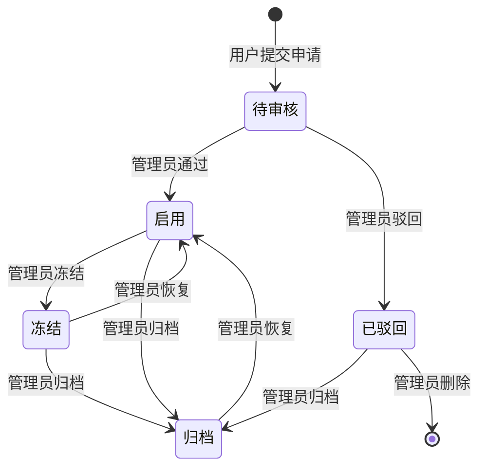

# 开发中心空间切换器 V2 需求设计

## 1. 需求背景

### 1.1 问题描述
用户在开发平台中可能拥有多个工作空间（个人空间、工作空间、专案空间），需要在不同空间之间快速切换以进行智能体开发协作。如果空间切换入口过于隐蔽或操作路径过长，会降低多空间协作场景下的用户体验。

此外，当用户需要加入新的工作空间时，缺乏便捷的自主申请通道——目前只能由管理员在管理中心手动创建空间，普通用户无法主动发起空间申请。这导致跨部门协作效率低下，用户需要线下沟通才能加入新空间。

### 1.2 目标用户
- 所有开发平台的登录用户（在侧边栏顶部展示空间切换入口）
- 仅在开发中心侧边栏展示该组件（其他模块不依赖空间上下文）
- **新增**：需要申请新空间的普通用户（通过空间切换弹窗发起申请）
- **新增**：平台管理员（在管理中心审批空间申请）

### 1.3 业务目标
- 在侧边栏顶部展示当前空间名称和头像，点击打开空间选择弹窗
- 弹窗支持按空间名称搜索过滤
- 清晰区分当前空间、可用空间和已冻结空间三种状态
- 选中后通过 WorkspaceContext.switchSpace 即时切换，全局联动
- **新增**：弹窗左下角提供「申请新的空间」入口，降低空间申请门槛
- **新增**：申请表单复用创建空间流程，用户提交后进入管理员审批
- **新增**：审批通过的空间自动出现在切换器中，形成「申请→审批→可用」闭环

---

## 2. 产品定位

### 2.1 产品定义
空间切换器（`WorkspaceSwitcher`）是一个共享组件，嵌入在开发中心侧边栏顶部。点击触发器弹出 Modal 展示可用空间列表，用户选择后立即切换空间上下文。
在 Modal 底部增加「申请新的空间」操作入口，串联空间申请与管理审批链路，实现从"只能切换已有空间"到"可主动申请新空间"的产品闭环。

### 2.2 核心价值
1. **快速切换**：侧边栏顶部常驻入口，一键打开弹窗
2. **全局联动**：切换后通过 WorkspaceContext 驱动所有页面数据刷新
3. **状态可视**：当前空间绿标高亮、已冻结灰显置灰，一目了然
4. **搜索过滤**：支持按空间名称模糊搜索
5. **自主申请**：用户无需离开开发中心即可发起空间申请，降低协作门槛
6. **审批闭环**：申请 → 管理员审批 → 空间启用 → 出现在切换器，全流程可追踪

---

## 3. 用户故事

### 3.1 正向场景（Happy Path）

#### 故事 A：空间切换

作为开发者
在需要切换到不同工作空间时，
为了快速进入目标空间进行工作，
需要通过侧边栏顶部的空间切换器选择目标空间。

#### 故事 B：申请新空间

作为开发者
在开发中心切换工作空间时发现没有想要加入的空间，
为了自主发起空间创建申请而无需线下沟通，
需要在空间切换弹窗中点击"申请新的空间"并填写申请表单。

#### 故事 C：管理员审批空间申请

作为平台管理员
在收到用户的建空间申请后，
为了控制空间创建的质量和合理性，
需要在管理中心的空间管理页面审核申请并做出通过或驳回决定。

### 3.2 负向场景（Unwanted Behavior）

#### 负向 A

作为开发者
在浏览空间列表时，
为了避免误操作进入已冻结的空间，
系统应阻止选择已冻结的空间。

#### 负向 B

作为开发者
在申请新空间时，
为了避免提交不合规的空间申请，
系统应在提交前要求必填字段（空间名称、负责人、空间类型），并阻止空表单提交。

#### 负向 C

作为平台管理员
在处理空间申请时，
为了保留审批记录和可追溯性，
驳回的申请不应直接删除，而应标记为"已驳回"状态并可查看申请详情。

---

## 4. 用户旅程

### 4.1 端到端主流程图

```mermaid
flowchart TD
    A[侧边栏渲染] --> B{当前模块是否为开发中心?}
    B -->|否| C[不渲染 WorkspaceSwitcher]
    B -->|是| D[渲染空间触发器]
    D --> E[展示当前空间头像+名称]
    E --> F{用户点击触发器}
    F -->|点击| G[打开切换弹窗]
    G --> H[加载可用空间列表]
    H --> I{用户操作}
    I -->|输入搜索关键词| J[实时过滤空间列表]
    J --> H
    I -->|点击当前空间| K[无操作，弹窗保持]
    I -->|点击已冻结空间| L[无响应，不可切换]
    I -->|点击可用空间/进入按钮| M[switchSpace 切换空间]
    M --> N[关闭弹窗，清空搜索]
    N --> O[WorkspaceContext 更新 currentSpace]
    O --> P[所有页面数据刷新]
    I -->|点击取消/关闭| Q[关闭弹窗，清空搜索]
    I -->|点击"申请新的空间"| R[打开申请抽屉]
```

### 4.2 空间申请审批闭环流程图

```mermaid
flowchart TD
    R[用户在切换弹窗点击"申请新的空间"] --> S[打开 StepDrawer 申请抽屉]
    S --> T[步骤1: 填写基本信息]
    T --> U[步骤2: 选择预置资源]
    U --> V[步骤3: 管理成员]
    V --> W[步骤4: 确认提交]
    W --> X{用户点击"提交申请"}
    X -->|提交| Y[空间以"待审核"状态写入数据]
    Y --> Z[关闭抽屉，显示成功提示]
    Z --> AA[空间出现在管理中心空间列表]
    AA --> AB{管理员操作}
    AB -->|审核通过| AC[状态变为"启用"]
    AC --> AD[空间出现在所有用户的切换器中]
    AB -->|驳回| AE[状态变为"已驳回"]
    AE --> AF[申请人可在切换器底部查看"我的申请"记录]
    X -->|取消| AG[关闭抽屉，不保存]
```

**逐段解释：**
1. 组件仅在开发中心模块下渲染（AppLayout L107: `activeModule === 'dev'`）
2. 触发器展示当前空间首字头像（渐变蓝底蓝字）和名称，折叠模式仅展示头像
3. Modal 打开后从 WorkspaceContext 获取 `spaces` 列表（仅启用空间，个人空间排最前）
4. 搜索使用 useMemo 实时过滤，匹配 name 字段
5. 点击非当前非冻结空间 → 调用 switchSpace → 关闭弹窗
6. 当前空间卡片边框蓝色高亮 + 绿色"当前空间"标签，不可重复切换
7. **新增**：弹窗左下角"申请新的空间"按钮 → 打开申请抽屉（复用创建空间的 StepDrawer）
8. **新增**：申请人填写4步骤表单 → 提交后空间以"待审核"状态创建
9. **新增**：管理员在 `/manage/space-manage` 查看待审核申请 → 通过/驳回
10. **新增**：通过后空间状态变为"启用"，出现在切换器中；驳回到"已驳回"，仅申请人可见

### 4.3 主流程覆盖模块对齐表

| Coverage Index ID | 页面/模块 | PRD章节定位 | 流程图节点名 | 是否覆盖 |
|---|---|---|---|---|
| C01 | 空间切换器 | 5.2.1 | 侧边栏渲染空间触发器 | ✅ |
| C01 | 空间切换弹窗 | 5.2.2 | 打开切换弹窗 | ✅ |
| C01 | 搜索过滤 | 5.2.3 | 实时过滤空间列表 | ✅ |
| C02 | 申请新空间入口 | 5.3 | 点击"申请新的空间" | ✅ |
| C02 | 空间申请表单 | 5.4 | 打开申请抽屉 | ✅ |
| C02 | 管理员审批 | 5.5 | 审核通过/驳回 | ✅ |

---

## 5. 功能清单与详细说明

### 5.0 功能覆盖索引

| ID | 页面/模块 | 类型 | 关键功能 | PRD章节定位 | 覆盖状态 |
|---|---|---|---|---|---|
| C01 | 空间切换器 | 共享组件 | 侧边栏常驻+Modal切换 | 5.2 | ✅已覆盖 |
| C02 | 申请新空间 | 共享组件+管理页面 | 弹窗入口→申请表单→管理审批→闭环 | 5.3-5.5 | ✅已覆盖 |

### 5.1 核心功能清单

| 功能点 | 优先级 | 功能描述 |
|---|---|---|
| 侧边栏触发器 | P0 | 展示当前空间头像+名称，折叠模式仅头像 |
| 空间切换弹窗 | P0 | Modal 680px 宽，展示空间列表+搜索 |
| 空间搜索过滤 | P0 | 按空间名称实时模糊搜索 |
| 空间状态区分 | P0 | 当前/可用/冻结三种状态差异化展示 |
| 空间即时切换 | P0 | 点击后 switchSpace，全局联动刷新 |
| **申请新的空间入口** | **P0** | **弹窗左下角增加"申请新的空间"操作入口** |
| **空间申请表单** | **P0** | **复用创建空间的4步骤 StepDrawer，最后一步按钮为"提交申请"** |
| **管理员审批** | **P0** | **管理中心空间列表支持"待审核"状态，提供"通过"/"驳回"操作** |
| **审批闭环** | **P0** | **通过→空间启用→加入切换器；驳回→已驳回→仅申请人可见** |

---

### 5.2 功能详细说明

#### [C01] 空间切换器

##### 1. 组件介绍

共享组件 `WorkspaceSwitcher`，接收 `collapsed` 和 `inline` 两个 Props，在侧边栏顶部渲染。非运维中心模块下展示。当前空间信息由 `useWorkspace()` 从 WorkspaceContext 读取。

##### 2. Props

| 属性 | 类型 | 默认值 | 说明 |
|---|---|---|---|
| collapsed | boolean | false | 侧边栏折叠状态，折叠时仅展示 26px 首字头像 |
| inline | boolean | false | 内联模式，用于页面头部，无边框无背景 |

##### 3. 触发器（Trigger）交互元素

**展开模式：**

| 元素 | 类型 | 说明 |
|---|---|---|
| 空间首字头像 | 展示 | 24x24px，圆角 5px，渐变蓝底（#e6f4ff）蓝字（#1677ff），fontSize 11px fontWeight 700 |
| 空间名称 | 文本 | fontSize 12px，fontWeight 600，颜色 #1D2129，textOverflow ellipsis |
| 下拉箭头 | 图标 | ▼ Unicode 字符，fontSize 10px，颜色 #B0B8C8 |

**折叠模式：**

| 元素 | 类型 | 说明 |
|---|---|---|
| 空间首字头像 | 展示 | 26x26px，圆角 7px，样式同上，居中 |

**交互：**
- hover 时背景变为 #fafafa（inline 模式下背景不变）
- 点击触发 `setModalOpen(true)` 打开切换弹窗

##### 4. 切换弹窗（Modal）交互元素

**弹窗容器：**

| 属性 | 值 | 说明 |
|---|---|---|
| 宽度 | 680px | 固定宽度 |
| 标题 | 无（title=null） | 自绘标题行 |
| 底部 | 无（footer=null） | 无底部按钮 |
| 销毁 | destroyOnHidden | 关闭时销毁 DOM |
| 内边距 | 24px 28px 28px | body padding |

**弹窗内容：**

| 区域 | 元素 | 说明 |
|---|---|---|
| 标题行 | "切换工作空间" | fontSize 18px，fontWeight 700，颜色 #1D2129 |
| 副标题 | "选择您要进入的工作空间，当前共有 N 个可用空间" | fontSize 13px，颜色 #7A8599，N 为过滤后非归档非待审核非已驳回空间数 |
| 搜索框 | Input prefix SearchOutlined | placeholder="搜索空间名称"，allowClear，圆角 6px |
| 空间列表 | 滚动容器 | flex column，gap 8px，可滚动，最大高度 72vh 内 |
| **底部操作区（新增）** | **"申请新的空间"入口** | **见 5.3 节** |

**空间卡片（每条记录）：**

| 元素 | 类型 | 说明 |
|---|---|---|
| 空间头像 | 展示 | 44x44px，圆角 8px，渐变蓝底（#e6f4ff）蓝字（#1677ff），fontSize 18px fontWeight 700 |
| 空间名称 | 文本 | fontSize 15px，fontWeight 600，颜色 #1D2129 |
| 默认空间标签 | Tag（仅个人空间） | 蓝色边框"默认空间"，fontSize 11px，圆角 4px |
| 已冻结标签 | Tag（仅冻结空间） | 灰色"已冻结"，fontSize 11px，圆角 4px |
| 当前空间标签 | Tag（仅当前空间） | 绿色"当前空间"，CheckCircleFilled 图标，fontSize 11px |
| 描述文本 | 文本 | fontSize 13px，颜色 #5F6B7A：个人空间固定文案，其他为"{dept} · 由{creator}创建及维护 · 空间用于{dept}的智能体开发协作" |
| 成员数 | 文本+TeamOutlined | fontSize 12px，颜色 #7A8599，"N 位成员" |
| 智能体数 | 文本+RobotOutlined | fontSize 12px，颜色 #7A8599，"N 智能体" |
| 所属部门 | 文本+BankOutlined | fontSize 12px，颜色 #7A8599 |
| 创建时间/所有者 | 文本 | 个人空间显示所有者姓名，其他显示"创建于 YYYY-MM-DD" |
| 进入按钮 | Button（非当前非冻结） | 蓝色 #1677ff，白色文字，fontSize 12px，padding 5px 16px，圆角 5px |
| 已冻结文字 | 文本（冻结空间） | "已冻结"，fontSize 12px，灰色 #8c8c8c，背景 #f5f5f5 |

**卡片状态样式：**

| 状态 | 背景 | 边框 | 鼠标 | opacity |
|---|---|---|---|---|
| 当前空间 | #F7F9FC | 1px solid #1677ff30 | default | 1 |
| 可用空间 | #fff | 1px solid #E5EAF3 | pointer（hover: #FAFBFC, #BCC7DB） | 1 |
| 冻结空间 | #fafafa | 1px solid #e8e8e8 | not-allowed | 0.6 |

##### 5. 搜索过滤行为

- 过滤源：`spaces`（来自 WorkspaceContext，已排除归档、待审核、已驳回且按个人空间优先排序）
- 匹配字段：name（大小写不敏感）
- 空搜索词时显示全部
- 无匹配结果时显示"未找到匹配的空间"空状态提示

##### 6. 切换行为

- 点击非当前非冻结卡片的任意区域 → `switchSpace(space.id)` → `setModalOpen(false)` → `setSearch('')`
- 点击"进入"按钮 → 同上（e.stopPropagation 防止重复触发）
- 点击当前空间卡片 → 无操作（不关闭弹窗）
- 点击冻结空间卡片 → 无响应
- 关闭弹窗（onCancel / 点击遮罩）→ `setModalOpen(false)` → `setSearch('')`

##### 7. Evidence

- code: `src/components/WorkspaceSwitcher.tsx` - 完整组件源码
- code: `src/contexts/WorkspaceContext.tsx` - 空间上下文，提供 currentSpace/spaces/switchSpace
- code: `src/layouts/AppLayout.tsx` L107 - 嵌入侧边栏的条件渲染
- code: `src/mock/data.ts` L174-202 - SpaceItem 接口定义

---

### 5.3 [C02] 申请新空间入口 — 弹窗底部操作区

#### 位置

位于空间切换 Modal 内容区的最底部，空间列表与弹窗底部之间，左对齐。

#### 交互元素

| 元素 | 类型 | 说明 |
|---|---|---|
| 分割线 | Divider | 1px solid #f0f0f0，上下各 16px margin |
| "申请新的空间"链接 | 按钮/文字链接 | 蓝色 #1677ff，fontSize 13px，前缀 PlusCircleOutlined 图标（14px） |
| 提示文字 | 辅助文本 | 紧跟在按钮右侧或下方，fontSize 12px，颜色 #B0B8C8，"需要加入新的工作空间？" |

#### 交互行为

- 点击"申请新的空间" → 关闭当前 Modal → 打开申请 StepDrawer
- 关闭 Modal 时不清空搜索（保留用户上下文，方便再次打开时继续）
- 点击"申请新的空间"时同样清空搜索（因为即将打开申请抽屉）

#### 视觉参考

```
┌─────────────────────────────────────────────┐
│  切换工作空间                                │
│  选择您要进入的工作空间...                    │
│  [🔍 搜索空间名称________________]           │
│                                             │
│  ┌─ 指挥中心空间 ──────────────────────┐     │
│  │ ...                                 │     │
│  └─────────────────────────────────────┘     │
│  ┌─ 反诈中心空间 ──────────────────────┐     │
│  │ ...                                 │     │
│  └─────────────────────────────────────┘     │
│                                             │
│  ─────────────────────────────────────       │
│  ⊕ 申请新的空间   需要创建新的工作空间？       │
└─────────────────────────────────────────────┘
```

---

### 5.4 [C02] 空间申请表单（复用创建空间 StepDrawer）

#### 1. 组件复用

申请表单**完全复用**管理中心「创建空间」的 4 步骤 StepDrawer（`src/components/StepDrawer.tsx`），与 `src/pages/ops-spaces/index.tsx` 中的创建流程共享同一套 UI 和逻辑：

#### 2. 步骤定义

| 步骤 | 标题 | 说明 |
|---|---|---|
| 步骤 0 | 基本信息 | 空间名称（必填）、空间描述、空间图标、所属警种/部门、负责人（必填）、空间类型（必填，工作空间/专案空间） |
| 步骤 1 | 预置资源 | 从平台预置资源中选择模型、提示词、工具、连接器、知识库（多选，可选） |
| 步骤 2 | 成员管理 | 添加初始成员并设置角色（可选，负责人自动成为"所有者"） |
| 步骤 3 | 确认提交 | 展示前三个步骤的汇总信息，供用户最终确认 |

#### 3. 与创建流程的差异点

| 对比项 | 创建空间（管理员） | 申请新空间（普通用户） |
|---|---|---|
| 触发入口 | `/manage/space-manage` FilterBar "创建空间"按钮 | 空间切换弹窗底部"申请新的空间" |
| 抽屉标题 | "创建空间" | "申请新的空间" |
| 最后一步按钮 | "确认创建" | **"提交申请"** |
| 提交后状态 | 直接「启用」 | **「待审核」** |
| 提交后提示 | `message.success('空间创建成功')` | **`message.success('空间申请已提交，请等待管理员审核')`** |
| 提交后行为 | 关闭抽屉，刷新列表 | 关闭抽屉，申请的空间进入管理中心待审核列表 |

#### 4. 表单校验规则（与创建空间一致）

| 字段 | 规则 | 触发时机 |
|---|---|---|
| 空间名称 | 必填，不能为空 | 点击"下一步"或"提交申请"时校验 |
| 负责人 | 必填，从 memberOptions 中选取 | 同上 |
| 空间类型 | 必填，可选"工作空间"或"专案空间" | 同上 |
| 空间描述 | 选填 | — |
| 所属警种/部门 | 选填 | — |
| 预置资源 | 选填 | — |
| 成员 | 选填 | — |

#### 5. 提交后的数据流

```
用户点击"提交申请"
  → 构造新的 SpaceItem 对象（id 自增，status='待审核'）
  → 写入 mockSpaces 数组（临时方案） / 调用后端 API
  → message.success('空间申请已提交，请等待管理员审核')
  → 关闭 StepDrawer，重置表单状态
  → 管理中心空间列表自动包含该待审核记录
```

#### 6. 申请人可见性

- 提交后，申请的空间**不会**立即出现在空间切换弹窗的可用空间列表中（因为 status 不是"启用"）
- 此行为与 WorkspaceContext 中 `spaces` 仅包含 `status === '启用'` 保持一致

---

### 5.5 [C02] 管理员审批 — 管理中心空间管理扩展

#### 1. 页面组织：三 Tab 架构

在 `/manage/space-manage`（`ops-spaces/index.tsx`）页面中，使用 `PageTabs` 组件将原有单一空间列表拆分为三个 Tab：

| Tab | 标签名 | 数据范围 | 核心操作 |
|---|---|---|---|
| Tab 1 | **空间管理** | 启用 / 冻结 / 归档（原有三种状态） | 创建空间、编辑、冻结/归档/恢复/删除 |
| Tab 2 | **待审批** | 待审核 | 通过 / 驳回 |
| Tab 3 | **审批记录** | 已驳回 | 删除 / 归档 |

**默认激活 Tab**：空间管理（保持用户进入页面时的既有体验）。

**Tab 切换行为**：切换 Tab 时保留各自的搜索和筛选状态，互不干扰。

#### 2. 页面布局

```
┌──────────────────────────────────────────────────────┐
│  空间管理                        [提示文字]           │  ← PageHeader
├──────────────────────────────────────────────────────┤
│  [空间管理]  [待审批 (N)]  [审批记录]                 │  ← PageTabs（页面级导航，置于顶部）
├──────────────────────────────────────────────────────┤
│  ┌──────┐ ┌──────┐ ┌──────┐ ┌──────┐               │  ← StatCards（根据 Tab 动态更新数值）
│  │总空间│ │个人  │ │工作  │ │专案  │               │
│  │  12  │ │  1   │ │  8   │ │  3   │               │
│  └──────┘ └──────┘ └──────┘ └──────┘               │
├──────────────────────────────────────────────────────┤
│  🔍 搜索  [状态▼] [类型▼]  [搜索] [重置]  [+ 创建]  │  ← FilterBar（按 Tab 动态适配）
├──────────────────────────────────────────────────────┤
│  ┌──────────────────────────────────────────────┐    │
│  │ 空间名称    │ 部门 │ 类型 │ 成员 │ ... │ 操作 │    │  ← Table
│  │ 指挥中心空间 │ ...  │ ...  │  12  │ ... │ ...  │    │
│  │ ...                                         │    │
│  └──────────────────────────────────────────────┘    │
└──────────────────────────────────────────────────────┘
```

#### 3. 各 Tab 详细设计

##### 3.1 Tab 1：空间管理（继承现有功能）

**数据源**：`mockSpaces` 中 status 为「启用」「冻结」「归档」的空间。

**统计卡片**：展示总空间数（启用+冻结+归档）、个人空间数、工作空间数、专案空间数（不含待审核和已驳回）。

**筛选条件**（FilterBar）：
- 搜索框：按空间名称搜索
- 状态筛选：「启用」「冻结」「归档」（**不移入**待审核/已驳回选项）
- 类型筛选：「个人空间」「工作空间」「专案空间」

**操作能力**：保持现有全部功能（创建空间按钮、编辑、成员管理、冻结/归档/启用/恢复/删除下拉菜单）。

> 注意：原有 `statusColorMap` 保持 `{ '启用': 'green', '冻结': 'blue', '归档': 'default' }`，无需在本 Tab 中感知待审核和已驳回。

##### 3.2 Tab 2：待审批

**Tab 标签**：`待审批`，当有待审批记录时显示角标数字 `待审批 (N)`。

**数据源**：`mockSpaces` 中 status 为「待审核」的空间。

**统计卡片**：切换至此 Tab 时统计卡片更新为审批相关指标：
| 卡片 | 说明 |
|---|---|
| 待审批 | 当前待审核空间数 |
| 已通过（今日） | 当日审批通过的空间数（mock 阶段可展示固定值或 0） |
| 已驳回（累计） | 历史驳回总数（已驳回状态的空间数） |
| 平均处理时长 | mock 阶段展示固定值如"约 2 小时" |

**筛选条件**（FilterBar）：
- 搜索框：按空间名称搜索
- 类型筛选：「工作空间」「专案空间」
- 时间范围筛选：申请时间范围（可选，DatePicker.RangePicker）
- **不展示**"创建空间"按钮，不展示状态筛选

**表格列定义**：

| 列名 | 宽度 | 说明 |
|---|---|---|
| 空间名称 | 200 | 首字头像 + 名称（点击可查看详情）+ 部门 |
| 空间类型 | 100 | Tag：工作空间 / 专案空间 |
| 申请人 | 90 | 申请者姓名（即 creator 字段） |
| 所属部门 | 110 | dept |
| 成员数 | 70 | memberCount |
| 申请时间 | 120 | createTime（YYYY-MM-DD HH:mm） |
| 操作 | 160 | 通过 + 驳回按钮 |

**操作列**：

| 操作 | 样式 | 说明 |
|---|---|---|
| 通过 | Button type="link" size="small"，绿色 #52c41a，CheckCircleOutlined | 点击 → ConfirmActionModal 通过确认 → 状态变为"启用" |
| 驳回 | Button type="link" size="small"，红色 #ff4d4f，CloseCircleOutlined | 点击 → ConfirmActionModal 驳回确认 → 状态变为"已驳回" |

##### 3.3 Tab 3：审批记录

**Tab 标签**：`审批记录`。

**数据源**：`mockSpaces` 中 status 为「已驳回」的空间。

**统计卡片**：与本 Tab 数据关联：
| 卡片 | 说明 |
|---|---|
| 已驳回 | 已驳回空间总数 |
| 已通过 | 历史通过空间总数（mock 展示所有启用空间中非初始 mock 数据的数量） |
| 驳回率 | 已驳回 /（已驳回 + 已通过）的百分比 |
| 最近审批时间 | 最近一次审批操作的时间 |

**筛选条件**（FilterBar）：
- 搜索框：按空间名称搜索
- 类型筛选：「工作空间」「专案空间」
- 时间范围筛选
- **不展示**"创建空间"按钮，不展示状态筛选

**表格列定义**：

| 列名 | 宽度 | 说明 |
|---|---|---|
| 空间名称 | 200 | 首字头像 + 名称 + 部门 |
| 空间类型 | 100 | Tag |
| 申请人 | 90 | creator |
| 所属部门 | 110 | dept |
| 成员数 | 70 | — |
| 驳回时间 | 120 | updateTime（审批操作时更新此字段） |
| 操作 | 140 | 删除 + 归档按钮 |

**操作列**：

| 操作 | 样式 | 说明 |
|---|---|---|
| 删除 | Button type="link" size="small" danger，DeleteOutlined | ConfirmActionModal 删除确认（需输入名称）→ 移除该申请记录 |
| 归档 | Button type="link" size="small"，SettingOutlined | ConfirmActionModal 归档确认 → 状态变为"归档" |

#### 4. 空间状态扩展

##### 4.1 SpaceStatus 类型扩展

`src/mock/data.ts` 中 SpaceStatus 类型由原来的三种扩展为五种：

```typescript
// 修改前
export type SpaceStatus = '启用' | '冻结' | '归档';

// 修改后
export type SpaceStatus = '启用' | '冻结' | '归档' | '待审核' | '已驳回';
```

##### 4.2 状态转换图



##### 4.3 各状态在 Tab 和切换器中的分布

| 状态 | Tab 1 空间管理 | Tab 2 待审批 | Tab 3 审批记录 | 空间切换弹窗 | 说明 |
|---|---|---|---|---|---|
| 启用 | ✅ 展示 | ❌ | ❌ | ✅ 展示 | 正常可用 |
| 冻结 | ✅ 展示 | ❌ | ❌ | ✅ 展示（灰色不可选） | WorkspaceSwitcher 内部单独展示 |
| 归档 | ✅ 展示 | ❌ | ❌ | ❌ 过滤 | 完全不展示 |
| 待审核 | ❌ | ✅ 展示 | ❌ | ❌ 过滤 | 等待审批，暂不可用 |
| 已驳回 | ❌ | ❌ | ✅ 展示 | ❌ 过滤 | 已被驳回，不可用 |

#### 5. 审批确认弹窗

##### 5.1 通过确认

使用 `ConfirmActionModal`（severity: 'info'）：

- 标题：「通过空间申请」
- 目标名称：`空间名称`
- 提示：
  - 「通过后，该空间将立即启用」
  - 「所有用户可在开发中心切换至该空间」
  - 「空间创建者将自动成为空间所有者」
- 确认按钮：「确认通过」（蓝色 primary）
- 无需输入空间名称确认

##### 5.2 驳回确认

使用 `ConfirmActionModal`（severity: 'warning'）：

- 标题：「驳回空间申请」
- 目标名称：`空间名称`
- 提示：
  - 「驳回后，该空间申请将被标记为"已驳回"」
  - 「驳回原因建议线下告知申请人」
  - 「已驳回的空间不会出现在用户切换列表中」
- 确认按钮：「确认驳回」（橙色 warning）
- 无需输入空间名称确认

##### 5.3 审批后行为

- **通过**：
  1. `message.success('空间申请已通过，「{空间名称}」已启用')`
  2. 该空间状态变更为"启用"，`updateTime` 更新为当前时间
  3. 该空间从 Tab 2「待审批」列表消失
  4. 该空间出现在 Tab 1「空间管理」列表
  5. 该空间满足 `WorkspaceContext.spaces` 过滤条件（status === '启用'），出现在所有用户切换器中
- **驳回**：
  1. `message.success('已驳回空间申请「{空间名称}」')`
  2. 该空间状态变更为"已驳回"，`updateTime` 更新为当前时间
  3. 该空间从 Tab 2「待审批」列表消失
  4. 该空间出现在 Tab 3「审批记录」列表

#### 6. 数据示例

```typescript
// mock/data.ts 中新增示例数据
{
  id: '11',
  name: '网安支队空间',
  dept: '网安支队',
  type: '工作空间',
  status: '待审核',
  memberCount: 3,
  agentCount: 0,
  knowledgeCount: 0,
  promptCount: 0,
  toolCount: 0,
  modelCount: 0,
  connectorCount: 0,
  creator: '赵警官',
  createTime: '2026-07-15',
  updateTime: '2026-07-15',
},
{
  id: '12',
  name: '禁毒专项小组',
  dept: '刑侦大队',
  type: '专案空间',
  status: '已驳回',
  memberCount: 2,
  agentCount: 0,
  knowledgeCount: 0,
  promptCount: 0,
  toolCount: 0,
  modelCount: 0,
  connectorCount: 0,
  creator: '钱警官',
  createTime: '2026-07-10',
  updateTime: '2026-07-12',
},
```

---

## 6. 数据模型

### 6.1 依赖数据

组件依赖 WorkspaceContext 暴露的以下数据和方法：

| 字段 | 类型 | 来源 | 说明 |
|---|---|---|---|
| currentSpace | SpaceItem | useWorkspace() | 当前空间实体 |
| spaces | SpaceItem[] | useWorkspace() | 已启用空间列表（个人空间排最前） |
| switchSpace | (id: string) => void | useWorkspace() | 切换空间方法 |

### 6.2 SpaceItem 接口（引用于 mock/data.ts）

| 字段 | 类型 | 说明 |
|---|---|---|
| id | string | 空间唯一标识 |
| name | string | 空间名称 |
| dept | string | 所属部门 |
| type | '个人空间' \| '工作空间' \| '专案空间' | 空间类型 |
| status | '启用' \| '冻结' \| '归档' \| **'待审核'** \| **'已驳回'** | 空间状态（仅启用空间在切换列表中展示） |
| memberCount | number | 成员数 |
| agentCount | number | 智能体数 |
| creator | string | 所有者/创建人 |
| createTime | string | 创建时间 YYYY-MM-DD |

> **V2 变更**：`status` 字段扩展了 `'待审核'` 和 `'已驳回'` 两个枚举值。

### 6.3 新增 WorkspaceContext 方法（可选扩展）

为支持申请功能，可考虑在 WorkspaceContext 中新增：

| 字段 | 类型 | 说明 |
|---|---|---|
| applySpace | (space: Omit<SpaceItem, 'id' \| 'createTime' \| 'updateTime'>) => void | 提交空间申请，状态自动设为"待审核" |

> 注：当前 mock 阶段可在页面组件内直接操作 mockSpaces 数组。对接真实 API 时建议收敛到 Context 或 service 层。

---

## 7. 测试标准

### 7.1 已有测试用例（C01：空间切换器）

| 用例ID | 测试场景 | 前置条件 | 操作步骤 | 预期结果 |
|---|---|---|---|---|
| TC01 | 触发器展示 | 登录开发平台 | 查看侧边栏顶部 | 展示当前空间头像和名称 |
| TC02 | 打开切换弹窗 | 登录开发平台 | 点击侧边栏触发器 | 弹出 680px Modal，标题"切换工作空间" |
| TC03 | 空间列表展示 | 打开弹窗 | 查看空间列表 | 所有启用空间展示，当前空间绿标高亮 |
| TC04 | 切换空间 | 选中非当前空间 | 点击卡片或"进入"按钮 | 弹窗关闭，侧边栏及页面数据更新 |
| TC05 | 当前空间不可重复切换 | 选中当前空间 | 点击当前空间卡片 | 弹窗保持不关闭 |
| TC06 | 冻结空间不可切换 | 弹窗中有冻结空间 | 点击冻结空间 | 无响应，按钮显示"已冻结" |
| TC07 | 搜索过滤 | 打开弹窗 | 输入"指挥" | 仅展示名称包含"指挥"的空间 |
| TC08 | 搜索无结果 | 打开弹窗 | 输入不存在的关键词 | 显示"未找到匹配的空间" |
| TC09 | 关闭弹窗清空搜索 | 已输入搜索词 | 点击取消或遮罩 | 弹窗关闭，搜索词被清空 |
| TC10 | 侧边栏折叠模式 | 侧边栏折叠 | 查看触发器 | 仅展示 26px 首字头像 |
| TC11 | 非开发中心模块不展示 | 切换到首页/应用中心/运维中心/管理中心 | 查看侧边栏顶部 | 无空间切换器 |
| TC12 | 切换后全局联动 | 打开空间管理页 | 切换空间 | 页面数据全部更新为新空间数据 |
| TC13 | 个人空间默认排前 | 有多个空间 | 打开弹窗 | 个人空间在列表最前，带"默认空间"标签 |

### 7.2 新增测试用例（C02：申请新空间闭环）

| 用例ID | 测试场景 | 前置条件 | 操作步骤 | 预期结果 |
|---|---|---|---|---|
| TC14 | 申请入口展示 | 打开空间切换弹窗 | 滚动到弹窗底部 | 显示分割线、"⊕ 申请新的空间"链接和提示文字 |
| TC15 | 点击申请入口 | 空间切换弹窗已打开 | 点击"申请新的空间" | 切换弹窗关闭，申请 StepDrawer 打开，标题"申请新的空间" |
| TC16 | 申请表单提交 | 申请抽屉已打开 | 填写必填字段（名称、负责人、类型），一路到步骤4点击"提交申请" | 抽屉关闭，提示"空间申请已提交，请等待管理员审核"，空间以"待审核"状态出现 |
| TC17 | 提交后不出现在切换器 | 已完成申请提交 | 重新打开空间切换弹窗 | 刚申请的空间不在列表中 |
| TC18 | 必填字段校验 | 申请抽屉步骤0 | 不填写空间名称和负责人，点击"下一步" | 表单校验失败，阻止进入下一步 |
| TC19 | 三Tab展示 | 进入管理中心空间管理 | 查看页面顶部 | 显示三个Tab："空间管理"（默认激活）、"待审批"、"审批记录" |
| TC20 | Tab 2查看待审批列表 | 有1条待审核申请 | 点击"待审批" Tab | 列表中仅展示待审核空间，每行操作列显示"通过""驳回"按钮 |
| TC21 | Tab 2待审批角标 | 有N条待审核申请 | 查看"待审批" Tab 标签 | Tab 标签显示角标数字 N，如"待审批 (3)" |
| TC22 | 审批通过 | 在Tab 2待审批列表中 | 点击某条申请的"通过"→确认弹窗点击"确认通过" | 该空间从Tab 2消失，出现在Tab 1空间管理列表中，状态变为"启用"，切换器中可见 |
| TC23 | 审批驳回 | 在Tab 2待审批列表中 | 点击某条申请的"驳回"→确认弹窗点击"确认驳回" | 该空间从Tab 2消失，出现在Tab 3审批记录列表中，状态变为"已驳回" |
| TC24 | Tab 3审批记录列表 | 有已驳回申请 | 点击"审批记录" Tab | 列表中仅展示已驳回空间，每行操作列显示"删除""归档"按钮 |
| TC25 | 审批记录删除 | 在Tab 3中 | 点击某条记录的"删除"→确认弹窗（需输入名称）→确认 | 该记录从Tab 3中移除 |
| TC26 | 审批记录归档 | 在Tab 3中 | 点击某条记录的"归档"→确认弹窗→确认 | 该记录从Tab 3消失，出现在Tab 1空间管理列表中（状态变为"归档"） |
| TC27 | Tab 1不含审批状态 | 进入空间管理Tab | 查看状态筛选下拉选项 | 仅有"启用""冻结""归档"，无"待审核""已驳回"选项 |
| TC28 | 审核后切换器可见 | 管理员通过审核 | 用户重新打开空间切换弹窗 | 新通过的空间出现在列表中，可正常切换进入 |
| TC29 | 各Tab筛选独立 | 在Tab 1搜索"指挥"后切换到Tab 2 | 查看Tab 2的搜索框 | Tab 2搜索框保持独立状态，不受Tab 1影响 |

---

## 8. 非功能性需求

### 8.1 性能要求
- 弹窗打开 < 200ms（useMemo 即时过滤）
- 搜索过滤响应 < 100ms（前端内存过滤）
- 申请表单提交响应 < 300ms（状态写入 mock 数据）

### 8.2 可用性
- 折叠模式适配：侧边栏收起时触发器缩为头像，不挤压布局
- 模块限定：activeModule === 'dev' 仅在开发中心展示
- inline 模式预留：支持在页面头部以内联方式嵌入
- 申请入口自然融入：底部操作区与弹窗整体风格一致，不突兀
- 审批流程简洁：管理员在现有空间管理页面即可完成审批，无需跳转额外页面

### 8.3 安全与合规
- 冻结空间不可点击切换，opacity 降低 + cursor not-allowed 双重保障
- 归档空间在 spaces 过滤阶段即排除，不在列表中展示
- 待审核和已驳回空间不在切换器中展示，确保未审批空间不可被访问
- 管理端审批需确认弹窗二次确认，防止误操作

---

## 9. 实现指引

### 9.1 涉及文件清单

| 文件 | 变更类型 | 变更说明 |
|---|---|---|
| `src/mock/data.ts` | 修改 | SpaceStatus 类型扩展 '待审核' \| '已驳回'；mockSpaces 新增示例数据 |
| `src/components/WorkspaceSwitcher.tsx` | 修改 | Modal 底部新增"申请新的空间"操作区；引入申请抽屉状态管理 |
| `src/pages/ops-spaces/index.tsx` | 重构 | **大幅改造**：引入 PageTabs 三 Tab 架构；Tab 1 保持原有逻辑但过滤掉待审核/已驳回；新增 Tab 2 待审批表格和审批操作；新增 Tab 3 审批记录表格和管理操作 |
| `src/components/StatCards.tsx` | 修改 | 支持动态切换统计卡片数据（Tab 切换时更新指标） |
| `src/contexts/WorkspaceContext.tsx` | 可选 | 可新增 applySpace 方法统一申请逻辑，当前 mock 阶段可在页面内直接操作 |

### 9.2 实现步骤建议

1. **数据层**：更新 `data.ts` 中 SpaceStatus 类型（新增 '待审核'、'已驳回'）和 mockSpaces 示例数据
2. **入口层**：在 `WorkspaceSwitcher.tsx` Modal 底部添加申请入口 UI 和申请抽屉状态
3. **表单层**：在 WorkspaceSwitcher 中嵌入申请 StepDrawer，复用 ops-spaces 的表单逻辑，提交后状态设为"待审核"
4. **Tab 架构层**：在 `ops-spaces/index.tsx` 中引入 PageTabs，拆分为三个 Tab
   - Tab 1（空间管理）：保持现有逻辑，数据过滤条件加上 `status !== '待审核' && status !== '已驳回'`
   - Tab 2（待审批）：新建独立状态管理，`pendingSpaces` = mockSpaces.filter(s => s.status === '待审核')
   - Tab 3（审批记录）：新建独立状态管理，`rejectedSpaces` = mockSpaces.filter(s => s.status === '已驳回')
5. **审批操作层**：实现「通过」「驳回」「删除」「归档」按钮的事件回调，更新 mockSpaces 状态并刷新 Tab
6. **闭环验证**：端到端测试「申请（Tab 2 出现）→ 审批通过（Tab 1 出现）→ 切换器可见」完整链路

### 9.3 关键代码位置参考

- 创建空间 StepDrawer 逻辑：`src/pages/ops-spaces/index.tsx` L291-588
- 空间表单状态变量：`src/pages/ops-spaces/index.tsx` L54-59
- 空间表格操作列：`src/pages/ops-spaces/index.tsx` L210-233
- WorkspaceSwitcher Modal：`src/components/WorkspaceSwitcher.tsx` L119-346
- WorkspaceContext 过滤逻辑：`src/contexts/WorkspaceContext.tsx` L20-26
- PageTabs 组件：`src/components/PageTabs.tsx` L1-32
- 统计卡片组件：`src/components/StatCards.tsx`

### 9.4 重构注意事项

- **Tab 1 兼容性**：Tab 1 本质上是对现有 `ops-spaces` 逻辑的约束强化——在现有 `filteredSpaces` 的 useMemo 中增加 `s.status !== '待审核' && s.status !== '已驳回'` 过滤条件。状态筛选选项也不包含这两个新状态。
- **Tab 2/3 状态独立**：Tab 2 和 Tab 3 各自维护独立的搜索、筛选、分页状态，不与 Tab 1 共享。
- **Tab 2/3 不展示创建按钮**：FilterBar 的 `onCreate` 和 `createText` 仅在 Tab 1 中传入。
- **统计卡片动态切换**：`activeTab` 状态变化时，`statCardItems` 的 useMemo 依赖 `activeTab` 重新计算卡片数据。
- **审批操作直接操作 mock 数据**：`handleApprove(id)` 将 mockSpaces 中对应项的 status 改为 '启用'，`handleReject(id)` 改为 '已驳回'。由于 React 不追踪普通对象变更，需要通过 `setFilters({...filters})` 或类似方式触发重新渲染。
