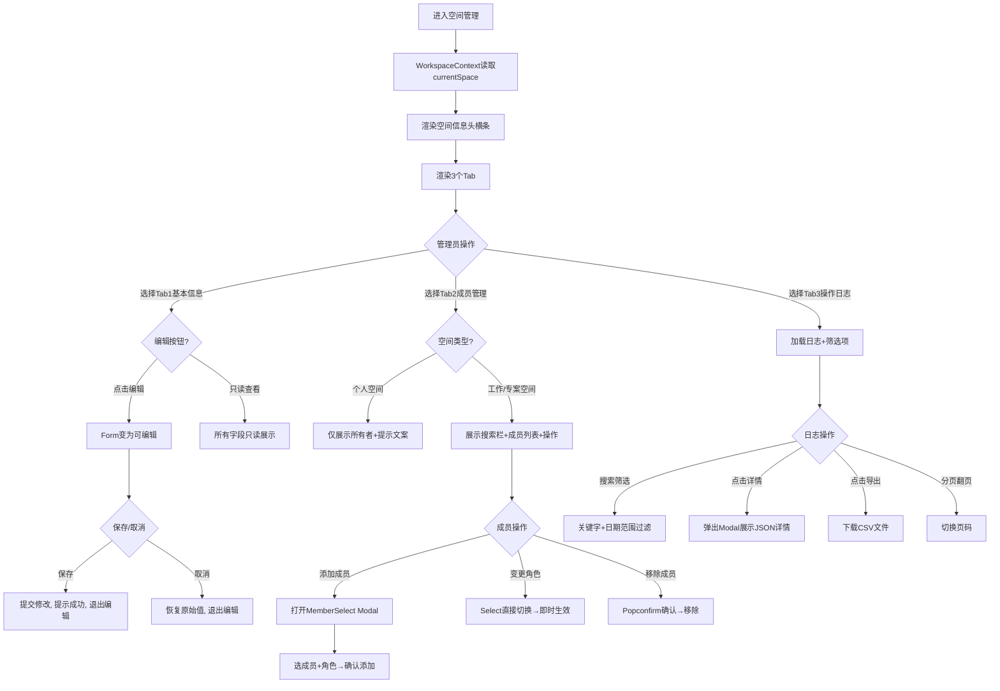

# 开发中心空间管理 V2 需求设计

## 1. 需求背景

### 1.1 问题描述

空间管理员需要对当前空间的配置信息、成员组成和操作审计记录进行集中管理。

### 1.2 目标用户

- 当前空间的管理员（空间创建人（所有者））
- 与管理中心全局空间管理不同，开发中心空间管理聚焦于**当前空间内部**的日常管理

### 1.3 业务目标

1. **集中管理**：基本信息 / 成员 / 日志三项能力在一个页面完成，减少跳转
2. **安全编辑**：基本信息默认只读，点击编辑按钮后切换为可编辑表单
3. **空间类型适配**：个人空间成员不可增删改，工作/专案空间完整管理
4. **审计可追溯**：操作日志支持搜索、详情查看和 CSV 导出

***

## 3. 用户故事

### 3.1 正向场景（Happy Path）

作为空间管理员
在需要修改空间名称或归属部门时，
为了安全地完成编辑操作，
需要通过只读→编辑切换模式进行修改。

验收标准：

- Tab1 基本信息默认只读展示空间名称/描述/图标/部门/类型/所有者/创建时间
- 点击「编辑」按钮后字段变为可编辑（除空间类型和所有者/时间为只读）
- 编辑态显示「保存」按钮，点击后提示"空间信息已更新"并退出编辑态
- 编辑态显示「取消」按钮，点击后恢复原始值并退出编辑态

作为空间管理员
在管理工作空间的成员时，
为了维护协作团队的人员组成，
需要支持添加新成员、变更角色和移除成员。

验收标准：

- 成员列表显示头像+姓名+部门、角色标签（带图标）、加入时间、最近活跃时间
- 搜索栏可按姓名/部门搜索，角色下拉可筛选全部/所有者/普通用户
- 点击「添加成员」弹出对话框，使用 MemberSelect 多选成员并指定初始角色
- 所有者角色不可变更、不可移除（下拉和按钮置灰）
- 普通用户可变更角色（Select 即刻生效）和移除（Popconfirm 确认）

作为空间管理员
在需要审计空间内的操作记录时，
为了追溯关键变更的负责人和时间，
需要通过操作日志列表查看和导出审计数据。

验收标准：

- 操作日志列表展示时间/操作人/操作类型(彩色Tag)/操作对象/详情按钮
- 筛选栏支持按操作人或操作对象搜索、日期范围筛选
- 点击「详情」按钮弹出 Modal 展示完整 JSON 数据
- 点击「导出」按钮下载当前筛选条件下的 CSV 文件
- 支持分页浏览

### 3.2 负向场景（Unwanted Behavior）

作为空间管理员
在访问个人空间的成员管理时，
为了避免错误地试图添加成员，
系统应限制个人空间的成员变更能力。

验收标准：

- 个人空间的成员列表仅展示所有者信息和提示文字
- 不显示搜索栏、「添加成员」按钮、角色变更下拉和移除按钮
- 提示："个人空间仅创建人可访问，不支持添加其他成员"

***

## 4. 用户旅程

### 4.1 端到端主流程图

**逐段解释：**

1. 页面加载时从 WorkspaceContext 读取 currentSpace，空间信息头和 Tab 内容均基于当前空间渲染
2. Tab1 编辑按钮在 antd Form 外部，避免 Form disabled 传递导致按钮也禁用
3. Tab2 根据空间类型分叉：个人空间纯只读，工作/专案空间展示完整成员管理功能
4. Tab3 筛选栏含搜索框和日期范围选择器，「导出」按钮在筛选栏右侧
5. 成员角色变更使用 Select 组件即时生效，移除使用 Popconfirm 二次确认

### 4.2 主流程覆盖模块对齐表

| Coverage Index ID | 页面/模块 | PRD章节定位 | 流程图节点名   | 是否覆盖 |
| ----------------- | ----- | ------- | -------- | ---- |
| P02               | 空间管理  | 5.2.2   | 进入空间管理   | ✅    |
| P02               | 基本信息  | 5.2.2.A | Tab1基本信息 | ✅    |
| P02               | 成员管理  | 5.2.2.B | Tab2成员管理 | ✅    |
| P02               | 操作日志  | 5.2.2.C | Tab3操作日志 | ✅    |

***

## 5. 功能清单与详细说明

### 5.0 功能覆盖索引

| ID  | 页面/模块  | 类型    | 路由             | 关键功能              | PRD章节定位 | 覆盖状态 |
| --- | ------ | ----- | -------------- | ----------------- | ------- | ---- |
| P02 | 空间管理   | Tabs  | /dev/space-ops | 基本信息+成员管理+操作日志    | 5.2.2   | ✅已覆盖 |
| D01 | 添加成员弹窗 | Modal | 成员Tab-添加成员     | MemberSelect+角色选择 | 5.2.3   | ✅已覆盖 |
| D02 | 日志详情弹窗 | Modal | 日志Tab-详情按钮     | JSON详情展示          | 5.2.4   | ✅已覆盖 |

### 5.1 核心功能清单

| 功能点      | 优先级 | 功能描述                 |
| -------- | --- | -------------------- |
| 基本信息 Tab | P0  | 空间资料编辑，只读/编辑切换       |
| 成员管理 Tab | P0  | 成员增删改+角色变更，个人空间适配    |
| 操作日志 Tab | P0  | 搜索筛选+详情查看+CSV导出+分页   |
| 添加成员弹窗   | P0  | MemberSelect 多选+角色选择 |
| 日志详情弹窗   | P1  | Modal 展示完整 JSON      |

***

### 5.2 功能详细说明

#### \[P02] 空间管理页

##### 1. 页面介绍

CRUD 管理页（Tab 聚合），路由 `/dev/space-ops`。页面顶部为空间信息横条，下方 Tabs 切换基本信息/成员管理/操作日志。内容随 WorkspaceContext.currentSpace 联动。

**A. Tab1：基本信息**

| 字段      | 类型             | 只读模式   | 编辑模式   | 说明              |
| ------- | -------------- | ------ | ------ | --------------- |
| 空间名称    | Input          | 文本     | 可编辑，必填 | 支持修改            |
| 空间描述    | TextArea(3行)   | 文本     | 可编辑    | 选填              |
| 空间图标    | 展示块            | 渐变蓝首字母 | 可点击    | 64x64px，2px虚线边框 |
| 所属警种/部门 | Select         | 文本     | 可编辑    | 9个部门选项          |
| 空间类型    | Input disabled | 文本     | 始终只读   | 创建时确定，不可改       |
| 所有者     | Input disabled | 文本     | 始终只读   | 不可编辑            |
| 创建时间    | Input disabled | 文本     | 始终只读   | 不可编辑            |

**编辑按钮交互**：

- 编辑按钮位于 `<Form>` 组件外部，不受 Form.disabled 属性继承影响
- 点击编辑 → Form.disabled=false → 字段变为可编辑 → 底部显示 保存/取消 按钮
- 保存 → 600ms loading → 提示"空间信息已更新" → 退出编辑态
- 取消 → form.resetFields() 恢复初始值 → 退出编辑态

**B. Tab2：成员管理**

**个人空间分支**：

- 顶部大卡片：头像(48px圆形)+姓名+提示文字"个人空间仅创建人可访问，不支持添加其他成员"
- 下方一条只读成员记录（带 CrownOutlined 所有者标签）
- 无搜索栏、添加按钮和行内操作

**工作/专案空间分支**：

搜索栏（左侧与表格列头对齐）：

| 筛选项     | 类型           | 默认值  | 说明                |
| ------- | ------------ | ---- | ----------------- |
| 搜索姓名或部门 | Input search | 空    | 匹配 name 和 dept    |
| 角色筛选    | Select       | 全部角色 | 全部/所有者/普通用户 |

全局操作：

| 按钮   | 类型  | 点击行为             |
| ---- | --- | ---------------- |
| 添加成员 | 主按钮 | 打开 \[D01] 添加成员弹窗 |

成员表格列：

| 列名   | 字段         | 宽度  | 说明                                                                   |
| ---- | ---------- | --- | -------------------------------------------------------------------- |
| 成员   | name       | 200 | 32px圆形头像+姓名+部门                                                       |
| 角色   | role       | 100 | Tag: 金色所有者(CrownOutlined)/默认普通用户(UserOutlined) |
| 加入时间 | joinTime   | 120 | 灰色文本                                                                 |
| 最近活跃 | lastActive | 150 | 灰色文本                                                                 |
| 操作   | -          | 160 | 角色变更Select+移除按钮                                                      |

行内操作：

| 操作   | 所有者                  | 普通用户                                            |
| ---- | -------------------- | ----------------------------------------------- |
| 角色变更 | Select disabled（无下拉） | Select 可选普通用户，onChange 即时生效提示"已将xx的角色变更为xx" |
| 移除   | Button disabled      | Popconfirm"确定移除xx？"→确认→提示"已移除xx"                |

**C. Tab3：操作日志**

搜索筛选区：

| 筛选项        | 类型           | 默认值 | 说明                   |
| ---------- | ------------ | --- | -------------------- |
| 搜索操作人或操作对象 | Input search | 空   | 匹配 operator 和 target |
| 时间范围       | RangePicker  | 空   | 起始\~结束日期             |

筛选栏右侧：

| 操作 | 类型     | 说明                  |
| -- | ------ | ------------------- |
| 导出 | Button | 点击后下载 CSV 文件，包含全部字段 |

日志表格列：

| 列名   | 字段       | 宽度  | 说明                             |
| ---- | -------- | --- | ------------------------------ |
| 时间   | time     | 170 | 13px灰色文本 "YYYY-MM-DD HH:mm"    |
| 操作人  | operator | 100 | 姓名                             |
| 操作类型 | type     | 100 | 彩色Tag：创建蓝/发布绿/修改配置橙/添加成员青/删除红等 |
| 操作对象 | target   | 160 | 加粗资源名称                         |
| 操作   | -        | 80  | 「详情」链接按钮                       |

##### 3. 页面级字段定义

| 字段含义    | 业务字段名                 | 类型               | 必填 | 说明                          |
| ------- | --------------------- | ---------------- | -- | --------------------------- |
| 空间名称    | name                  | String           | 是  | 编辑Tab1可修改                   |
| 空间描述    | description           | String           | 否  | TextArea编辑                  |
| 所属部门    | dept                  | String           | 是  | Select下拉                    |
| 空间类型    | type                  | enum             | 只读 | 个人/工作/专案                    |
| 所有者     | creator               | String           | 只读 | 空间所有者姓名                     |
| 创建时间    | createTime            | String           | 只读 | YYYY-MM-DD                  |
| 成员筛选关键词 | memberFilters.keyword | String           | -  | 搜索过滤                        |
| 成员筛选角色  | memberFilters.role    | String           | -  | 搜索过滤，角色选项：全部/所有者/普通用户 |
| 日志筛选关键词 | logFilters.keyword    | String           | -  | 搜索过滤                        |
| 日志筛选日期  | logFilters.dateRange  | \[Moment,Moment] | -  | 日期范围                        |

##### 4. Evidence

- code: `src/pages/space-ops/index.tsx` - 完整页面组件
- code: `src/contexts/WorkspaceContext.tsx` - 空间上下文
- code: `src/components/MemberSelect.tsx` - 成员多选组件
- code: `src/components/FilterBar.tsx` - 共用筛选栏组件

***

#### \[D01] 添加成员弹窗

##### 1. 页面介绍

Modal 组件，由成员管理 Tab 的「添加成员」按钮触发。标题"添加成员"，包含 MemberSelect 组件和初始角色选择器。

##### 3. 交互元素

| 元素    | 类型                   | 说明                |
| ----- | -------------------- | ----------------- |
| 成员选择器 | MemberSelect (multi) | 下拉选项头像+姓名+部门，支持搜索 |
| 初始角色  | Select               | 普通用户，默认普通用户   |

##### 4. 业务规则

- 确认添加后提示"已添加成员 \[姓名]（\[角色]）"
- 关闭弹窗时清空已选成员和角色状态

##### 5. Evidence

- code: `src/pages/space-ops/index.tsx` L136-170 添加成员弹窗
- code: `src/components/MemberSelect.tsx` 共用组件

***

#### \[D02] 日志详情弹窗

##### 1. 页面介绍

Modal 组件，由操作日志列表的「详情」按钮触发。展示当前日志条目的完整 JSON 数据。

##### 2. 交互元素

| 元素   | 类型       | 说明                                     |
| ---- | -------- | -------------------------------------- |
| 详情内容 | JSON.pre | JSON.stringify(logDetailData, null, 2) |

***

## 6. 测试标准

| 用例ID | 测试场景     | 前置条件      | 操作步骤               | 预期结果              |
| ---- | -------- | --------- | ------------------ | ----------------- |
| TC01 | 正常进入空间管理 | 管理员登录     | 点击"空间运营-空间管理"      | 展示空间头+3个Tab       |
| TC02 | 基本信息只读   | 进入Tab1    | 查看字段               | 所有字段不可编辑，显示"编辑"按钮 |
| TC03 | 基本信息编辑   | 进入Tab1    | 点击编辑→修改名称→保存       | 提示"空间信息已更新"，退出编辑态 |
| TC04 | 基本信息取消编辑 | 进入Tab1编辑态 | 修改后点击取消            | 字段恢复原值，退出编辑态      |
| TC05 | 个人空间成员只读 | 切换到个人空间   | 点击Tab2             | 仅展示所有者+提示文字，无操作按钮 |
| TC06 | 工作空间添加成员 | 切换到工作空间   | Tab2→添加成员→选人+角色→确认 | 成员列表新增            |
| TC07 | 角色变更     | 工作空间      | 成员下拉选"普通用户"       | 即时变更为普通用户         |
| TC08 | 移除成员     | 工作空间      | 普通用户→移除→确认         | 成员从列表消失           |
| TC09 | 所有者不可移除  | 工作空间      | 所有者行的移除按钮          | 按钮置灰不可点击          |
| TC10 | 日志搜索     | 进入Tab3    | 输入"演示用户"搜索         | 列表仅展示操作人为演示用户的记录  |
| TC11 | 日志详情查看   | 进入Tab3    | 点击某行的"详情"          | 弹出Modal展示JSON     |
| TC12 | 日志导出     | 进入Tab3    | 点击"导出"             | 下载CSV文件           |
| TC13 | 日志分页     | 日志列表超过20条 | 翻页                 | 切换页码加载对应数据        |

***

## 7. 非功能性需求

### 7.1 性能要求

- Tab 切换瞬时（各 Tab 内容为条件渲染）
- 成员筛选使用 useMemo 即时过滤（< 200ms）
- 日志详情 Modal 渲染 JSON < 100ms

### 7.2 安全与合规

- 基本信息编辑按钮在 Form 外部，避免全局 disabled 导致无法点击
- 所有者角色不可降级、不可移除

### 7.3 可用性

- Tab 切换时保留当前 Tab 内的筛选状态
- 角色变更使用 Select 即刻生效，移除使用 Popconfirm 二次确认
- FilterBar 筛选栏与表格列头左对齐

***

## 8. 技术可行性与风险预判

### 8.1 依赖

- antd (Table, Tabs, Tag, Button, Form, Input, Select, Modal, Popconfirm, Progress, Card, DatePicker, Typography, message)
- @ant-design/icons
- 共用组件：PageHeader, FilterBar, MemberSelect
- WorkspaceContext (useWorkspace)

### 8.2 核心逻辑

- 编辑模式：editing state 控制 Form.disabled，编辑/保存/取消按钮在 Form JSX 外部
- 成员过滤：useMemo 双重条件过滤（role + keyword），支持 includes 模糊匹配
- 空间类型适配：isPersonal 布尔值控制成员管理 Tab 的条件渲染

   

***

## 9. 迭代规划

| 里程碑 | 内容                          | 优先级 |
| --- | --------------------------- | --- |
| M1  | 空间管理基础框架（3 Tab + 空间头）       | P0  |
| M2  | 基本信息编辑（只读/编辑切换 + 保存/取消）     | P0  |
| M3  | 成员管理（添加/角色变更/移除 + 个人空间适配）   | P0  |
| M4  | 操作日志（搜索筛选 + 详情弹窗 + 导出 + 分页） | P0  |
| M5  | 成员增删改接入真实接口                 | P1  |
| M6  | 操作日志接入后端接口                  | P1  |

***

## 10. 附录

### 10.1 术语表

| 术语               | 说明                           |
| ---------------- | ---------------------------- |
| 空间运营             | 开发中心下聚合统计分析和空间管理的模块          |
| 空间管理             | 以 Tab 形式聚合基本信息、成员管理、操作日志的单页  |
| MemberSelect     | 人员多选下拉组件，支持搜索和头像展示           |
| FilterBar        | 共用筛选栏组件，支持搜索框/Select/日期范围/按钮 |
| WorkspaceContext | 全局空间状态管理，提供 currentSpace     |

### 10.2 参考文件

- `src/pages/space-ops/index.tsx` - 空间管理页面源码
- `src/contexts/WorkspaceContext.tsx` - 空间上下文
- `src/components/MemberSelect.tsx` - 成员多选组件
- `src/components/FilterBar.tsx` - 筛选栏组件
- `prd/04_开发中心_空间运营.md` - 旧版 PRD

