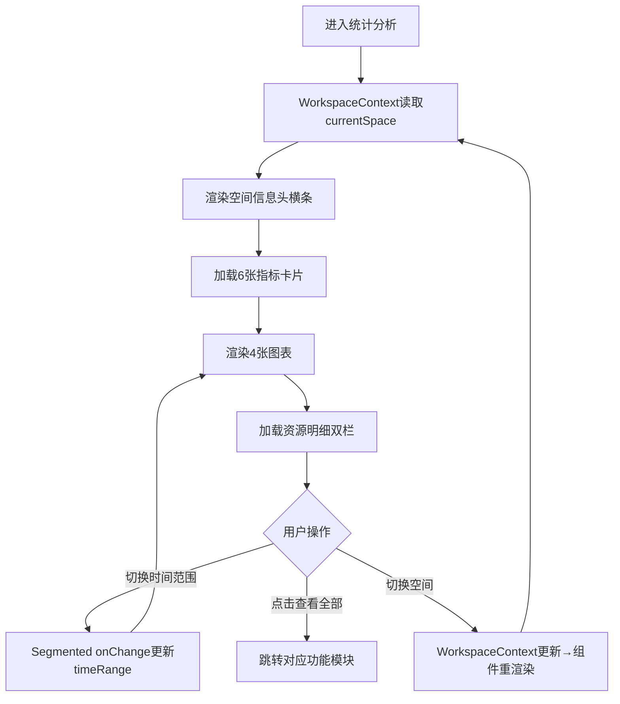

# 开发中心统计分析 V2 需求设计

## 1. 需求背景

### 1.1 问题描述
空间所有者需要一目了然地掌握当前空间的运营全貌，包括资源持有量、调用趋势和成员活跃度。缺乏集中式的运营仪表盘导致所有者需要多次跳转才能拼凑出完整的空间状态视图。

### 1.2 目标用户
- 空间创建人（所有者）
- 需要对空间运营数据做定期巡检的管理者

### 1.3 业务目标
- 以仪表盘形式聚合展示空间核心运营指标
- 通过图表可视化调用量趋势、Token 消耗、智能体分布和成员活跃度
- 以只读进度条展示配额使用情况，超阈值变色预警
- 提供最近智能体和知识库的快速入口

---

## 2. 产品定位

### 2.1 产品定义
统计分析是开发中心空间运营的默认首页（路由 `/dev/space-stats`），以看板形式聚合当前空间的核心数据指标和趋势图表。

### 2.2 核心价值
1. **一目了然**：一张页面覆盖空间运营全部关键指标
2. **趋势可视化**：4 张图表（面积图/环形图/折线图/条形图）直观展示变化趋势
3. **空间切换联动**：从 WorkspaceContext 读取 currentSpace，切换空间后自动刷新

---

## 3. 用户故事

### 3.1 正向场景（Happy Path）

作为空间所有者
在进入空间运营后，
为了快速了解空间内的资源持有量，
需要通过统计分析的仪表盘查看各项指标。

验收标准：
- 顶部横条展示当前空间名称、空间类型标签、角色标签、创建时间和所有者
- 右侧时间范围选择器（近一天/近七天/近三十天）切换图表数据范围
- 6 张指标卡片展示智能体/知识库/提示词/工具/模型/连接器数量
- 4 张图表分别展示调用量趋势/智能体类型分布/Token消耗/智能体活跃
- 最下方双栏展示最近智能体（5条）和最近知识库（5条）

### 3.2 负向场景（Unwanted Behavior）

暂无。

---

## 4. 用户旅程

### 4.1 端到端主流程图

**逐段解释：**
1. 页面加载时从 WorkspaceContext 获取 currentSpace，所有指标数据均基于当前空间计算
2. 空间信息头、指标卡片、图表、资源明细按从上到下顺序渲染
3. 时间范围选择器切换时更新 timeRange 状态（当前图表数据为静态 Mock，实际需联动接口）
4. 资源明细的「查看全部」链接跳转至对应功能模块（智能体管理/知识库）
5. 切换工作空间后 WorkspaceContext 更新 currentSpace，触发整个页面重渲染

### 4.2 主流程覆盖模块对齐表

| Coverage Index ID | 页面/模块 | PRD章节定位 | 流程图节点名 | 是否覆盖 |
|---|---|---|---|---|
| P01 | 统计分析 | 5.2.1 | 进入统计分析 | ✅ |
| P01 | 空间信息头 | 5.2.1.A | 渲染空间信息头横条 | ✅ |
| P01 | 指标卡片行 | 5.2.1.B | 加载6张指标卡片 | ✅ |
| P01 | 图表区 | 5.2.1.C | 渲染4张图表 | ✅ |
| P01 | 资源明细 | 5.2.1.D | 加载资源明细双栏 | ✅ |

---

## 5. 功能清单与详细说明

### 5.0 功能覆盖索引

| ID | 页面/模块 | 类型 | 路由 | 关键功能 | PRD章节定位 | 覆盖状态 |
|---|---|---|---|---|---|---|
| P01 | 统计分析 | Dashboard | /dev/space-stats | 指标+图表+资源明细 | 5.2.1 | ✅已覆盖 |

---

### 5.1 功能详细说明

#### [P01] 统计分析页

##### 1. 页面介绍

看板页（Dashboard），作为开发中心空间运营的默认首页。自上而下分为四个区域：空间信息头、指标卡片行、图表区（两行）、资源明细区（双栏）。

##### 3. 交互元素清单

**A. 空间信息头横条**

| 元素 | 类型 | 说明 |
|---|---|---|
| 空间首字母头像 | 展示 | 48px渐变蓝圆角方形，取空间名首字 |
| 空间名称 | 文本 | 16px 加粗 |
| 空间类型标签 | Tag | 个人空间蓝色/工作空间及专案空间绿色，圆角4px |
| 角色标签 | Tag | 金色"所有者"，带 CrownOutlined 图标，圆角4px |
| 创建时间 | 文本 | "创建时间：YYYY-MM-DD" |
| 所有者 | 文本 | "所有者：{creator}" |
| 时间范围选择器 | Segmented | "近一天"/"近七天"/"近三十天"，默认近三十天 |

**B. 指标卡片行（6列，span=4）**

| 卡片 | 图标 | 颜色 | 取值来源 |
|---|---|---|---|
| 智能体数 | RobotOutlined | #1677ff | currentSpace.agentCount |
| 知识库数 | FolderOutlined | #722ed1 | currentSpace.knowledgeCount |
| 提示词数 | FileTextOutlined | #52c41a | currentSpace.promptCount |
| 工具数 | ToolOutlined | #fa8c16 | currentSpace.toolCount |
| 模型数 | ThunderboltOutlined | #13c2c2 | currentSpace.modelCount ?? 0 |
| 连接器数 | ApiOutlined | #eb2f96 | currentSpace.connectorCount ?? 0 |

每张卡片布局：左侧标题+大数字(26px加粗)，右侧彩色圆角图标方块(36px, 10%透明度背景)。

**C. 图表区第一行（2列，span=12）**

| 图表 | 类型 | 数据 | 高度 |
|---|---|---|---|
| 近三十天调用量趋势 | 面积图 | thirtyDayTrend (30点正弦+随机) | 260px |
| 智能体类型分布 | 环形图 | 标准4/流程1/自主2，内径60外径100 | 260px |

**D. 图表区第二行（2列，span=12）**

| 图表 | 类型 | 数据 | 高度 |
|---|---|---|---|
| Token 消耗趋势 | 双线折线图 | 输入Token + 输出Token (30点) | 260px |
| 智能体活跃 Top10 | 横向条形图 | 10个智能体调用次数降序 | 260px |

图表技术栈：Recharts (AreaChart, PieChart, LineChart, BarChart)，使用 ResponsiveContainer 自适应宽度。

**E. 资源明细区（2列，span=12）**

| 区域 | 标题 | 操作 | 数据 |
|---|---|---|---|
| 最近智能体 | "最近智能体" + 查看全部链接 | 跳转智能体管理 | mockAgents.slice(0,5)，展示名称+类型Tag+状态Tag+创建时间 |
| 最近知识库 | "最近知识库" + 查看全部链接 | 跳转知识库 | 5条静态数据，展示名称+文档数+状态Tag |

##### 4. 页面级字段定义

| 字段含义 | 业务字段名 | 类型 | 说明 |
|---|---|---|---|
| 智能体总数 | agentCount | Number | 来自 WorkspaceContext |
| 知识库数量 | knowledgeCount | Number | 来自 WorkspaceContext |
| 提示词数量 | promptCount | Number | 来自 WorkspaceContext |
| 工具数量 | toolCount | Number | 来自 WorkspaceContext |
| 模型数量 | modelCount | Number | 来自 WorkspaceContext |
| 连接器数量 | connectorCount | Number | 来自 WorkspaceContext |
| 每日Token已用 | dailyTokenUsed | Number | 日配额用量 |
| 每日Token上限 | dailyTokenLimit | Number | 日配额上限 |
| 每月Token已用 | monthlyTokenUsed | Number | 月配额用量 |
| 每月Token上限 | monthlyTokenLimit | Number | 月配额上限 |
| 存储已用 | storageUsed | Number | 已用存储(MB) |
| 存储上限 | storageLimit | Number | 存储配额(MB) |
| 智能体已用 | agentQuotaUsed | Number | 已创建智能体数 |
| 智能体上限 | agentQuotaLimit | Number | 智能体配额上限 |
| 成员数 | memberCount | Number | 当前成员总数 |
| 成员上限 | memberLimit | Number | 成员配额上限 |
| 时间范围 | timeRange | String | 近一天/近七天/近三十天 |

---

## 6. 测试标准

| 用例ID | 测试场景 | 前置条件 | 操作步骤 | 预期结果 |
|---|---|---|---|---|
| TC01 | 正常进入统计分析 | 所有者登录且有当前空间 | 点击"空间运营-统计分析" | 展示完整仪表盘 |
| TC02 | 指标卡片显示 | 空间有智能体/知识库等数据 | 进入统计分析 | 6张卡片显示对应数值 |
| TC03 | 时间范围切换 | 进入统计分析 | 点击"近七天" | Segmented切换，图表数据随之变化 |
| TC04 | 智能体列表空状态 | 空间无智能体 | 进入统计分析 | 智能体列表区显示"暂无智能体" |
| TC05 | 查看全部跳转 | 进入统计分析 | 点击最近智能体"查看全部" | 跳转智能体管理页 |
| TC06 | 空间切换刷新 | 有两个以上空间 | 切换工作空间 | 仪表盘数据全部更新为新空间数据 |

---

## 7. 非功能性需求

### 7.1 性能要求
- 首屏加载 ≤ 2s（含4张Recharts图表渲染）
- 图表渲染使用 ResponsiveContainer 自适应，不阻塞交互

### 7.2 可用性
- 所有图表 hover 时展示 Tooltip（含格式化数值和圆角样式）
- 响应式适配：Col span 基于24栅格，宽屏下图表横排，窄屏自动换行

---

## 8. 技术可行性与风险预判

### 8.1 依赖
- antd (Card, Typography, Segmented, Tag, Button, Row, Col, Space)
- recharts (AreaChart, PieChart, LineChart, BarChart, ResponsiveContainer, Tooltip, Legend, CartesianGrid, Cell)
- WorkspaceContext (useWorkspace)
- @ant-design/icons

### 8.2 核心逻辑
- 所有数据从 WorkspaceContext.currentSpace 获取，切换空间时自动重渲染
- 图表数据为静态 Mock，实际需后端接口

### 8.3 风险项
- 图表数据当前为静态 Mock（正弦函数+随机数），生产环境需替换为真实接口
- modelCount 和 connectorCount 使用可选链（`?? 0`），需确保后端字段下发

---

## 9. 迭代规划

| 里程碑 | 内容 | 优先级 |
|---|---|---|
| M1 | 仪表盘基础布局（信息头+指标卡片+图表区+资源明细） | P0 |
| M2 | 接入 WorkspaceContext 实现空间联动 | P0 |
| M3 | 图表数据接入真实后端接口 | P1 |
| M4 | 时间范围选择器联动图表数据范围 | P1 |

---

## 10. 附录

### 10.1 参考文件
- `src/pages/space-stats/index.tsx` - 统计分析页面源码
- `src/contexts/WorkspaceContext.tsx` - 空间上下文
- `src/mock/data.ts` - SpaceItem 接口与数据
