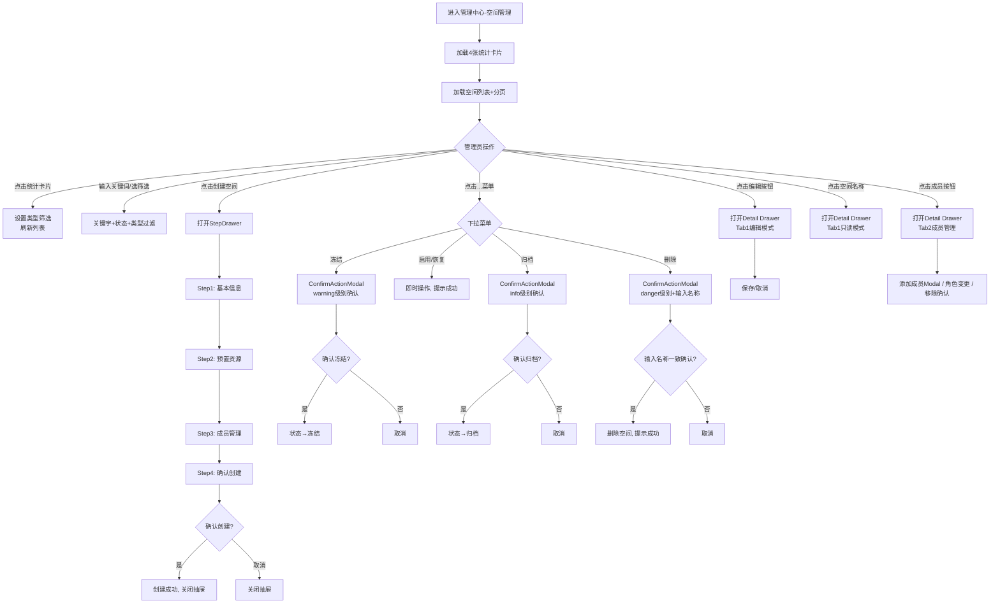
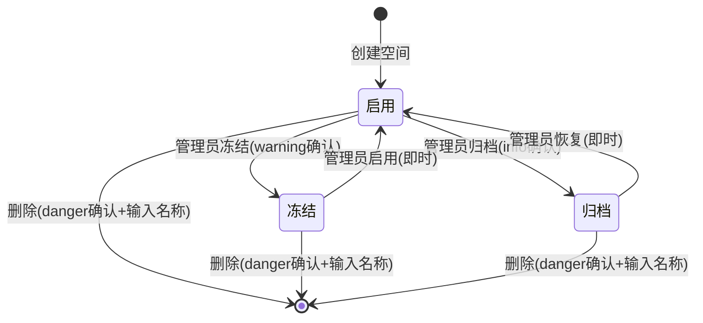
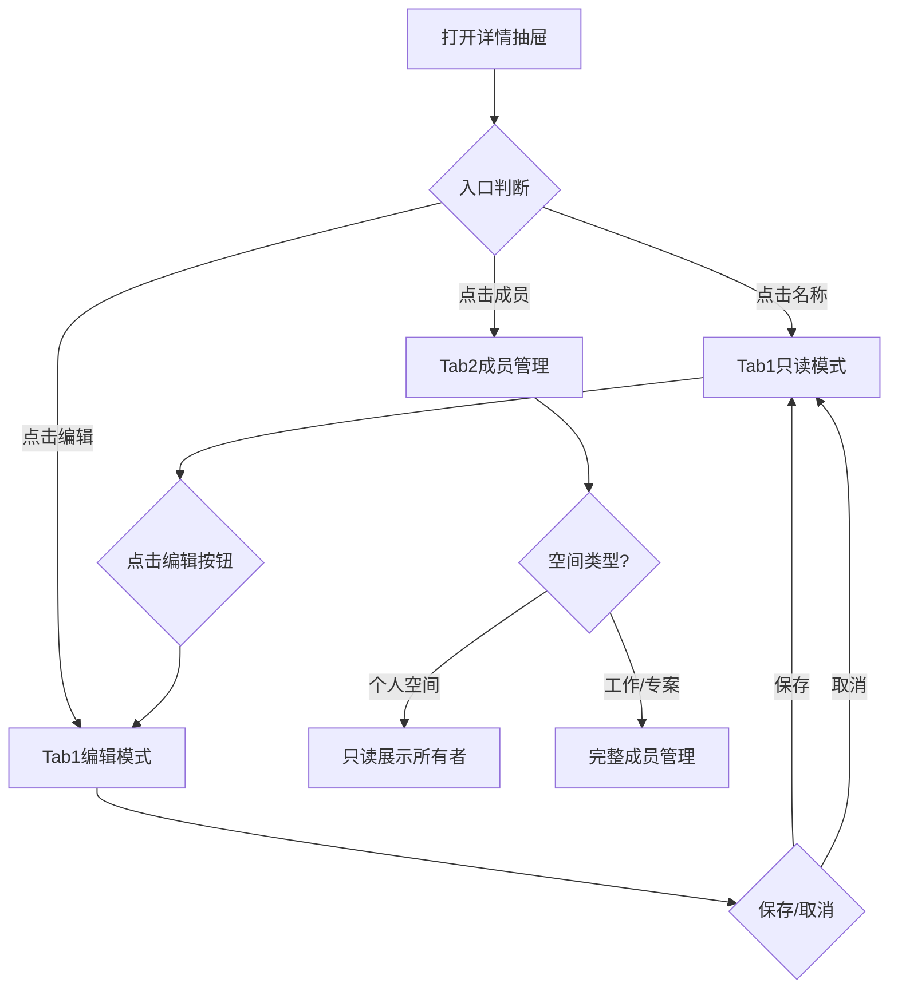

# 管理中心空间管理 V2 需求设计

## 0. 版本变更记录

| 版本号  | 修订日期       | 修订人 | 变更类型 | 变更描述                                                                   | 影响面                  |
| :--- | :--------- | :-- | :--- | :--------------------------------------------------------------------- | :------------------- |
| v1.0 | 2026-06-29 | AI  | 新建   | 从 ops-spaces 源码提取，覆盖 6 个页面/弹窗                                          | 全篇                   |
| v1.1 | 2026-06-29 | AI  | 修改   | 操作日志标注\[待确认]分页；预置资源Step间联动标注\[待确认]                                     | 4.2 Tab4 / D02 Step2 |
| v1.2 | 2026-07-02 | AI  | 修改   | ①创建空间增加负责人必填、部门改为非必填 ②预置资源去掉数据连接和技能 ③去掉整个配额限制环节及相关影响 ④创建空间增加成员管理步骤     | 全篇                   |
| v1.3 | 2026-07-02 | AI  | 修改   | ①空间操作"停用"更名为"冻结" ②切换空间时归档不展示、冻结可展示但不可进入 ③统计分析"活跃成员TOP10"改为"智能体活跃Top10" | 全篇                   |

***

## 1. 需求背景

### 1.1 问题描述

平台超级管理员需要对所有工作空间进行集中管控。随着平台规模扩大，空间数量增多，管理员面临以下挑战：

- 缺乏全局视角下的空间统计与状态监控能力
- 空间创建流程不标准，资源配置缺乏统一模板
- 空间生命周期（启用→冻结→归档→删除）管理缺失
- 成员管理操作分散，效率低下

### 1.2 目标用户

- 管理中心超级管理员
- 平台级组织管理人员

### 1.3 业务目标

- 提供全局空间列表与统计概览，支持快速检索与筛选
- 通过标准化四步向导引导空间创建，确保创建时正确配置资源与成员
- 建立完整的空间生命周期管控机制（冻结/启用+归档/恢复+删除）
- 在详情抽屉中聚合基本信息编辑、成员管控和操作日志审查

***

## 3. 用户故事

### 3.1 正向场景（Happy Path）

作为管理中心超级管理员
在需要创建一个新的工作空间时，
为了确保空间的负责人明确、资源预置到位，
需要通过标准化的四步向导完成空间创建。

验收标准：

- 点击「创建空间」打开四步向导抽屉
- Step1 填写空间名称（必填）、描述（选填）、图标、所属部门（选填）、负责人（必填）、空间类型（默认工作空间）
- Step2 可选预置模型/提示词/工具/连接器/知识库，每类显示已选数量
- Step3 成员管理：可添加成员并设置初始角色（普通用户），可跳过
- Step4 汇总前三步信息，点击「确认创建」提交
- 创建成功后抽屉关闭，列表自动刷新

作为管理中心超级管理员
在需要调整某空间的配置时，
为了高效完成编辑操作，
需要通过详情抽屉统一完成信息修改和成员管理。

验收标准：

- 点击空间名称或「编辑」按钮打开详情抽屉
- Tab1 基本信息：默认只读展示，点击「编辑」切换为可编辑表单
- Tab2 成员管理：可添加成员、变更角色、移除成员
- Tab3 操作日志：展示操作人、操作类型、详情和时间

### 3.2 负向场景（Unwanted Behavior）

作为管理中心超级管理员
在需要对空间执行停用/归档/删除操作时，
为了确保不会误操作造成数据损失，
系统必须提供差异化的二次确认。

验收标准：

- 冻结：弹出 ConfirmActionModal（warning级别），说明"已发布智能体继续运行"和"可随时恢复"
- 归档：弹出 ConfirmActionModal（info级别），说明"已发布智能体停止"和"可恢复但不轻易操作"
- 删除：弹出 ConfirmActionModal（danger级别），需输入空间名称确认，说明"永久移除不可恢复"
- 取消操作时状态不变

作为管理中心超级管理员
在访问个人空间的成员管理时，
为了避免错误操作，
系统应限制个人空间的成员变更。

验收标准：

- 个人空间的成员Tab仅展示所有者名片和说明文字，不显示添加/移除按钮
- 工作空间和专案空间正常显示成员管理功能

***

## 4. 用户旅程

### 4.1 端到端主流程图

**逐段解释：**

1. **入口**：管理员进入空间管理页面，自动加载统计卡片和空间列表
2. **统计卡片筛选**：点击4张统计卡片中的任一张，按对应空间类型筛选列表；点击总空间数则清除筛选
3. **创建空间**：通过四步向导（基本信息→预置资源→成员管理→确认创建）完成，每步可前进/后退，最后一步确认提交
4. **详情查看**：点击空间名称进入只读详情；点击编辑/成员按钮可直接定位对应Tab
5. **生命周期操作**：冻结（warning确认）、归档（info确认）均需经 ConfirmActionModal；删除（danger确认）还需输入空间名称
6. **即时操作**：启用、恢复操作为即时生效，无需二次确认
7. **成员管理**：个人空间仅展示所有者；工作/专案空间支持添加、角色变更、移除（Popconfirm二次确认）

### 4.2 主流程覆盖模块对齐表

| Coverage Index ID | 页面/模块  | PRD章节定位 | 流程图节点名             | 是否覆盖 |
| ----------------- | ------ | ------- | ------------------ | ---- |
| P01               | 空间列表页  | 5.2.1   | 加载空间列表+分页          | ✅    |
| D01               | 空间详情抽屉 | 5.2.2   | 打开Detail Drawer    | ✅    |
| D02               | 创建空间抽屉 | 5.2.3   | 打开StepDrawer       | ✅    |
| D03               | 添加成员弹窗 | 5.2.4   | 添加成员Modal          | ✅    |
| D05               | 操作确认弹窗 | 5.2.6   | ConfirmActionModal | ✅    |

***

## 5. 功能清单与详细说明

### 5.0 功能覆盖索引

| ID  | 页面/模块  | 类型                 | 入口/路由                  | 关键功能                    | PRD章节定位 | 覆盖状态 |
| --- | ------ | ------------------ | ---------------------- | ----------------------- | ------- | ---- |
| P01 | 空间列表页  | List               | /manage/space-manage    | 统计卡片+筛选+表格+行操作          | 5.2.1   | ✅已覆盖 |
| D01 | 空间详情抽屉 | Drawer             | 点击名称/编辑/成员             | 3Tab: 基本信息+成员+日志        | 5.2.2   | ✅已覆盖 |
| D02 | 创建空间抽屉 | StepDrawer         | 点击创建空间                 | 4步向导: 基本信息→预置资源→成员管理→确认 | 5.2.3   | ✅已覆盖 |
| D03 | 添加成员弹窗 | Modal              | 成员Tab-添加成员 / 创建流程Step3 | MemberSelect+角色选择       | 5.2.4   | ✅已覆盖 |
| D05 | 操作确认弹窗 | ConfirmActionModal | ...菜单-冻结/归档/删除         | 差异化确认文案+名称输入            | 5.2.6   | ✅已覆盖 |

### 5.1 核心功能清单

| 模块   | 功能点             | 优先级 | 功能描述                            |
| :--- | :-------------- | :-- | :------------------------------ |
| 空间列表 | 统计卡片 + 点击联动筛选   | P0  | 4张卡片展示总空间/个人/工作/专案数量，点击筛选列表     |
| 空间列表 | 关键字搜索 + 状态/类型筛选 | P0  | 搜索空间名称 + 下拉筛选状态和空间类型            |
| 空间列表 | 空间表格展示          | P0  | 名称/部门/类型/成员数/智能体数/状态/时间/操作 8列   |
| 空间列表 | 行操作按钮           | P0  | 编辑/成员/...下拉菜单（冻结启用恢复/归档/删除）     |
| 空间列表 | 创建空间（四步向导）      | P0  | StepDrawer: 基本信息→预置资源→成员管理→确认创建 |
| 空间详情 | 基本信息（只读/编辑切换）   | P0  | 7字段展示，点击编辑切换为表单模式               |
| 空间详情 | 成员管理            | P0  | 增删改 + 角色变更，个人空间只读               |
| 空间详情 | 操作日志            | P1  | 操作人/类型/详情/时间列表                  |
| 生命周期 | 冻结/归档/删除/恢复     | P0  | ConfirmActionModal 分级确认         |

### 5.2 功能详细说明

***

#### \[P01] 空间列表页

##### 1. 页面介绍

列表管理页（List Management），作为管理中心空间管理模块的主视图（路由 `/manage/space-manage`）。自上而下分为：统计卡片组、筛选操作区、数据表格区。页面顶部使用 PageHeader 组件展示标题和提示文案。

##### 3. 交互元素清单

**A. 统计卡片组**

| 卡片   | 数值     | 颜色      | 点击行为      |
| ---- | ------ | ------- | --------- |
| 总空间数 | 平台空间总数 | #1677ff | 清除空间类型筛选  |
| 个人空间 | 个人空间数量 | #52c41a | 筛选类型=个人空间 |
| 工作空间 | 工作空间数量 | #722ed1 | 筛选类型=工作空间 |
| 专案空间 | 专案空间数量 | #fa8c16 | 筛选类型=专案空间 |

高亮逻辑：点击卡片后，activeIndex 高亮对应卡片（边框+背景色微调+浮动阴影）

**B. 搜索筛选区**

| 筛选项    | 类型           | 默认值 | 说明                       |
| ------ | ------------ | --- | ------------------------ |
| 搜索空间名称 | Input search | 空   | 对空间 name 做 includes 模糊匹配 |
| 状态     | Select       | 全部  | 启用 / 冻结 / 归档             |
| 空间类型   | Select       | 全部  | 个人空间 / 工作空间 / 专案空间       |

筛选项变更后列表即时过滤（useMemo），重置时清除所有筛选并取消卡片高亮。

**C. 全局操作按钮区**

| 按钮名称 | 类型  | 展示条件 | 点击后行为                  | 权限要求  |
| ---- | --- | ---- | ---------------------- | ----- |
| 创建空间 | 主按钮 | 始终显示 | 打开 StepDrawer (Step 0) | 超级管理员 |

**D. 表格列定义**

| 列名      | 字段          | 宽度  | 排序 | 说明                        |
| ------- | ----------- | --- | -- | ------------------------- |
| 空间名称    | name        | 200 | -  | 首字母头像 + 可点击名称链接 + 部门副文本   |
| 所属警种/部门 | dept        | 110 | -  | 灰色辅助文本                    |
| 空间类型    | type        | 100 | -  | Tag: 蓝色个人空间/绿色工作空间/橙色专案空间 |
| 成员数     | memberCount | 80  | ✅  | 数字，支持排序                   |
| 智能体数    | agentCount  | 90  | ✅  | 数字，支持排序                   |
| 状态      | status      | 80  | -  | Tag: 绿色启用/蓝色冻结/灰色归档       |
| 创建时间    | createTime  | 110 | ✅  | YYYY-MM-DD，支持排序           |
| 操作      | -           | 220 | -  | 编辑+成员按钮+...下拉菜单           |

**E. 行内操作按钮**

| 按钮    | 展示条件  | 点击行为                               | 二次确认     | 成功后行为     |
| ----- | ----- | ---------------------------------- | -------- | --------- |
| 编辑    | 始终显示  | 打开详情抽屉 Tab1 编辑模式                   | 否        | 编辑保存后关闭   |
| 成员    | 始终显示  | 打开详情抽屉 Tab2 成员管理                   | 否        | -         |
| ...冻结 | 状态=启用 | 弹出 ConfirmActionModal(warning)     | 需确认      | 状态变更为冻结   |
| ...启用 | 状态=冻结 | 即时操作                               | 否        | 状态变更为启用   |
| ...恢复 | 状态=归档 | 即时操作                               | 否        | 状态变更为启用   |
| ...归档 | 状态≠归档 | 弹出 ConfirmActionModal(info)        | 需确认      | 状态变更为归档   |
| ...删除 | 始终显示  | 弹出 ConfirmActionModal(danger)+名称输入 | 需确认+输入名称 | 删除空间，提示成功 |

**F. 其他交互**

- 点击表格行选中空间并高亮（`#f0f5ff` 背景）
- 分页：默认每页 20 条，支持切换每页条数，显示总数
- 排序：成员数、智能体数、创建时间列支持点击表头排序

##### 4. 业务规则与逻辑

**空间状态流转：**

**逐段解释：**

1. 创建空间后默认状态为"启用"
2. 启用状态可被冻结或归档，均需经过 ConfirmActionModal 确认
3. 冻结随时可启用（即时操作）；归档可恢复但为即时操作（无确认弹窗），暗示该操作为"可恢复但不轻易操作"
4. 三种状态下均允许删除，但必须通过 danger 级别确认 + 输入空间名称
5. 删除后空间从列表中消失，不可恢复

##### 5. 核心业务字段

| 字段含义  | 业务字段名           | 类型     | 必填 | 说明             |
| ----- | --------------- | ------ | -- | -------------- |
| 空间ID  | id              | String | 是  | 全局唯一标识         |
| 空间名称  | name            | String | 是  | 列表搜索匹配字段       |
| 所属部门  | dept            | String | 否  | 空间归属的业务部门（选填）  |
| 空间类型  | type            | enum   | 是  | 个人空间/工作空间/专案空间 |
| 状态    | status          | enum   | 是  | 启用/冻结/归档       |
| 成员数   | memberCount     | Number | 是  | 当前空间成员总数       |
| 智能体已用 | agentQuotaUsed  | Number | 是  | 已使用的智能体数量      |
| 智能体上限 | agentQuotaLimit | Number | 是  | 智能体配额上限        |
| 创建时间  | createTime      | String | 是  | YYYY-MM-DD     |
| 创建人   | creator         | String | 是  | 空间创建者姓名        |

##### 6. Evidence

- code: `src/pages/ops-spaces/index.tsx` L83-106 统计卡片、L111-118 过滤逻辑、L121-198 表格列
- code: `src/mock/data.ts` L174-202 SpaceItem 接口定义

***

#### \[D01] 空间详情抽屉

##### 1. 页面介绍

Drawer 组件（宽 640px），从右侧滑出。顶部展示空间头像+名称+类型标签+部门+状态标签，下方以 Tabs 切换三个 Tab：基本信息、成员管理、操作日志。

##### 3. Tab 详细说明

**Tab1: 基本信息**

| 字段   | 只读模式     | 编辑模式               |
| ---- | -------- | ------------------ |
| 空间名称 | 文本       | Input              |
| 空间描述 | 文本（暂无描述） | TextArea 3行        |
| 所属部门 | 文本       | Select 下拉（9个选项）    |
| 空间类型 | 文本       | Input disabled（只读） |
| 创建人  | 文本       | -（不可编辑）            |
| 创建时间 | 文本       | -（不可编辑）            |
| 最近更新 | 文本       | -（不可编辑）            |

交互逻辑：

- 默认只读展示，底部显示「编辑」按钮（antd Form 外部，不受全局 disabled 影响）
- 点击编辑切换为表单模式，底部显示「保存」「取消」按钮
- 保存后关闭编辑模式并提示"空间信息已更新"

**Tab2: 成员管理**

个人空间分支：

- 展示所有者大卡片（头像+姓名+"个人空间仅创建人可访问，不支持添加其他成员"）
- 下方一条成员记录，标记"Crown 所有者"标签
- 无操作按钮

工作空间/专案空间分支：

- 顶部操作栏：角色筛选（Select: 全部/所有者/普通用户）+ 成员搜索 Input +「添加成员」Button
- 成员列表：每行展示头像+姓名+部门+加入时间

行内操作（按角色区分）：

| 角色   | 角色选择器          | 移除按钮                 |
| ---- | -------------- | -------------------- |
| 所有者  | 无（显示Crown Tag） | 无                    |
| 普通用户 | Select 可切换角色   | Popconfirm「确认移除」→ 移除 |

**Tab3: 操作日志**

日志列表，每行展示：

| 列    | 说明                      |
| ---- | ----------------------- |
| 操作人  | 姓名 + 操作类型 Tag（蓝色/青色/橙色） |
| 操作时间 | YYYY-MM-DD HH:mm        |
| 操作详情 | 描述文本                    |

当前为静态示例数据 \[待确认: 实际需后端接口分页查询 | P1 | 后端接口负责人]。

##### 4. 业务规则

**逐段解释：**

1. 详情抽屉有三条入口路径，对应列表页的空间名称点击、编辑按钮和成员按钮
2. 基本信息 Tab 在只读和编辑模式间切换，由 editingInfo 状态控制
3. 成员管理跨空间类型有不同分支，个人空间纯只读

##### 5. Evidence

- code: `src/pages/ops-spaces/index.tsx` L459-806 详情抽屉全部内容

***

#### \[D02] 创建空间抽屉

##### 1. 页面介绍

StepDrawer 组件承载的四步向导。

**步骤条**：基本信息 → 预置资源 → 成员管理 → 确认创建

**底部固定栏**：取消、上一步（Step2-4可见）、下一步/确认创建（Step4变为确认创建）

##### 2. 各步骤详细内容

**Step1: 基本信息**

| 字段      | 类型            | 必填 | 默认值           | 说明                                 |
| ------- | ------------- | -- | ------------- | ---------------------------------- |
| 空间名称    | Input         | 是  | -             | 校验全局唯一性                            |
| 空间描述    | TextArea (3行) | 否  | -             | 描述用途和适用范围                          |
| 空间图标    | IconPicker    | 否  | IconPicker 组件 | 64x64 预览 + 三模式（文字/上传/Icon），详见 10.3 |
| 所属警种/部门 | Select        | 否  | -             | 9个部门选项，选填                          |
| 负责人     | Select        | 是  | -             | 从组织人员中选择，必填                        |
| 空间类型    | Select        | 是  | 工作空间          | 工作空间 / 专案空间                        |

空间类型字段下方提示："个人空间为平台默认开启，无需手动创建。"

**Step2: 预置资源**（可选，可跳过）

| 资源类别 | 图标               | 示例选项                                                  |
| ---- | ---------------- | ----------------------------------------------------- |
| 模型   | RobotOutlined    | DeepSeek-Chat/Reasoner/Qwen-72B/GPT-4o/Claude/Hunyuan |
| 提示词  | FileTextOutlined | 案情摘要/违章分析/接警分析/证件审核模板                                 |
| 工具   | ToolOutlined     | 文书智能解析/人口信息查询/车辆轨迹查询/图像识别                             |
| 连接器  | ApiOutlined      | 公安数据库/交管数据/政务云连接器                                     |
| 知识库  | BookOutlined     | 公安法规库/警情案例库/标准文书库                                     |

每类资源配置行：

- 左侧：图标 + 资源名称 + 已选计数 Tag（蓝色"已选 N 个"）
- 右侧：全宽多选 Select，支持关键字搜索，最大显示 5 个 Tag

**Step3: 成员管理**（可选，可跳过）

管理员可在此步骤为空间添加初始成员并设置角色。功能与详情抽屉中的成员管理「添加成员」弹窗一致：使用 MemberSelect 多选成员并选择初始角色（普通用户，默认普通用户）。成员列表显示头像、姓名、部门和角色，支持角色变更和移除。若无成员需求可跳过此步。

**Step4: 确认创建**

分三块展示：

1. 基本信息摘要（蓝底卡片）：从 Step1 回显空间名称、空间类型、所属部门（未填写时显示"未选择"）、负责人（未选择时显示"未选择"）
2. 预置资源清单（灰底卡片）：从 Step2 回显 5 类资源（模型/提示词/工具/连接器/知识库），已选则以 Tag 展示具体条目，未选择则显示"未选择"
3. 成员清单（灰底卡片）：从 Step3 回显已添加的成员列表（头像+姓名+部门+角色 Tag），未添加时显示"未添加成员"

##### 3. 业务规则

- 前几步可自由前进后退，不校验（创建为演示流程）
- 确认创建后提示"空间创建成功"，关闭抽屉
- 个人空间不可在此创建（类型仅限工作空间和专案空间）

##### 4. Evidence

- code: `src/pages/ops-spaces/index.tsx` L200-206 创建步骤定义、L255-456 StepDrawer 内容
- code: `src/components/IconPicker.tsx` — 空间图标选择组件

***

#### \[D03] 添加成员弹窗

##### 1. 页面介绍

Modal 组件，标题"添加成员"，包含 MemberSelect 组件和角色选择器。

##### 3. 交互元素清单

| 元素    | 类型           | 说明                     |
| ----- | ------------ | ---------------------- |
| 成员选择器 | MemberSelect | 多选，下拉选项展示头像+姓名+部门，支持搜索 |
| 初始角色  | Select       | 普通用户（默认普通用户）           |

##### 4. 业务规则

- 从 11 人候选池中选择，确认添加后随机抽取候选人姓名加入空间成员列表
- 添加后提示："已添加成员 \[姓名]（\[角色]）"

##### 5. Evidence

- code: `src/pages/ops-spaces/index.tsx` L809-850 添加成员 Modal
- code: `src/components/MemberSelect.tsx` 共用的成员选择组件

***

#### \[D05] 操作确认弹窗

##### 1. 页面介绍

ConfirmActionModal 通用组件，根据操作类型（冻结/归档/删除）差异化展示确认文案。

##### 2. 各操作类型确认规则

| 操作 | severity | 描述文案                                                                        | 需输入名称 | 按钮文案 |
| -- | -------- | --------------------------------------------------------------------------- | ----- | ---- |
| 冻结 | warning  | 空间不可进入、不可编辑；已发布的智能体对外服务**继续运行**；可随时恢复启用，数据不受影响                              | 否     | 确认冻结 |
| 归档 | info     | 空间不可进入、不可操作；已发布的智能体对外服务**停止**；归档前请确认空间内无已发布的智能体和已上线资源广场的资源；可恢复，但不轻易操作；适用于长期不活跃或使命完成的空间 | 否     | 确认归档 |
| 删除 | danger   | 空间及所有数据将**永久移除**，不可恢复；仅适用于从未启用、误创建或完全无效的空间；删除前请确认空间内无已发布的智能体和已上线资源广场的资源                | **是** | 确认删除 |

##### 3. 业务规则

- 删除操作 requirNameInput=true，用户需输入与空间名称一致的文本方能确认

***

## 6. 测试标准

### 6.1 功能测试用例

| 用例ID | 测试场景      | 前置条件      | 操作步骤               | 预期结果            |
| ---- | --------- | --------- | ------------------ | --------------- |
| TC01 | 正常进入空间管理  | 超级管理员登录   | 点击"管理中心-空间管理"      | 加载统计卡片+空间列表     |
| TC02 | 统计卡片点击筛选  | 列表有多个空间   | 点击"个人空间"卡片         | 列表仅展示个人空间，卡片高亮  |
| TC03 | 统计卡片清除筛选  | 已点击某卡片    | 点击"总空间数"卡片         | 列表展示全部空间        |
| TC04 | 关键字搜索     | 列表有多个空间   | 输入"反诈"             | 列表仅展示名称含"反诈"的空间 |
| TC05 | 状态筛选      | 有冻结空间     | 状态下拉选"冻结"          | 列表仅展示冻结空间       |
| TC06 | 创建空间-四步向导 | 管理员进入空间管理 | 点击创建→完成四步→确认       | 创建成功，抽屉关闭       |
| TC07 | 编辑空间信息    | 选中某空间     | 点击编辑→修改名称→保存       | 提示"空间信息已更新"     |
| TC08 | 冻结空间      | 空间状态=启用   | ...→冻结→确认弹窗→确认     | 状态变为冻结          |
| TC09 | 归档空间      | 空间状态≠归档   | ...→归档→确认弹窗→确认     | 状态变为归档          |
| TC10 | 删除空间      | 选中某空间     | ...→删除→输入名称确认      | 空间从列表消失         |
| TC11 | 恢复空间      | 空间状态=归档   | ...→恢复             | 状态变为启用          |
| TC12 | 启用空间      | 空间状态=冻结   | ...→启用             | 状态变为启用          |
| TC13 | 成员-添加     | 工作空间      | 成员Tab→添加→选成员+角色→确认 | 成员列表新增          |
| TC14 | 成员-角色变更   | 工作空间      | 成员角色下拉→选所有者        | 角色变更为所有者        |
| TC15 | 成员-移除     | 工作空间      | 非所有者→移除→确认         | 成员从列表消失         |
| TC16 | 个人空间成员只读  | 选中个人空间    | 成员Tab              | 仅展示所有者，无操作按钮    |

***

## 7. 非功能性需求

### 7.1 性能要求

- 列表首屏加载 ≤ 1.5s（mock 数据场景 ≤ 500ms）
- 筛选反应时间 ≤ 200ms（useMemo 即时过滤）
- 抽屉打开/关闭动画流畅（240ms 过渡）

### 7.2 安全与合规

- 仅管理中心超级管理员可访问
- 删除操作需输入空间名称双重确认
- 所有生命周期操作（冻结/归档）均有说明文案

### 7.3 可用性

- 统计卡片点击联动筛选，降低切换成本
- 编辑按钮置于 Form 外部，避免全局 disabled 导致的按钮禁用
- ConfirmActionModal 提供清晰的差异化解说文案

***

## 10. 附录

### 10.1 术语表

| 术语                 | 说明                            |
| ------------------ | ----------------------------- |
| 空间                 | 平台中独立的工作隔离单元，承载智能体、知识库、提示词等资源 |
| 个人空间               | 每个用户自动拥有的私有空间，成员仅所有者          |
| 工作空间               | 部门或团队的协作空间，支持多成员              |
| 专案空间               | 临时专项任务的协作空间（如专项行动），有明确起止时间    |
| 冻结                 | 暂时关闭空间入口，数据保留，已发布智能体仍运行       |
| 归档                 | 长期封存空间，已发布智能体停止，可恢复           |
| StepDrawer         | 多步向导抽屉，支持步骤前进/后退/取消/完成        |
| ConfirmActionModal | 危险操作确认弹窗，支持分级提示+名称输入          |
| MemberSelect       | 人员多选组件，支持搜索和头像展示              |

### 10.2 实体数据字典

**SpaceItem（空间）**

| 字段含义  | 业务字段名          | 类型     | 必填 | 说明             |
| --------- | -------------- | ------ | -- | -------------- |
| 空间ID    | id             | String | 是  | 全局唯一           |
| 空间名称   | name           | String | 是  | 列表搜索匹配字段       |
| 空间图标   | icon           | String | 否  | 图标标识，支持预设选择与自定义上传 |
| 描述      | description    | String | 否  | 空间用途说明         |
| 所属部门   | dept           | String | 是  | 业务部门           |
| 空间类型   | type           | enum   | 是  | 个人空间/工作空间/专案空间 |
| 状态      | status         | enum   | 是  | 启用/冻结/归档       |
| 成员数     | memberCount    | Number | 是  | 当前成员总数         |
| 智能体数   | agentCount     | Number | 是  | 智能体总数          |
| 知识库数   | knowledgeCount | Number | 是  | 知识库总数          |
| 提示词数   | promptCount    | Number | 是  | 提示词总数          |
| 工具数     | toolCount      | Number | 是  | 工具总数           |
| 模型数     | modelCount     | Number | 是  | 模型总数           |
| 连接器数   | connectorCount | Number | 是  | 连接器总数          |
| 创建人     | creator        | String | 是  | 创建者姓名          |
| 创建时间   | createTime     | String | 是  | YYYY-MM-DD     |
| 更新时间   | updateTime     | String | 是  | YYYY-MM-DD     |

**SpaceMember（空间成员）**

| 字段含义 | 业务字段名      | 类型     | 必填 | 说明               |
| ---- | ---------- | ------ | -- | ---------------- |
| 成员ID | id         | String | 是  | 全局唯一             |
| 姓名   | name       | String | 是  | 成员姓名             |
| 部门   | dept       | String | 是  | 所属部门             |
| 角色   | role       | enum   | 是  | 所有者/普通用户         |
| 加入时间 | joinTime   | String | 是  | YYYY-MM-DD       |
| 最后活跃 | lastActive | String | 是  | YYYY-MM-DD HH:mm |

### 10.4 空间内角色权限矩阵

开发中心各功能模块按角色区分访问权限，普通用户在空间内无法访问管理类功能。开发时，预留角色和资源的可扩展、可调整，暂不实现页面配置功能。

| 菜单    | 所有者 | 普通用户   |
| :---- | :-- | :----- |
| 空间切换  | ✅️  | ✅️     |
| 工作台   | ✅️  | ✅️     |
| 智能体构建 | ✅️  | ✅️     |
| 智能体管理 | ✅️  | ✅️     |
| 智能体测评 | ✅️  | ✅️     |
| 模型    | ✅️  | ✅️     |
| 提示词   | ✅️  | ✅️     |
| 工具    | ✅️  | ✅️     |
| 连接器   | ✅️  | ✅️     |
| 技能    | ✅️  | ✅️     |
| 数据连接  | ✅️  | ✅️     |
| 知识库   | ✅️  | ✅️     |
| 资源广场  | ✅️  |   |
| 我的资源  | ✅️  |   |
| 统计分析  | ✅️  |   |
| 空间管理  | ✅️  |   |

