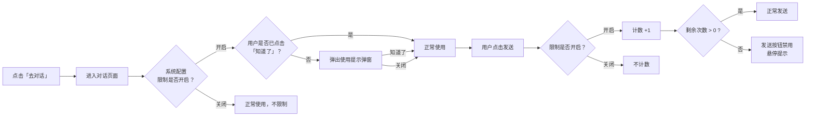

# 开发中心智能体增加对话功能并限制使用次数

## 背景

开发者完成智能体配置后，需要能够在开发中心内直接与智能体进行对话测试，但需要根据项目需求进行使用次数限制。

***

## 需求概述

1、在智能体管理页面，增加「去对话」入口，点击后进入对话二级页面，提供对话能力。**核心约束**：开发中心的对话页面仅供测试，每日使用次数受系统配置限制。正式使用需将智能体发布到门户后前往门户使用。

2、系统管理员可在管理中心 > 系统配置中调整限制参数。

***

## 一、入口设计

### 1.1 卡片视图入口

智能体卡片底部的 `...` 下拉菜单中新增「去对话」选项，图标为消息气泡：

```
编辑       |  复制       |  删除
去对话（新增）|
```

### 1.2 表格视图入口

表格操作列的 `...` 下拉菜单中同步新增「去对话」选项。

| 操作列按钮 | 说明     |
| ----- | ------ |
| 编辑    | 现有     |
| 配置    | 现有     |
| …     | 下拉菜单   |
| → 去对话 | **新增** |
| → 删除  | 现有     |

***

## 二、对话页面设计

### 2.1 页面结构

对话页面为**二级页面**，替换智能体管理列表视图。页面布局分为上下两部分：

| 区域  | 内容                                |
| --- | --------------------------------- |
| 标题区 | 返回箭头 + 标题 + 功能提示。右侧展示：剩余次数（如限制开启） |
| 内容区 | 灰色占位卡片，后续嵌入实际对话组件                 |

### 2.2 标题区域

标题区域与一级页面（智能体管理）样式一致，左侧增加返回箭头：

| 元素     | 内容                 |
| ------ | ------------------ |
| ← 返回箭头 | 点击返回智能体管理列表        |
| 标题     | {智能体名称}            |
| (?) 提示 | 悬停提示「在此与智能体进行对话交互」 |

### 2.3 内容区域

标题下方整个内容区域为「嵌入助手对话页面」。

***

## 三、使用提示弹窗

### 3.1 触发时机

首次进入对话页面时弹出。用户点击「知道了」后记录状态，后续不再提示。

### 3.2 弹窗内容

| 项目 | 内容                                                             |
| -- | -------------------------------------------------------------- |
| 标题 | 使用提示                                                           |
| 正文 | 开发中心的对话页面仅供测试，限制每日使用次数（具体次数由系统配置决定），如需正常使用，请将智能体发布到门户，并前往门户使用。 |
| 按钮 | 知道了 / 关闭                                                       |

### 3.3 按钮行为

| 按钮  | 行为                |
| --- | ----------------- |
| 知道了 | 关闭弹窗，**下次不再提示**   |
| 关闭  | 仅关闭弹窗，**下次进入仍提示** |

***

## 四、使用次数管控

### 4.1 计数规则

| 规则      | 说明                               |
| ------- | -------------------------------- |
| 每日上限    | 由系统配置决定，默认为 10 次                 |
| 计数方式    | 用户在对话页面**点击发送按钮**时计数 +1          |
| 计数范围    | 按天隔离，每天独立计数                      |
| 剩余展示    | 标题区右侧实时展示「今日剩余使用次数：N/M」          |
| 剩余为 0 时 | 对话发送按钮**禁用**，鼠标悬停显示提示「今日使用次数已用完」 |
| 限制关闭时   | 不计数、不展示剩余次数、不限制发送                |

### 4.2 数据流



### 4.3 超限交互

| 状态       | 发送按钮 | 悬停提示        |
| -------- | ---- | ----------- |
| 剩余次数 > 0 | 正常可用 | 无           |
| 剩余次数 = 0 | 禁用置灰 | 「今日使用次数已用完」 |
| 限制已关闭    | 正常可用 | 无           |

***

## 五、系统配置

### 5.1 配置入口

管理中心 > 系统配置，以列表形式展示所有系统级配置项。点击「智能体对话限制」行进入配置抽屉。

### 5.2 配置项

| 配置项        | 类型 | 说明                 | 默认值 |
| ---------- | -- | ------------------ | --- |
| 启用每日使用次数限制 | 开关 | 关闭后开发中心对话不做次数限制    | 开启  |
| 每日使用上限（次）  | 数字 | 范围 1-100，仅在「启用」时生效 | 10  |

### 5.3 影响范围

| 影响点       | 限制开启时            | 限制关闭时 |
| --------- | ---------------- | ----- |
| 进入对话页的弹窗  | 首次弹窗（用户可永久关闭）    | 不弹窗   |
| 标题区剩余次数展示 | 显示「今日剩余使用次数：N/M」 | 不显示   |
| 发送按钮计数    | 每次发送 +1          | 不计数   |
| 发送按钮超限    | 剩余为 0 时禁用 + 悬停提示 | 不限制   |

***

## 六、验收用例

| 编号    | 场景         | 前置条件             | 操作步骤                        | 预期结果                         |
| ----- | ---------- | ---------------- | --------------------------- | ---------------------------- |
| AC-01 | 进入对话页面     | 智能体管理列表页可见       | 点击智能体卡片 `…` →「去对话」          | 进入对话二级页面，显示智能体名称作为标题，左侧有返回箭头 |
| AC-02 | 返回列表       | 已在对话二级页面         | 点击左上角返回箭头                   | 回到智能体管理列表页                   |
| AC-03 | 首次弹窗提示     | 限制开启，用户未点击过「知道了」 | 在列表中点击任意智能体的「去对话」           | 弹出使用提示弹窗，正文说明测试用途及次数限制       |
| AC-04 | 知道了后不再弹窗   | 限制开启，AC-03 已执行   | 点击弹窗「知道了」→ 返回列表 → 再次点击「去对话」 | 不再弹出使用提示弹窗                   |
| AC-05 | 关闭后仍弹窗     | 限制开启，用户未点击过「知道了」 | 点击弹窗「关闭」→ 返回列表 → 再次点击「去对话」  | 再次弹出使用提示弹窗                   |
| AC-06 | 切换智能体不重复弹窗 | 限制开启，用户已点击过「知道了」 | 返回列表 → 点击另一个智能体的「去对话」       | 不弹出弹窗，直接进入对话页面               |
| AC-07 | 发送时计数      | 限制开启，剩余次数 > 0    | 在对话页面点击发送按钮                 | 剩余次数 -1，标题区数字同步更新            |
| AC-08 | 发送按钮超限禁用   | 限制开启，剩余次数 = 0    | 在对话页面尝试点击发送按钮               | 发送按钮置灰不可点击；鼠标悬停提示「今日使用次数已用完」 |
| AC-09 | 限制关闭不计数    | 系统配置中限制已关闭       | 进入对话页面并多次点击发送按钮             | 标题区不显示剩余次数，发送按钮始终可用，不计数      |
| AC-10 | 限制关闭不弹窗    | 系统配置中限制已关闭       | 点击任意智能体的「去对话」               | 不弹出使用提示弹窗，直接进入对话页面           |

***

## 七、异常处理

| 场景       | 处理方式                   |
| -------- | ---------------------- |
| 浏览器存储不可用 | 不影响核心对话功能，静默降级，不弹窗、不计次 |
| 系统配置读取失败 | 使用默认值（限制开启，每日 10 次）    |
| 当日已跨天    | 次数自动清零，重新开始计数          |

