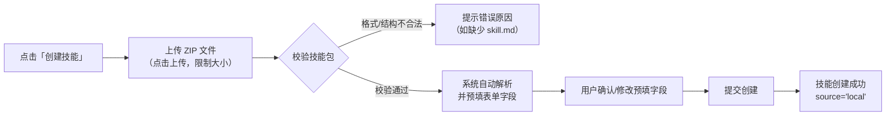
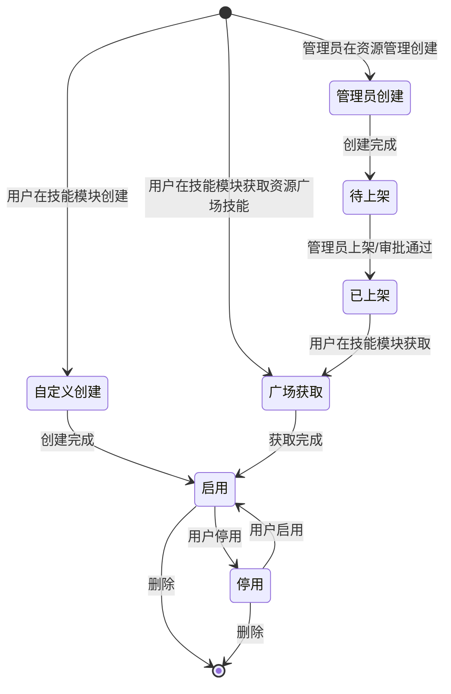

# 开发中心技能模块

## 背景

当前开发中心的组件管理模块包含模型、工具、连接器、数据连接、知识库、文件库六个子模块，但缺少对"技能"这一可复用能力单元的统一管理。

***

## 需求概述

1. **技能管理模块（开发中心）**：在组件管理分组下新增「技能」入口，提供技能的创建、编辑、删除、查看、下载技能等完整 CRUD 能力。创建技能目前仅支持上传技能压缩包的方式，暂不支持一句话创建技能。
2. **从资源广场获取技能**：用户可从技能模块跳转资源广场（新开页面），浏览已上架的技能类资源；公开资源直接获取，需授权资源提交申请，获取/申请通过后进入当前空间
3. **从资源广场发布**：普通用户可以在资源广场创建发布技能，经过审核后，供其他用户发现和使用。创建时支持全新创建和从已有数据拉取。
4. **从资源管理创建/上架技能**：管理员可在管理中心 > 资源管理中直接创建技能并上架

***

## 一、入口与导航

### 1.1 菜单入口

开发中心侧边栏「组件管理」分组中新增「技能」菜单项：

```
组件管理
├── 模型
├── 工具
├── 连接器
├── 技能    （新增）
├── 数据连接
├── 知识库
└── 文件库

```

### 1.2 路由

技能模块路由 `/dev/skills` 已在 `App.tsx` 中预留（当前指向 PlaceholderPage），需替换为实际的技能管理页面组件。

```tsx
// App.tsx 变更
- <Route path="/dev/skills" element={<DevGuard><PlaceholderPage title="技能管理" description="可复用技能单元管理" /></DevGuard>} />
+ <Route path="/dev/skills" element={<DevGuard><SkillsPage /></DevGuard>} />
```

***

## 二、技能管理页面

### 2.1 页面布局

技能管理页面采用与「工具管理」一致的布局模式：

| 区域     | 内容                               |
| ------ | -------------------------------- |
| 标题区    | 页面标题「技能管理」+功能说明icon              |
| 筛选区    | 关键词搜索 + 来源筛选 + 右侧「创建技能」「从广场获取」按钮 |
| 列表/卡片区 | 技能数据展示，分页                        |

### 2.2 筛选区

| 筛选项   | 类型   | 说明              |
| ----- | ---- | --------------- |
| 关键词搜索 | 文本输入 | 搜索技能名称或描述       |
| 来源    | 下拉选择 | 全部 / 自定义 / 广场资源 |

### 2.3 列表视图

| 列    | 说明               |
| ---- | ---------------- |
| 技能名称 | 技能名称及缩略图标        |
| 来源   | 文本展示：自定义 / 广场资源  |
| 更新时间 | 最后更新时间           |
| 状态   | 启用/停用开关          |
| 操作   | 编辑 / 删除（≤3个直接展示） |

> 操作列遵循全局规范：≤3 个按钮直接展示，超过则使用 `…` 下拉菜单。广场资源来源的技能（获取自资源广场）不可编辑，仅可查看详情和删除。

### 2.4 卡片视图

| 元素   | 说明                  |
| ---- | ------------------- |
| 卡片顶部 | 技能图标 + 技能名称 + 唯一标识  |
| 卡片中部 | 技能描述（两行截断）          |
| 卡片底部 | 来源 · 创建人 · 创建日期     |
| 卡片悬停 | `…` 下拉菜单，操作项与列表视图一致 |

***

## 三、技能 CRUD 操作

### 3.1 创建技能

点击「创建技能」按钮，进入上传技能包创建流程。创建技能目前仅支持上传技能压缩包（ZIP）的方式，暂不支持通过自然语言描述需求由 Agent/大模型自动生成技能（即「一句话创建技能」）。

用户将符合规范的技能包（ZIP 格式）上传，系统自动解析并预填表单，用户确认后创建。此方式适用于技能包在本地或其他平台已组装好的场景（参考腾讯云 ADP Skills、阿里云百炼插件导入机制）。

#### 技能包结构规范

技能包为 ZIP 压缩文件，根目录必须包含 `skill.md` 描述文件：

```
<技能名称>.zip
├── skill.md               # 技能描述文件（Markdown，必填）
└── （可选）其他资源文件
```

`skill.md` 为 Markdown 文本，包含技能名称、描述、使用场景、用法等：

```markdown
# police-incident-classifier

根据警情描述自动分类并判定紧急等级。

## 使用场景

适用于 110 接处警、线索核查等场景。

## 用法

- 输入：警情描述文本
- 输出：警情类别与紧急等级
```

> 技能名称（`skill.md` 一级标题 / ZIP 文件名）通常为非中文，仅包含小写字母、数字和连字符。

#### 上传流程



#### 上传弹窗与预填字段

| 字段    | 是否必填 | 说明                                   |
| ----- | ---- | ------------------------------------ |
| 技能名称  | 是    | 上传后写入 skill 名称（非中文），用户可修改为中文         |
| 唯一标识  | 是    | 上传后写入 skill 名称，创建后不允许修改（小写字母、数字、连字符） |
| 技能描述  | 是    | 从 `skill.md` 解析，允许修改                 |
| 头像    | 否    | 技能包内含图标文件时自动提取，否则用默认头像               |
| 技能压缩包 | 是    | 上传 ZIP，解析后渲染回显 `skill.md` 内容         |

> 上传 ZIP 后，系统将 skill 名称同时写入「技能名称」与「唯一标识」；用户通常仅将「技能名称」改为中文，唯一标识保持不变。

#### 校验规则

| 校验项  | 规则                               |
| ---- | -------------------------------- |
| 文件格式 | 仅支持 `.zip`，限制大小（建议 10 MB 以内）     |
| 结构校验 | 根目录必须包含 `skill.md`               |
| 唯一标识 | 必填，仅小写字母、数字、连字符，不能以连字符开头/结尾，全局唯一 |
| 技能名称 | 必填，全局唯一                          |

#### 来源标记

上传技能包创建时，`source` 字段标记为 `'local'`（自定义）。

### 3.2 编辑技能

仅 `source === 'local'`（自定义来源）的技能可编辑。编辑抽屉回填现有技能信息，支持修改名称、描述、头像等基本信息。

**操作入口**：

- 列表视图：操作列「编辑」按钮
- 卡片视图：`…` 下拉菜单中的「编辑」选项

**约束**：

- 广场资源来源的技能（`source === 'square'`）不可编辑，操作列不显示「编辑」按钮
- 编辑后 `updateTime` 自动更新

### 3.3 删除技能

#### 操作入口

- 列表视图：操作列「删除」按钮
- 卡片视图：`…` 下拉菜单中的「删除」选项

#### 删除流程

点击删除后，根据技能是否被智能体引用，分两种情况处理：

| 情况     | 处理方式              |
| ------ | ----------------- |
| 无智能体引用 | 弹出二次确认弹窗，用户确认后删除  |
| 有智能体引用 | 不允许删除，提示先解除绑定后再删除 |

#### 删除确认（无智能体引用时）

点击删除后弹出二次确认弹窗：

| 内容   | 说明                  |
| ---- | ------------------- |
| 提示文案 | 「删除后该技能将无法恢复，确定删除？」 |
| 确认方式 | 用户点击「确认删除」          |

#### 约束

- 有智能体正在引用该技能时，不允许删除，提示「该技能已被 N 个智能体引用，请先解除绑定后再删除」，并列出引用智能体列表
- 广场资源来源的技能删除后，用户可重新从资源广场获取

### 3.4 查看详情

点击技能名称或卡片主体，打开技能详情抽屉（只读模式）：

| 区域       | 内容                              |
| -------- | ------------------------------- |
| 基本信息     | 头像、名称、唯一标识、描述、来源、状态、创建/更新时间     |
| 技能包信息    | skill.md 中的真实名称、真实描述            |
| skill.md | 技能包中的使用场景、用法等 Markdown 文本（渲染展示） |

### 3.5 下载技能

支持将技能导出为技能描述文件，用于本地备份、跨空间复用或分享给其他用户。

#### 操作入口

- 列表视图：操作列 `…` 下拉菜单中的「下载」选项
- 卡片视图：`…` 下拉菜单中的「下载」选项

#### 导出内容

将skill文件打包成zip下载

#### 约束

- 广场资源来源的技能同样支持下载

***

## 四、从资源广场获取技能

### 4.1 入口

技能管理页面顶部操作栏放置「从广场获取」按钮，点击后在新标签页打开资源广场独立页面，并自动定位到「技能」资源类型：

> 与已实现的模型（`tab=model`）、工具（`tab=api`）、连接器（`tab=mcp`）、知识库（`tab=knowledge`）获取入口一致。

### 4.2 资源广场独立页面

新页面复用资源广场页面（`/standalone/resource-square`），资源类型 Tab 新增「技能」项，通过 `tab=skill` 参数默认选中。页面内支持：

- 浏览已上架的技能类资源（卡片网格，含名称、描述、发布者、热度）
- 关键词搜索与资源类型切换
- 点击卡片打开资源详情抽屉，查看详细介绍与授权状态

### 4.3 获取与申请

点击资源卡片进入详情抽屉，根据当前空间的访问状态展示对应操作：

| 访问状态   | 展示         | 说明              |
| ------ | ---------- | --------------- |
| 已获取    | 「已获取资源」提示  | 展示调用地址，无需重复获取   |
| 开放未获取  | 「获取资源」按钮   | 公开资源（完全公开）可直接获取 |
| 未授权    | 「申请使用」按钮   | 需授权资源需提交使用申请    |
| 审批中    | 「审批中」提示    | 申请已提交，无需重复申请    |
| 已撤销/失效 | 「资源不可获取」提示 | 资源已撤销、过期或删除     |

#### 获取

公开策略为「完全公开」的技能可直接获取。获取成功后，技能加入当前空间「我的资源」，并同步出现在技能管理列表（`source='square'`）。若当前空间已获取该技能，系统提示「当前空间已获取该资源，无需重复操作」，不重复创建记录。

#### 申请

公开策略为「公开可见授权可用」或「仅授权对象可见」的技能需提交使用申请。申请经资源所有权人审批通过后，技能加入当前空间。若当前空间已有待审批申请，系统提示「当前空间已有待审批申请，请勿重复提交」。

### 4.4 数据关联

获取或申请审批通过后，技能出现在技能管理列表：

| 字段                 | 值                      |
| ------------------ | ---------------------- |
| `source`           | `'square'`             |
| `sourceResourceId` | 资源广场中该资源的 `resourceId` |
| `config`           | 从资源广场同步的技能配置           |
| `status`           | `'active'`（获取后默认启用）    |

> 从资源广场获取的技能不可编辑（source='square'），如需修改，需在资源管理侧更新资源后重新获取。

***

## 五、发布技能到资源广场

技能发布不占用技能模块的操作入口，而是复用资源广场「我的发布」Tab 的现有发布流程。

### 5.1 入口

- 打开资源广场页面（`/standalone/resource-square`）
- 切换至「我的发布」Tab
- 点击「发布资源」按钮，打开「创建并发布资源」抽屉（`ResourceFormDrawer`）

### 5.2 创建流程

发布技能复用 `ResourceFormDrawer` 的三步流程，资源类型新增「技能」选项：

| 步骤 | 名称   | 内容                           |
| -- | ---- | ---------------------------- |
| 1  | 选择来源 | 选择资源类型（新增「技能」）+ 关联来源方式       |
| 2  | 完善信息 | 资源名称、唯一标识 Key、描述、资源介绍、技能详细配置 |
| 3  | 发布策略 | 公开策略 + 可见范围                  |

#### 步骤一：选择来源

| 项      | 说明                                   |
| ------ | ------------------------------------ |
| 资源类型   | 在现有 模型 / API / MCP / 知识库 基础上新增「技能」   |
| 关联来源方式 | 从已有数据拉取（拉取未发布的现有资源） / 全新创建（直接创建资源信息） |

- 选择「从已有数据拉取」时，需选择所在空间与现有资源
- 选择「全新创建」时，直接创建技能资源信息

#### 步骤二：完善信息

| 字段       | 必填 | 说明                    |
| -------- | -- | --------------------- |
| 资源名称     | 是  | 资源在广场展示的名称            |
| 唯一标识 Key | 是  | 创建后不允许编辑              |
| 描述信息     | 是  | 简洁描述资源功能              |
| 资源介绍     | 否  | Markdown 格式           |
| 技能详细配置   | 是  | 上传技能压缩包并解析回显 skill.md |

#### 步骤三：发布策略

| 字段   | 说明                        |
| ---- | ------------------------- |
| 公开策略 | 完全公开 / 公开可见授权可用 / 仅授权对象可见 |
| 可见范围 | 当公开策略为「仅授权对象可见」时展示        |

### 5.3 提交与审批

普通用户在「我的发布」创建技能资源后，进入发布审批流程：

1. 提交创建 → 状态为「发布审批中」
2. 管理员审批通过 → 技能上架，出现在资源广场（类型=技能）
3. 管理员驳回 → 回退到待上架状态，通知创建者

### 5.4 数据关联

- 技能作为资源类型的一种（`type: 'skill'`），融入现有资源发布状态机
- 发布的技能资源与技能模块中的本地技能为**独立实体**，互不影响

***

## 六、从资源管理创建/上架技能

### 6.1 入口

管理中心 > 资源管理 > 全部资源 Tab > 创建资源

### 6.2 创建技能资源

管理员在资源管理中创建资源时，资源类型新增「技能」选项

### 6.3 创建表单扩展

创建技能类型资源时，在现有 ResourceFormDrawer 的基础上扩展技能专属配置步骤：

| 步骤           | 内容                      | 变更       |
| ------------ | ----------------------- | -------- |
| 选择来源         | 从工坊已有资源拉取 / 全新创建        | 不变       |
| 完善信息         | 名称、描述、资源 Key、类型（新增「技能」） | 扩展类型枚举   |
| **技能配置**（新增） | 上传技能压缩包并解析回显 skill.md   | **新增步骤** |
| 发布策略         | 公开策略、可见目标               | 不变       |

#### 技能配置步骤

创建技能类型资源时，技能配置通过上传技能压缩包的方式填写：上传 ZIP 技能包后，系统解析其中的 `skill.md` 并渲染回显。

| 字段       | 类型   | 必填 | 说明                                |
| -------- | ---- | -- | --------------------------------- |
| 技能压缩包    | 文件上传 | 是  | 上传 ZIP 技能包，系统解析 `skill.md` 并回显    |
| skill.md | 只读展示 | —  | 渲染回显技能包中的 `skill.md` 内容（使用场景、用法等） |

### 6.4 上架技能

管理员创建技能资源后，资源状态为「待上架」。管理员可直接上架，也可提交审批（取决于系统配置）。

#### 管理员直接上架

管理员在资源管理中点击「上架」，技能立即出现在资源广场，其他用户可在资源广场浏览和获取该技能。

#### 审批流程上架

如果系统配置了审批流程，管理员提交上架后进入审批，审批通过后自动上架。

### 6.5 资源类型扩展

`ResourceType` 枚举新增 `'skill'`：

```typescript
type ResourceType = 'model' | 'api' | 'mcp' | 'knowledge' | 'skill'; // 新增 'skill'
```

`ResourceItem` 扩展技能专属字段：

```typescript
interface ResourceItem {
  // ... 现有字段 ...
  // 技能专属字段（type='skill' 时有效）
  skillConfig?: {
    inputSchema?: Record<string, any>;
    outputSchema?: Record<string, any>;
    timeout?: number;
    retryCount?: number;
    skillMd?: string;       // 技能包（skill.md）的 Markdown 内容
  };
}
```

***

## 七、技能在智能体中的引用

暂不开发

目前，技能只能用于首页的全局智能体。开发中心/个人空间/技能模块下，以启用的技能，会出现在门户首页的技能下拉列表中。

***

## 八、技能生命周期与状态

### 8.1 技能来源与状态模型



### 8.2 状态定义（技能管理页面内部）

| 状态 | 说明                       |
| -- | ------------------------ |
| 启用 | 技能正常可用，可被智能体引用           |
| 停用 | 技能被停用，不可被智能体引用（已有引用不受影响） |

***

## 九、验收用例

| 编号    | 场景              | 前置条件                  | 操作步骤                                      | 预期结果                              |
| ----- | --------------- | --------------------- | ----------------------------------------- | --------------------------------- |
| AC-01 | 进入技能管理          | 开发中心侧边栏可见             | 点击侧边栏「技能」菜单                               | 进入技能管理页面，显示技能列表（含已有数据/空状态）        |
| AC-02 | 上传技能包创建技能       | 已准备好符合规范的 ZIP 技能包     | 点击「创建技能」→ 上传 ZIP → 确认预填字段 → 提交            | 技能创建成功，来源=自定义                     |
| AC-03 | 上传技能包校验失败       | 技能包缺少 skill.md 或格式不合法 | 上传不合法的 ZIP 文件                             | 提示错误原因，不创建技能                      |
| AC-04 | 下载技能            | 存在一条技能                | 点击 `…` →「下载」                              | 下载 ZIP 技能包（含 skill.md）            |
| AC-05 | 编辑技能            | 存在一条自定义来源的技能          | 点击操作列「编辑」→ 修改技能名称 → 保存                    | 技能名称更新，updateTime 更新              |
| AC-06 | 广场资源技能不可编辑      | 存在一条广场资源来源的技能         | 查看该技能的操作列                                 | 操作列无「编辑」按钮                        |
| AC-07 | 删除技能            | 存在一条未被引用的技能           | 点击「删除」→ 确认弹窗 → 确认                         | 技能从列表移除                           |
| AC-08 | 删除被引用的技能        | 技能被智能体引用              | 点击「删除」                                    | 不允许删除，提示解除绑定，并列出引用智能体列表           |
| AC-09 | 启用/停用技能         | 技能当前为启用状态             | 点击状态开关 → 弹窗确认                             | 弹窗告知停用后果；确认后技能变为停用状态、开关置灰；取消则状态不变 |
| AC-10 | 从资源广场获取技能（公开资源） | 资源广场有已上架的公开技能资源       | 点击「从广场获取」→ 新标签页定位「技能」类型 → 打开详情 → 点击「获取资源」 | 获取成功，技能加入本地列表，来源=广场资源             |
| AC-11 | 获取已获取的技能        | 当前空间已获取该技能            | 打开该技能详情抽屉                                 | 显示「已获取资源」提示，不重复创建记录               |
| AC-12 | 申请使用需授权技能       | 资源广场有需授权的技能资源         | 打开详情 → 点击「申请使用」→ 填写申请 → 提交                | 申请提交至资源所有权人，审批通过后技能加入本地列表         |
| AC-13 | 重复提交申请          | 当前空间已有该技能的待审批申请       | 打开详情 → 点击「申请使用」                           | 提示「当前空间已有待审批申请，请勿重复提交」            |
| AC-14 | 全新创建发布技能        | 资源广场「我的发布」Tab         | 点击「发布资源」→ 选择类型「技能」→「全新创建」→ 填写信息 → 提交      | 进入发布审批流程，可在我的发布中查看状态              |
| AC-15 | 从已有数据拉取发布技能     | 资源广场「我的发布」Tab         | 点击「发布资源」→ 选择类型「技能」→「从已有数据拉取」→ 选择现有资源 → 提交 | 进入发布审批流程，可在我的发布中查看状态              |
| AC-16 | 管理员创建技能资源       | 管理中心 > 资源管理           | 点击「创建资源」→ 选择类型「技能」→ 填写表单 → 提交             | 创建成功，状态为「待上架」                     |
| AC-17 | 管理员上架技能资源       | 资源管理中有待上架的技能          | 点击「上架」                                    | 技能状态变为「已上架」，资源广场可见                |
| AC-18 | 卡片视图            | 技能管理页面                | 切换为卡片视图                                   | 技能以卡片形式展示，右上角有状态标签                |
| AC-19 | 列表视图            | 技能管理页面                | 切换为列表视图                                   | 技能以表格形式展示，列包括名称、来源、更新时间、状态、操作     |
| AC-20 | 技能详情查看          | 存在一条技能                | 点击技能名称                                    | 打开详情抽屉，展示完整信息（只读）                 |

***

## 十、异常处理

| 场景                | 处理方式                                                  |
| ----------------- | ----------------------------------------------------- |
| 技能名称重复            | 创建/编辑时全局唯一校验，重复时提示「技能名称已存在」                           |
| 技能包格式不合法          | 上传时校验，非 ZIP 或缺少 skill.md 时提示具体错误原因，不创建技能              |
| 技能包文件过大           | 超过限制（建议 10 MB）时提示「文件过大，请压缩后重试」                        |
| skill.md 解析失败     | 提示「skill.md 解析失败」，并定位到具体问题                            |
| 上传技能包时技能名称重复      | 校验重复，提示「技能名称已存在，请修改后重试」                               |
| 下载技能失败            | 提示「下载失败，请稍后重试」，不阻塞其他操作                                |
| 发布到资源广场时资源 Key 冲突 | 校验资源 Key 全局唯一，冲突时提示并建议修改名称，且修改名称需要与压缩包名称及skill.md描述一致 |
| 获取广场技能失败          | 提示「获取失败，请稍后重试」，不阻塞其他操作                                |
| 广场技能已下架           | 本地技能不受影响                                              |
| 删除技能时网络异常         | 提示「删除失败，请稍后重试」，不删除本地数据                                |

***

## 十一、待明确事项

- [ ] 技能发布到资源广场后，是否允许在本地继续独立编辑（当前方案允许）？需与业务方确认。
- [ ] 技能发布审批流程是否与现有资源广场发布审批共用一个工作流（当前方案共用）？需与业务方确认。
- [ ] 技能的图标和配色方案需与 UI 设计确认。
- [ ] 技能包规范（skill.md 结构）是否需与腾讯云 Skills 等主流格式对齐兼容？需与技术方确认。
- [ ] 上传技能包是否需引入安全审核/扫描机制（参考腾讯云 Skills 安全审核）？需与安全方确认。

