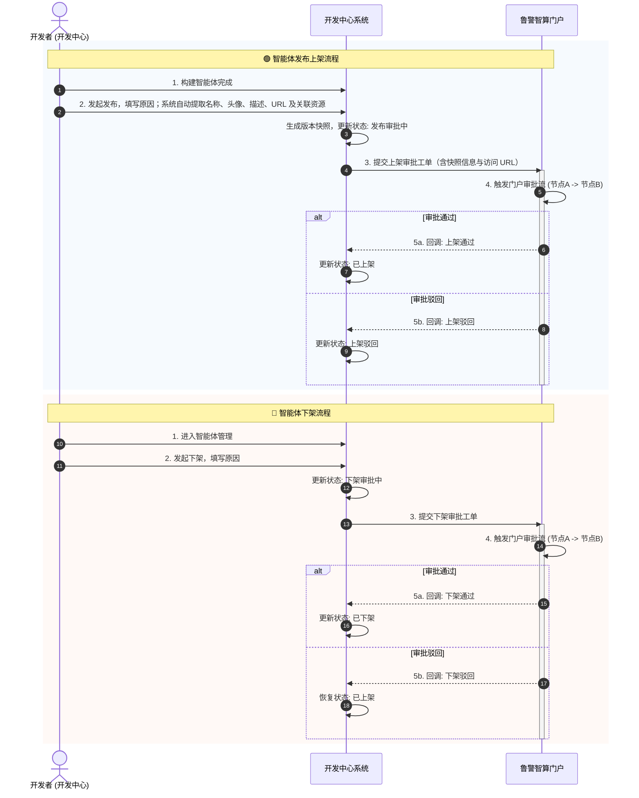
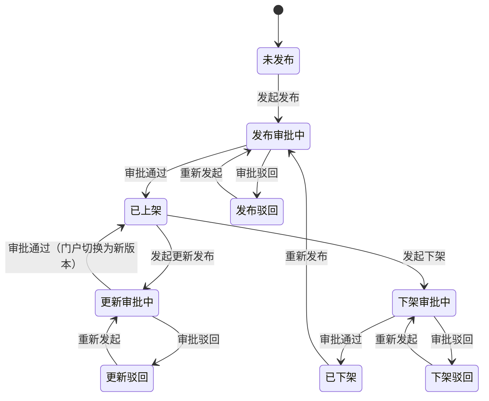

# 第三方门户发布渠道

## 背景

GA项目中，构建完成的智能体要发布到**鲁警智算门户**，需要从开发中心发起"发布"和"下架"操作，并对接门户端的审批待办。

**现状：**智能体平台（即开发中心）的智能体管理模块，目前支持以下应用渠道：1、智能体广场，2、集成页面，3、API接口。

**需求：**为了支持第三方门户发布智能体，需要在开发中心添加一个"第三方门户"渠道，用户可以在开发中心发起发布操作，同时触发门户端的审批流程。

**定位：**门户侧负责智能体的展示分发与审批管控，智能体的实际运行仍在开发中心。上架后，门户端用户点击智能体卡片，跳转至开发中心的智能体访问 URL。

### 业务流程

---

## 版本快照机制（方案 C）

已上架的智能体，开发者仍可在开发中心继续迭代编辑（不锁定）。门户侧运行的是发布时生成的**版本快照**，保持稳定。

当开发者需要将最新变更同步到门户时，主动发起**"更新发布"**，走审批流程。审批通过后，门户切换为新版本快照。

| 对比维度 | 说明 |
|---------|------|
| 开发迭代 | 不受阻，发布后仍可自由编辑 |
| 门户稳定性 | 始终运行已审批的快照版本，不受开发侧变更影响 |
| 版本追溯 | 每次发布/更新生成独立快照，可追溯历史版本 |

---

## 状态机

智能体发布生命周期状态定义：

| 状态 | 含义 |
|------|------|
| 未发布 | 从未发起到门户的发布流程 |
| 发布审批中 | 已提交发布申请，等待门户审批 |
| 已上架 | 审批通过，智能体已在门户展示 |
| 发布驳回 | 发布申请被门户驳回，可重新发起 |
| 更新审批中 | 已上架的智能体发起版本更新，等待审批 |
| 更新驳回 | 更新申请被驳回，门户维持当前版本 |
| 下架审批中 | 已上架的智能体发起下架，等待审批 |
| 已下架 | 下架审批通过，智能体从门户移除 |
| 下架驳回 | 下架申请被驳回，智能体仍保持上架 |

状态流转：

**约束**：同一智能体同时只能存在一个审批中的流程（发布/更新/下架互斥）。

---

## 发布操作界面

发起发布时，系统自动提取当前智能体信息并展示：

| 字段 | 来源 | 说明 |
|------|------|------|
| 智能体名称 | 自动提取 | 当前名称，支持在发布前修改（仅影响本次发布快照） |
| 智能体头像 | 自动提取 | 当前头像 |
| 智能体描述 | 自动提取 | 当前描述 |
| 访问 URL | 自动提取 | 指向开发中心该智能体的运行地址；上架后门户用户点击智能体卡片即跳转至此 URL |
| 关联模型 | 自动提取 | 列表展示模型名称、版本 |
| 关联工具 | 自动提取 | 列表展示工具名称 |
| 关联知识库 | 自动提取 | 列表展示知识库名称 |
| 关联连接器 | 自动提取 | 列表展示连接器名称 |
| 发布原因 | 手动填写 | 必填 |

---

## 下架影响

下架审批通过后，门户端该智能体的访问页面跳转至**「该智能体已下架」占位页面**，不直接报错或白屏。

---

## 异常处理

| 场景 | 处理方式 |
|------|----------|
| 回调失败 | 开发中心定时轮询门户审批状态作为兜底；管理端提供「手动同步状态」按钮 |
| 重复提交 | 提交时校验：同一智能体已有审批中流程时，阻断并提示"已有审批中的流程，请等待审批完成" |
| 门户不可用 | 提交失败时明确提示"门户服务异常，请稍后重试"，保留已填写的发布内容 |
| 审批超时 | 超过 7 个工作日未完成审批，自动标记为「审批超时」，通知开发者可重新发起 |

---

## 待明确事项

- [ ] 发布/下架/更新流程是否支持**撤回审批**（审批中由发起人主动撤回）？需与业务方确认。
