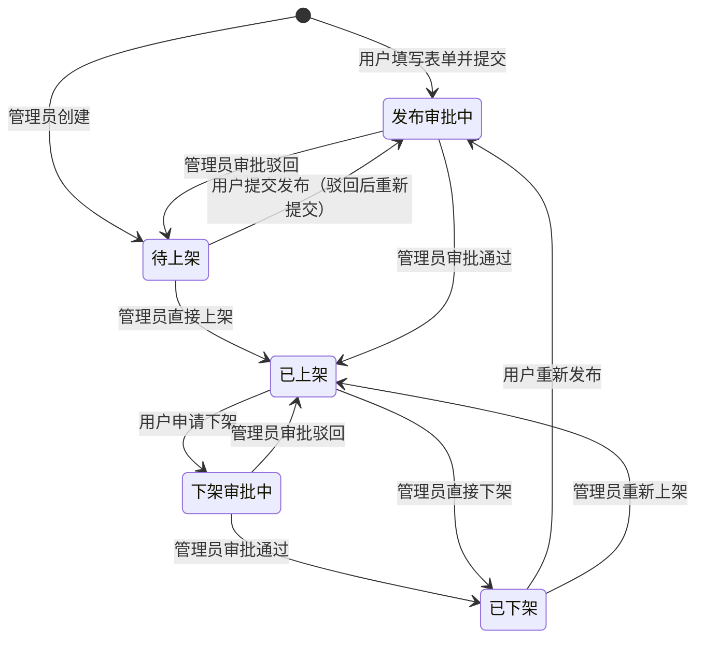
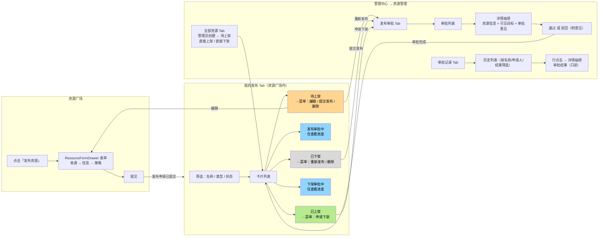
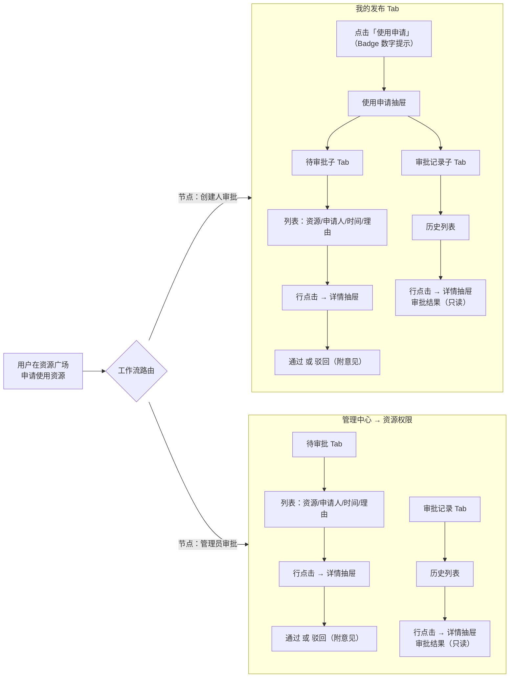

# 资源广场发布审批

## 背景

当前资源广场的"资源发布"与"使用申请审批"均集中在管理中心，由管理员统一操作：

| 功能      | 当前入口        | 操作人  |
| ------- | ----------- | ---- |
| 创建资源    | 管理中心 > 资源管理 | 管理员  |
| 上架/下架资源 | 管理中心 > 资源管理 | 管理员  |
| 审批使用申请  | 管理中心 > 资源权限 | 管理员  |
| 浏览/获取资源 | 开发中心 > 资源广场 | 所有用户 |

**痛点**：普通用户无法自主发布资源，所有资源发布均依赖管理员，限制了资源生态的活跃度。

***

## 需求概述

1. **普通用户可申请发布资源**：在开发中心即可创建资源并提交发布审批，审批通过后资源进入资源广场
2. **使用申请审批支持资源创建者审批和管理员审批。**增加审批入口。在项目落地时，支持**使用申请审批支持工作流配置**：使用申请的审批流程不再固定为管理员审批，而是通过可配置的工作流定义审批节点（如创建人审批、管理员审批），灵活组合
3. **入口重构**：创建资源、管理我的发布、审批使用申请等入口从管理中心迁移/复刻到开发中心

***

## 一、资源发布审批

### 1.1 发布状态机

| 状态    | 含义                           |
| ----- | ---------------------------- |
| 待上架   | 资源已创建但未上架（管理员创建未发布 / 审批驳回回退） |
| 发布审批中 | 用户已提交发布申请，等待管理员审批            |
| 已上架   | 审批通过，资源在广场展示                 |
| 下架审批中 | 用户申请下架，等待管理员审批（广场仍可见）        |
| 已下架   | 下架审批通过，资源从广场移除               |



> **两条入口，一个待上架状态**：普通用户创建直接进入「发布审批中」；管理员创建进入「待上架」，可随时直接上架。审批驳回回退到「待上架」，用户可编辑后重新提交。

### 1.2 用户操作流程图

#### 资源发布与下架流程

下图以**页面为单位**，串联普通用户和管理员在各页面的所有操作。



> 每个子图内的操作为自包含，箭头标注了用户操作后跳转到的目标页面。"我的发布"卡片颜色随发布状态变化（黄=待上架，蓝=审批中，绿=已上架，灰=已下架）。

#### 使用申请审批流程

下图展示用户申请使用资源后，审批根据工作流当前节点路由到创建者或管理员，两者在各自页面独立完成审批。



> 创建者和管理员各自的审批操作互不干扰。审批详情抽屉内含资源信息 Card + 申请信息 Card + 审批意见/审批结果 Card。工作流配置见 [二、使用申请审批](#二使用申请审批工作流配置不需要开发配置页面依赖工作流组件)。

### 1.3 入口设计

| 入口   | 位置                | 说明                 |
| ---- | ----------------- | ------------------ |
| 发布资源 | 资源广场页顶部操作栏（新增按钮）  | 所有用户可见             |
| 我的发布 | 资源广场内新增 Tab「我的发布」 | 展示当前用户创建的资源及发布审批状态 |
| 资源管理 | 管理中心 > 资源管理（保留）   | 管理员仍可在此创建/管理所有资源   |

#### 资源广场页面结构调整

现有 Tab：全部资源 | 我的资源（compact 模式）

调整为：

- **全部资源**：不变
- **我的资源**：不变（已获取的资源）
- **我的发布**：新增 Tab，展示当前用户作为创建者的资源
  - 按发布状态筛选：待上架 / 发布审批中 / 已上架 / 下架审批中 / 已下架
  - 每个资源卡片展示发布状态标签

| 状态    | 用户可执行操作         |
| ----- | --------------- |
| 待上架   | 编辑资源内容、提交发布审批   |
| 发布审批中 | 查看进度（不可编辑、不可撤回） |
| 已上架   | 申请下架            |
| 下架审批中 | 查看进度（不可编辑、不可撤回） |
| 已下架   | 重新提交发布审批        |

##### 申请下架操作

在「我的发布」Tab 中，已上架资源卡片操作菜单包含「申请下架」。点击后弹出确认模态框：

| 字段   | 说明               |
| ---- | ---------------- |
| 资源名称 | 禁用，自动填入          |
| 下架原因 | 必填，文本输入，最多 200 字 |

提交后资源进入「下架审批中」，在广场仍可见；审批通过后变为「已下架」，从广场移除。

##### 删除资源操作

在「我的发布」Tab 中，待上架和已下架状态的资源卡片操作菜单包含「删除资源」操作。审批中（发布审批中、下架审批中）的资源不可删除。

点击删除后弹出二次确认弹窗（与资源管理页面的删除确认一致）：

- 展示已获取该资源的空间数量
- 列出删除风险说明（全站不可用、资产回收、权限解绑）
- 需勾选风险确认、输入资源名称后确认删除

##### 筛选区

「我的发布」Tab 顶部提供筛选区，包含：

- 资源名称搜索（文本输入）
- 资源类型下拉（全部 / 知识库 / 模型 / API / MCP）
- 发布状态下拉（全部 / 待上架 / 发布审批中 / 已上架 / 下架审批中 / 已下架）
- 搜索 / 重置按钮

##### 卡片交互

- 点击卡片主体 → 打开资源详情抽屉（从创建者视角查看，不展示当前空间的获取权限状态）
- 卡片右上角 `…` 下拉菜单：根据当前发布状态动态展示可用操作
- 审批中状态的卡片仅提供「查看详情」

### 1.4 创建资源表单

完全复用现有 `ResourceFormDrawer`，三个步骤不变：

| 环节   | 内容                              | 变更 |
| ---- | ------------------------------- | -- |
| 选择来源 | 从工坊已有资源拉取 / 全新创建                | 不变 |
| 完善信息 | 名称、描述、资源 Key、类型、技术配置            | 不变 |
| 发布策略 | 公开策略（完全公开 / 公开可见授权可用 / 仅授权对象可见） | 不变 |

表单底部操作：

- **提交发布**：资源直接进入发布审批中，等待管理员审批

### 1.5 资源管理页面改造

资源管理页面从原有的纯卡片视图扩展为 Tab 结构，与资源权限页面模式一致：

| Tab  | 内容                                   |
| ---- | ------------------------------------ |
| 全部资源 | 现有卡片视图，扩展 `publishStatus` 枚举值自动展示新状态 |
| 发布审批 | 发布申请 + 下架申请的审批列表，支持通过/驳回             |
| 审批记录 | 历史审批决策，支持按资源名称、申请人、审批结果筛选            |

> 命名为"发布审批"而非"待审批"，与资源权限页的"待审批" Tab 区分，避免同名混淆。

#### 全部资源 Tab

- 保留现有卡片浏览、筛选、搜索、创建、编辑、上架/下架等全部功能（状态标签已有，无需改动）
- 卡片上不加审批操作
- 管理员下架直接生效，不走审批（与现有行为一致）；用户发起下架需走审批（见 1.1 状态机）

#### 发布审批 Tab

| 列    | 说明                     |
| ---- | ---------------------- |
| 资源名称 | 资源名称及类型标签              |
| 申请人  | 提交发布/下架的用户             |
| 申请类型 | 发布 / 下架                |
| 申请时间 | 提交时间                   |
| 公开策略 | 资源的公开策略                |
| 操作   | 查看详情 → 通过 / 驳回（填写审批意见） |

##### 发布审批详情

点击「查看详情」或行点击打开详情抽屉，展示以下内容：

- **资源信息 Card**：资源名称、类型标签、发布状态标签、创建人、更新时间、资源标识、可见范围、资源描述
- **申请信息 Card**：申请人、申请类型（发布/下架）、申请时间、下架原因（下架时展示）
- **可见目标**（创建时设为"仅授权对象可见"时展示）：列出创建者设定的可见对象名单
- **审批意见 Card**：审批意见输入框（驳回时必填）

底部按钮：取消 | 驳回 | 通过

##### 审批记录详情

审批记录 Tab 中点击任意记录行打开详情抽屉，展示：

- **资源信息 Card**：同上
- **申请信息 Card**：同上（含可见目标）
- **审批结果 Card**：审批决策（通过/已驳回 Tag）、审批人、审批时间、审批意见

审批记录详情为只读，无操作按钮。

#### 审批记录 Tab

展示历史已完成的审批决策，列表字段：

| 列    | 说明             |
| ---- | -------------- |
| 资源名称 | 资源名称及类型标签      |
| 申请人  | 提交发布/下架的用户     |
| 申请类型 | 发布 / 下架        |
| 审批决策 | 审批通过 / 已驳回（标签） |
| 申请时间 | 提交时间           |
| 审批人  | 执行审批的管理员       |
| 审批意见 | 审批时填写的意见       |

支持按资源名称、申请人、审批结果筛选。点击行 → 打开审批记录详情抽屉（见上方）。

#### 与资源权限的职责边界

| 页面   | Tab            | 职责               |
| ---- | -------------- | ---------------- |
| 资源管理 | 全部资源、发布审批、审批记录 | 资源 CRUD + 生命周期审批 |
| 资源权限 | 待审批、审批记录、权限审计  | 资源使用权审批 + 权限审计   |

***

## 二、使用申请审批——工作流配置（不需要开发配置页面，依赖工作流组件）

### 2.1 设计思路

通过**可配置的审批工作流**来定义。工作流由若干审批节点组成，节点可以是不同角色，按顺序或条件流转。

当前可预见的审批节点角色：

| 节点角色  | 说明             |
| ----- | -------------- |
| 创建人审批 | 资源创建者对使用申请进行审批 |
| 管理员审批 | 平台管理员对使用申请进行审批 |

### 2.2 典型工作流配置示例

| 工作流       | 节点顺序          | 适用场景                    |
| --------- | ------------- | ----------------------- |
| 仅管理员审批    | 管理员审批         | 现有逻辑，向后兼容               |
| 仅创建人审批    | 创建人审批         | 非敏感资源，创建人自主把控使用授权       |
| 创建人 → 管理员 | 创建人审批 → 管理员审批 | 创建人初审，管理员终审；兼顾资源把控和平台治理 |
| 管理员 → 创建人 | 管理员审批 → 创建人审批 | 管理员先做合规校验，创建人确认业务合理性    |

> 工作流的具体配置由管理员在系统管理后台定义，所有资源统一遵循同一工作流（或按资源类型区分）。工作流配置、节点定义、流转规则的具体实现不在此文档展开，作为独立的工作流引擎需求另案处理。

### 2.3 工作流运行时的审批入口

审批入口根据工作流运行实例**当前所在节点**自动路由：

| 当前节点  | 审批入口                 |
| ----- | -------------------- |
| 创建人审批 | 「我的发布」Tab → 使用申请（抽屉） |
| 管理员审批 | 管理中心 > 资源权限 > 待审批    |

#### 创建者审批入口详设

「我的发布」Tab 顶部操作栏放置**使用申请**按钮，有待审批时显示 Badge 数字。点击弹出抽屉，内部两个子 Tab：

| Tab  | 内容                             |
| ---- | ------------------------------ |
| 待审批  | 汇总展示卡在「创建人审批」节点的所有使用申请，支持通过/驳回 |
| 审批记录 | 历史审批决策（通过/驳回），支持按资源名称、申请人筛选    |

待审批列表字段：

| 列    | 说明            |
| ---- | ------------- |
| 资源名称 | 被申请的资源名称      |
| 申请人  | 申请使用的用户及所属空间  |
| 申请时间 | 提交时间          |
| 使用期限 | 长期 / 指定日期     |
| 申请理由 | 用户填写的理由       |
| 操作   | 通过 / 驳回（填写意见） |

##### 待审批详情

点击待审批列表行打开详情抽屉（抽屉内嵌套），展示：

- **资源信息 Card**：资源名称、类型标签、创建人、更新时间、资源标识、可见范围、资源描述
- **申请信息 Card**：申请人（含头像、部门）、申请空间、申请时间、使用期限、申请理由
- **审批意见 Card**：审批意见输入框（驳回时必填）

底部按钮：取消 | 驳回 | 通过

##### 审批记录详情

点击审批记录列表行打开详情抽屉（抽屉内嵌套），展示：

- **资源信息 Card**：同上
- **申请信息 Card**：同上
- **审批结果 Card**：审批决策（通过/已驳回 Tag）、审批人、审批时间、审批意见

审批记录详情为只读，无操作按钮。

### 2.4 资源权限审批记录详情

管理中心 > 资源权限 > 审批记录中，点击任意记录行同样打开详情抽屉，结构与使用申请中的审批记录详情一致（资源信息 + 申请信息 + 审批结果）。

### 2.5 权限审计

管理中心 > 资源权限 > 权限审计 不受影响，仍可审计所有空间的资源授权关系，无论审批流程中经过了哪些节点。

***

## 三、入口与路由重构

### 3.1 路由规划

| 路由                             | 页面   | 访问角色 | 变更                            |
| ------------------------------ | ---- | ---- | ----------------------------- |
| `/dev/resource-square`         | 资源广场 | 所有用户 | 新增「发布资源」按钮；新增「我的发布」Tab        |
| `/dev/my-resources`            | 我的资源 | 所有用户 | 不变                            |
| `/manage/resource-manage`      | 资源管理 | 管理员  | 扩展为 Tab 结构：全部资源 + 发布审批 + 审批记录 |
| `/manage/resource-permissions` | 资源权限 | 管理员  | 待审批列表展示当前管理员审批节点上的使用申请        |

### 3.2 菜单调整

管理中心侧栏不变（不新增菜单项）：

```
资源管理
├── 资源管理        → /manage/resource-manage      （Tab：全部资源 | 发布审批 | 审批记录）
└── 资源权限        → /manage/resource-permissions   （Tab：待审批 | 审批记录 | 权限审计）
```

开发中心侧栏不变，资源广场页面内部通过 Tab 切换：

```
资源广场          → /dev/resource-square
├── 全部资源       （现有）
├── 我的资源       （现有）
└── 我的发布       （新增）
```

***

## 四、与现有实现的兼容性

### 4.1 数据结构变更

`ResourceItem` 需扩展 `publishStatus` 枚举值：

```typescript
type PublishStatus = 
  | 'pending'       // 现有：待上架（管理员创建未发布 / 审批驳回回退，复用现有状态值）
  | 'reviewing'     // 新增：发布审批中（用户提交发布申请，等待管理员审批）
  | 'published'     // 现有：已上架
  | 'unpublishing'  // 新增：下架审批中（用户申请下架，等待管理员审批）
  | 'offline'       // 现有：已下架
```

> 现有 `pending`（待上架）的语义和状态值不变，管理员创建后即落此状态。新增 `reviewing`、`unpublishing` 用于用户的审批流转。

`ResourceApplication` 需新增字段以支持工作流：

```typescript
interface ResourceApplication {
  // ... 现有字段 ...
  workflowInstanceId?: string;           // 工作流运行实例 ID
  currentNode?: string;                  // 当前审批节点（如 'creator' | 'admin'）
}
```

> 工作流引擎相关的完整数据结构不在本文档中展开。

`ResourceItem` 新增字段以支持可见目标：

```typescript
interface ResourceItem {
  // ... 现有字段 ...
  visibleTargets?: { id: string; name: string }[];  // 可见目标：创建时设为"仅授权对象可见"时指定
}
```

> 该字段与 `publicStrategy: 'whitelist'` 配合使用，记录创建者在发布策略步骤中设置的可见对象名单。发布审批详情和审批记录详情中展示此名单替代原有的已授权空间列表（grants）。

新增 `PublishApproval` 类型用于发布/下架审批：

```typescript
interface PublishApproval {
  id: string;
  resourceId: string;
  applicant: string;
  applyType: 'publish' | 'offline';   // 发布 / 下架
  applyTime: string;
  status: 'pending' | 'approved' | 'rejected';
  opinion?: string;                    // 审批意见
  operator?: string;                   // 审批人
  approvalTime?: string;               // 审批时间
  reason?: string;                     // 下架原因
}
```

### 4.2 Context 变更

`ResourceCenterContext` 需新增方法：

| 方法                                    | 说明                                |
| ------------------------------------- | --------------------------------- |
| `submitPublish(resourceId)`           | 提交发布审批，待上架/已下架 → 发布审批中（reviewing） |
| `approvePublish(resourceId)`          | 审批通过，发布审批中 → 已上架                  |
| `rejectPublish(resourceId, reason)`   | 审批驳回，发布审批中 → 待上架                  |
| `submitOffline(resourceId, reason)`   | 申请下架，已上架 → 下架审批中（unpublishing）    |
| `approveOffline(resourceId)`          | 审批通过，下架审批中 → 已下架                  |
| `rejectOffline(resourceId, reason)`   | 审批驳回，下架审批中 → 已上架                  |
| `getMyPublishedResources()`           | 获取当前用户作为创建者的资源列表                  |
| `getPendingApprovalsForMyResources()` | 获取当前用户在「创建人审批」节点上的使用申请待办          |

***

## 五、异常处理

| 场景          | 处理方式                                       |
| ----------- | ------------------------------------------ |
| 重复提交发布      | 校验：待上架/已下架状态才可提交，其他状态阻断并提示                 |
| 审批中编辑       | 发布审批中和下架审批中的资源不可编辑                         |
| 资源 Key 唯一性  | 全局唯一校验，包含待上架、发布审批中、下架审批中等所有未删除状态的资源        |
| 创建者离职/账号注销  | 其资源自动转交管理员，其审批节点上的待办自动转至管理员审批节点            |
| 下架中的资源被申请使用 | 允许提交申请，下架审批通过后自动拒绝所有待审批申请并通知申请人（理由是该资源以下架） |

***

## 六、待明确事项

- [ ] 资源发布审批是否走工作流，还是固定由管理员审批（当前方案为固定管理员审批）？待业务方确认。

